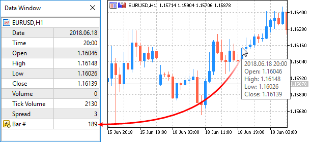

ArraySetAsSeries


[MQL5 Reference](index.md)  /  [Array Functions](array.md) / ArraySetAsSeries

[](array_reverse.md) 
[](arraysize.md)

ArraySetAsSeries

The function sets the AS\_SERIES flag to a selected [object of a dynamic array](dynamic_array.md), and elements will be indexed like in [timeseries](series.md).

```
bool  ArraySetAsSeries(
   const void&  array[],    // array by reference
   bool         flag        // true denotes reverse order of indexing
   );
```

Parameters

array[]

[in][out]  Numeric array to set.

flag

[in]  Array indexing direction.

Return Value

The function returns true on success, otherwise  - false.

Note

The [AS\_SERIES](arraygetasseries.md) flag can't be set for multi-dimensional arrays or static arrays (arrays, whose size in square brackets is preset already on the compilation stage). Indexing in timeseries differs from a common array in that the elements of timeseries are indexed from the end towards the beginning (from the newest to oldest data).

Example: Indicator that shows bar number



 

```
#property indicator_chart_window
#property indicator_buffers 1
#property indicator_plots   1
//---- plot Numeration
#property indicator_label1  "Numeration"
#property indicator_type1   DRAW_LINE
#property indicator_color1  CLR_NONE
//--- indicator buffers
double         NumerationBuffer[];
//+------------------------------------------------------------------+
//| Custom indicator initialization function                         |
//+------------------------------------------------------------------+
int OnInit()
  {
//--- indicator buffers mapping
   SetIndexBuffer(0,NumerationBuffer,INDICATOR_DATA);
//--- set indexing for the buffer like in timeseries
   ArraySetAsSeries(NumerationBuffer,true);
//--- set accuracy of showing in DataWindow
   IndicatorSetInteger(INDICATOR_DIGITS,0);
//--- how the name of the indicator array is displayed in DataWindow
   PlotIndexSetString(0,PLOT_LABEL,"Bar #"); 
//---
   return(INIT_SUCCEEDED);
  }
//+------------------------------------------------------------------+
//| Custom indicator iteration function                              |
//+------------------------------------------------------------------+
int OnCalculate(const int rates_total,
                const int prev_calculated,
                const datetime &time[],
                const double &open[],
                const double &high[],
                const double &low[],
                const double &close[],
                const long &tick_volume[],
                const long &volume[],
                const int &spread[])
  {
//---  we'll store the time of the current zero bar opening
   static datetime currentBarTimeOpen=0;
//--- revert access to array time[] - do it like in timeseries
   ArraySetAsSeries(time,true);
//--- If time of zero bar differs from the stored one
   if(currentBarTimeOpen!=time[0])
     {
     //--- enumerate all bars from the current to the chart depth
      for(int i=rates_total-1;i>=0;i--) NumerationBuffer[i]=i;
      currentBarTimeOpen=time[0];
     }
//--- return value of prev_calculated for next call
   return(rates_total);
  }
```

See also

[Access to timeseries](series.md), [ArrayGetAsSeries](arraygetasseries.md)