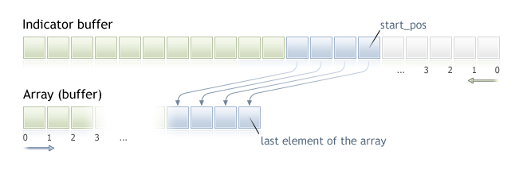

Indexing Direction in Arrays, Buffers and Timeseries


[MQL5 Reference](index.md)  /  [Timeseries and Indicators Access](series.md) / Indexing Direction in Arrays, Buffers and Timeseries

[](series.md) 
[](timeseries_access.md)

Indexing Direction in Arrays, Buffers and Timeseries

The default indexing of all arrays and indicator buffers is left to right. The index of the first element is always equal to zero. Thus, the very first element of an array or indicator buffer with index 0 is by default on the extreme left position, while the last element is on the extreme right position.

An indicator buffer is a [dynamic array](dynamic_array.md) of type double, whose size is managed by the client terminals, so that it always corresponds to the number of bars the indicator is calculated on. A usual dynamic array of type double is assigned as an indicator buffer using the [SetIndexBuffer()](setindexbuffer.md) function. Indicator buffers do not require setting of their size using function [ArrayResize()](arrayresize.md) - this will be done by the executing system of the terminal.

[Timeseries](series.md) are arrays with reverse indexing, i.e. the first element of a timeseries is in the extreme right position, and the last element is in the extreme left position. Timeseries being used for storing history price data and contain the time information, we can say that the newest data are placed in the extreme right position of the timeseries, while the oldest data are in the extreme left position.

So the timeseries element with index 0 contains the information about the latest quote of a symbol. If a timeseries contains data on a daily timeframe, data of the current yet uncompleted day are located on the zero position, and the position with index 1 contains yesterday data.

Changing the Indexing Direction

Function [ArraySetAsSeries()](arraysetasseries.md) allows changing the method of accessing elements of a dynamic array; the physical order of data storing in the computer memory is not changed at that. This function simply changes the method of addressing array elements, so when copying one array to another using function [ArrayCopy()](arraycopy.md), the contents of the recipient array will not depend on the indexing direction in the source array.

Direction of indexing cannot be changed for statically distributed arrays. Even if an array was passed as a parameter to a function, attempts to change the indexing direction inside this function will bring no effect.

For indicator buffers, like for usual arrays, indexing direction can also be set as backward (like in timeseries), i.e. reference to the zero position in the indicator buffer will mean reference to the last value on the corresponding indicator buffer and this will correspond to the value of the indicator on the latest bar. Still, the physical location of indicator bars will be unchanged.

Receiving Price Data in Indicators

Each [custom indicator](customind.md) must necessarily contain the [OnCalculate()](oncalculate.md) function, to which price data required for calculating values in indicator buffers are passed. Indexing direction in these passed arrays can be found out using function [ArrayGetAsSeries()](arraygetasseries.md).

Arrays [passed to the function](parameterpass.md) reflect price data, i.e. these arrays have the sign of a timeseries and function [ArrayIsSeries()](arrayisseries.md) will return true when checking these arrays. However, in any case indexing direction should be checked only by function [ArrayGetAsSeries()](arraygetasseries.md).

In order not to be dependent on default values, [ArraySetAsSeries()](arraysetasseries.md) should be unconditionally called for the arrays you are going to work with, and set the required direction.

Receiving Price Data and Indicator Values

Default indexing direction of all arrays in Expert Advisors, indicators and scripts is left-to-right. If necessary, in any mql5 program you can request timeseries values on any symbol and timeframe, as well as values of indicators calculated on any symbol and timeframe.

Use functions Copy...() for these purposes:

* [CopyBuffer](copybuffer.md) copy values of an indicator buffer to an array of double type;
* [CopyRates](copyrates.md) copy price history to an array of structures [MqlRates](mqlrates.md);
* [CopyTime](copytime.md) copy Time values to an array of datetime type;
* [CopyOpen](copyopen.md) copy Open values to an array of double type;
* [CopyHigh](copyhigh.md) copy High values to an array of double type;
* [CopyLow](copylow.md) copy Low values to an array of double type;
* [CopyClose](copyclose.md) copy Close values to an array of double type;
* [CopyTickVolume](copytickvolume.md) copy tick volumes to an array of long type;
* [CopyRealVolume](copyrealvolume.md) copy equity volumes to a long type array;
* [CopySpread](copyspread.md) copy the spread history to an array of int type;

 

All these functions work in a similar way. Let's consider the data obtaining mechanism on the example of CopyBuffer(). It is implied that the indexing direction of requested data is that of timeseries, and the position with index 0 (zero) stores data of the current yet uncompleted bar. In order to get access to  these data we need to copy the necessary volume of data into the recipient array, e.g. into array buffer.



When copying we need to specify the starting position in the source array, starting from which data will be copied to the recipient array. In case of success, the specified number of elements will be copied to the recipient array from the source array (from the indicator buffer in this case). Irrespective of the indexing value set in the recipient array, copying is always performed as is shown in the above figure.

If it is expected that price data will be handled in a loop with a large number of iterations, it is advisable that you check the fact of forced program termination using the [IsStopped()](isstopped.md) function:

```
int copied=CopyBuffer(ma_handle,// Indicator handle
                      0,        // The index of the indicator buffer
                      0,        // Start position for copying
                      number,   // Number of values to copy 
                      Buffer    // The array that receives the values
                      );
if(copied<0) return;
int k=0;
while(k<copied && !IsStopped())
  {
   //--- Get the value for the k index
   double value=Buffer[k];
   // ... 
   // work with value
   k++;
  }
```

Example:

```
input int per=10; // period of the exponent
int ma_handle;    // indicator handle
//+------------------------------------------------------------------+
//| Expert initialization function                                   |
//+------------------------------------------------------------------+
int OnInit()
  {
//---
   ma_handle=iMA(_Symbol,0,per,0,MODE_EMA,PRICE_CLOSE);
//---
   return(INIT_SUCCEEDED);
  }
//+------------------------------------------------------------------+
//| Expert tick function                                             |
//+------------------------------------------------------------------+
void OnTick()
  {
//---
   double ema[10];
   int copied=CopyBuffer(ma_handle,// indicator handle
                         0,        // index of the indicator buffer
                         0,        // starting position to copy from
                         10,       // number of values for copying
                         ema       // value receiving array
                         );
   if(copied<0) return;
// .... further code
  }
```

See also

[Organizing Data Access](timeseries_access.md)