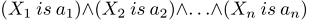

CConditions


[MQL5 Reference](index.md)  /  [Standard Library](standardlibrary.md)  /  [Mathematics](mathematics.md)  /  [Fuzzy Logic](fuzzy_logic.md)  /  [Fuzzy systems rules](fuzzy_rule.md) / CConditions

[](csingleconditionvar.md) 
[](cconditionsconditionslist.md)

CConditions

Class defines a set of fuzzy conditions connected to each other by an operator.  

Description

A set of fuzzy conditions connected to each other by an operator may be described as follows:



where:

* X = (X1, X2, X3 ... Xn) vector of input variables;

* a = (a1, a2, a3 ... an) vector of input variable values.

In this example, the and operator is used. Besides, the or operator is available in this class.

Declaration

```
   class CConditions : public ICondition
```

Title

```
   #include <Math\Fuzzy\fuzzyrule.mqh>
```

|  |
| --- |
| Inheritance hierarchy    [CObject](cobject.md)        ICondition            CConditions |

Class methods

| Class method | Description |
| --- | --- |
| [ConditionsList](cconditionsconditionslist.md) | Gets the list of all conditions |
| [Not](cconditionsnot.md) | Gets and sets the flag indicating whether it is necessary to apply negation to these conditions |
| [Op](cconditionsop.md) | Gets and sets a type of the conditions bundle operator. |

|  |
| --- |
| Methods inherited from class CObject  Prev, Prev, Next, Next, [Save](cobjectsave.md), [Load](cobjectload.md), [Type](cobjecttype.md), [Compare](cobjectcompare.md) |