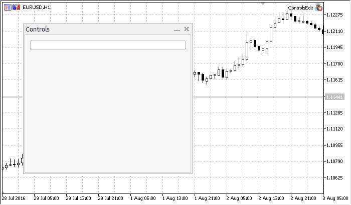

CEdit


[MQL5 Reference](index.md)  /  [Standard Library](standardlibrary.md)  /  [Panels and Dialogs](controls.md) / CEdit

[](cbuttononmouseup.md) 
[](ceditcreate.md)

CEdit

CEdit is class of the simple control based on "Edit" chart object.

Description

CEdit class in intended for creation of controls, in which the user can enter text.

Declaration

```
   class CEdit : public CWndObj
```

Title

```
   #include <Controls\Edit.mqh>
```

|  |
| --- |
| Inheritance hierarchy    [CObject](cobject.md)        [CWnd](cwnd.md)            [CWndObj](cwndobj.md)                CEdit |

Result of the [code](cedit.md#sample) provided below:



Class Methods by Groups

| Create |  |
| --- | --- |
| [Create](ceditcreate.md) | Creates control |
| Properties |  |
| [ReadOnly](ceditreadonly.md) | Gets/sets the "ReadOnly" property |
| [TextAlign](cedittextalign.md) | Gets/sets the "TextAlign" property |
| Chart object event handlers |  |
| [OnObjectEndEdit](ceditonobjectendedit.md) | The [CHARTEVENT\_OBJECT\_ENDEDIT](enum_chartevents.md) event handler (virtual) |
| Properties change event handlers |  |
| [OnSetText](ceditonsettext.md) | "SetText" event handler |
| [OnSetColor](ceditonsetcolor.md) | "SetColor" event handler |
| [OnSetColorBackground](ceditonsetcolorbackground.md) | "SetColorBackground" event handler |
| [OnSetColorBorder](ceditonsetcolorborder.md) | "SetColorBorder" event handler |
| [OnSetFont](ceditonsetfont.md) | "SetFont" event handler |
| [OnSetFontSize](ceditonsetfontsize.md) | "SetFontSize" event handler |
| [OnSetZOrder](ceditonsetzorder.md) | "SetZOrder" event handler |
| Internal event handlers |  |
| [OnCreate](ceditoncreate.md) | "Create" internal event handler |
| [OnShow](ceditonshow.md) | "Show" internal event handler |
| [OnHide](ceditonhide.md) | "Hide" internal event handler |
| [OnMove](ceditonmove.md) | "Move" internal event handler |
| [OnResize](ceditonresize.md) | "Resize" internal event handler |
| [OnChange](ceditonchange.md) | "Change" internal event handler |
| [OnClick](ceditonclick.md) | "Click" internal event handler |

| Methods inherited from class CObject  Prev, Prev, Next, Next, [Save](cobjectsave.md), [Load](cobjectload.md), [Type](cobjecttype.md), [Compare](cobjectcompare.md) |
| --- |
| Methods inherited from class CWnd  [Destroy](cwnddestroy.md), [OnMouseEvent](cwndonmouseevent.md), [Name](cwndname.md), [ControlsTotal](cwndcontrolstotal.md), [Control](cwndcontrol.md), [ControlFind](cwndcontrolfind.md), [Rect](cwndrect.md), [Left](cwndleft.md), [Left](cwndleft.md), [Top](cwndtop.md), [Top](cwndtop.md), [Right](cwndright.md), [Right](cwndright.md), [Bottom](cwndbottom.md), [Bottom](cwndbottom.md), [Width](cwndwidth.md), [Width](cwndwidth.md), [Height](cwndheight.md), [Height](cwndheight.md), Size, Size, Size, [Move](cwndmove.md), [Move](cwndmove.md), [Shift](cwndshift.md), [Contains](cwndcontains.md), [Contains](cwndcontains.md), [Alignment](cwndalignment.md), [Align](cwndalign.md), [Id](cwndid.md), [Id](cwndid.md), [IsEnabled](cwndisenabled.md), [Enable](cwndenable.md), [Disable](cwnddisable.md), [IsVisible](cwndisvisible.md), [Visible](cwndvisible.md), [Show](cwndshow.md), [Hide](cwndhide.md), [IsActive](cwndisactive.md), [Activate](cwndactivate.md), [Deactivate](cwnddeactivate.md), [StateFlags](cwndstateflags.md), [StateFlags](cwndstateflags.md), [StateFlagsSet](cwndstateflagsset.md), [StateFlagsReset](cwndstateflagsreset.md), [PropFlags](cwndpropflags.md), [PropFlags](cwndpropflags.md), [PropFlagsSet](cwndpropflagsset.md), [PropFlagsReset](cwndpropflagsreset.md), [MouseX](cwndmousex.md), [MouseX](cwndmousex.md), [MouseY](cwndmousey.md), [MouseY](cwndmousey.md), [MouseFlags](cwndmouseflags.md), [MouseFlags](cwndmouseflags.md), [MouseFocusKill](cwndmousefocuskill.md), BringToTop |
| Methods inherited from class CWndObj  [Text](cwndobjtext.md), [Text](cwndobjtext.md), [Color](cwndobjcolor.md), [Color](cwndobjcolor.md), [ColorBackground](cwndobjcolorbackground.md), [ColorBackground](cwndobjcolorbackground.md), [ColorBorder](cwndobjcolorborder.md), [ColorBorder](cwndobjcolorborder.md), [Font](cwndobjfont.md), [Font](cwndobjfont.md), [FontSize](cwndobjfontsize.md), [FontSize](cwndobjfontsize.md), [ZOrder](cwndobjzorder.md), [ZOrder](cwndobjzorder.md) |

Example of creating a panel with Edit control:

```
//+------------------------------------------------------------------+
//|                                                 ControlsEdit.mq5 |
//|                         Copyright 2000-2024, MetaQuotes Ltd. |
//|                                             https://www.mql5.com |
//+------------------------------------------------------------------+
#property copyright "Copyright 2017, MetaQuotes Software Corp."
#property link      "https://www.mql5.com"
#property version   "1.00"
#property description "Control Panels and Dialogs. Demonstration class CEdit"
#include <Controls\Dialog.mqh>
#include <Controls\Edit.mqh>
//+------------------------------------------------------------------+
//| defines                                                          |
//+------------------------------------------------------------------+
//--- indents and gaps
#define INDENT_LEFT                         (11)      // indent from left (with allowance for border width)
#define INDENT_TOP                          (11)      // indent from top (with allowance for border width)
#define INDENT_RIGHT                        (11)      // indent from right (with allowance for border width)
#define INDENT_BOTTOM                       (11)      // indent from bottom (with allowance for border width)
#define CONTROLS_GAP_X                      (5)       // gap by X coordinate
#define CONTROLS_GAP_Y                      (5)       // gap by Y coordinate
//--- for buttons
#define BUTTON_WIDTH                        (100)     // size by X coordinate
#define BUTTON_HEIGHT                       (20)      // size by Y coordinate
//--- for the indication area
#define EDIT_HEIGHT                         (20)      // size by Y coordinate
//--- for group controls
#define GROUP_WIDTH                         (150)     // size by X coordinate
#define LIST_HEIGHT                         (179)     // size by Y coordinate
#define RADIO_HEIGHT                        (56)      // size by Y coordinate
#define CHECK_HEIGHT                        (93)      // size by Y coordinate
//+------------------------------------------------------------------+
//| Class CControlsDialog                                            |
//| Usage: main dialog of the Controls application                   |
//+------------------------------------------------------------------+
class CControlsDialog : public CAppDialog
  {
private:
   CEdit             m_edit;                          // CEdit object
 
public:
                     CControlsDialog(void);
                    ~CControlsDialog(void);
   //--- create
   virtual bool      Create(const long chart,const string name,const int subwin,const int x1,const int y1,const int x2,const int y2);
   //--- chart event handler
 
protected:
   //--- create dependent controls
   bool              CreateEdit(void);
  };
//+------------------------------------------------------------------+
//| Constructor                                                      |
//+------------------------------------------------------------------+
CControlsDialog::CControlsDialog(void)
  {
  }
//+------------------------------------------------------------------+
//| Destructor                                                       |
//+------------------------------------------------------------------+
CControlsDialog::~CControlsDialog(void)
  {
  }
//+------------------------------------------------------------------+
//| Create                                                           |
//+------------------------------------------------------------------+
bool CControlsDialog::Create(const long chart,const string name,const int subwin,const int x1,const int y1,const int x2,const int y2)
  {
   if(!CAppDialog::Create(chart,name,subwin,x1,y1,x2,y2))
      return(false);
//--- create dependent controls
   if(!CreateEdit())
      return(false);
//--- succeed
   return(true);
  }
//+------------------------------------------------------------------+
//| Create the display field                                         |
//+------------------------------------------------------------------+
bool CControlsDialog::CreateEdit(void)
  {
//--- coordinates
   int x1=INDENT_LEFT;
   int y1=INDENT_TOP;
   int x2=ClientAreaWidth()-INDENT_RIGHT;
   int y2=y1+EDIT_HEIGHT;
//--- create
   if(!m_edit.Create(m_chart_id,m_name+"Edit",m_subwin,x1,y1,x2,y2))
      return(false);
//--- allow editing the content
   if(!m_edit.ReadOnly(false))
      return(false);
   if(!Add(m_edit))
      return(false);
//--- succeed
   return(true);
  }
//+------------------------------------------------------------------+
//| Global Variables                                                 |
//+------------------------------------------------------------------+
CControlsDialog ExtDialog;
//+------------------------------------------------------------------+
//| Expert initialization function                                   |
//+------------------------------------------------------------------+
int OnInit()
  {
//--- create application dialog
   if(!ExtDialog.Create(0,"Controls",0,40,40,380,344))
      return(INIT_FAILED);
//--- run application
   ExtDialog.Run();
//--- succeed
   return(INIT_SUCCEEDED);
  }
//+------------------------------------------------------------------+
//| Expert deinitialization function                                 |
//+------------------------------------------------------------------+
void OnDeinit(const int reason)
  {
//--- clear comments
   Comment("");
//--- destroy dialog
   ExtDialog.Destroy(reason);
  }
//+------------------------------------------------------------------+
//| Expert chart event function                                      |
//+------------------------------------------------------------------+
void OnChartEvent(const int id,         // event ID  
                  const long& lparam,   // event parameter of the long type
                  const double& dparam, // event parameter of the double type
                  const string& sparam) // event parameter of the string type
  {
   ExtDialog.ChartEvent(id,lparam,dparam,sparam);
  }
```