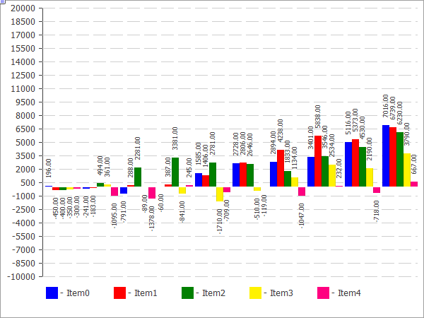

CHISTOGRAMCHART


[MQL5 Reference](index.md)  /  [Standard Library](standardlibrary.md)  /  [Custom Graphics](canvasgraphics.md) / CHistogramChart

[](cchartcanvasdrawchart.md) 
[](chistogramchartgradient.md)

CHistogramChart

Class for plotting histograms.

Description

All methods for working with the plotting of histograms are implemented in this class. They can be used to set the column width and for configuring the work with data series. The methods for working with gradient filling of histogram columns are included, which allow to visualize the data more clearly.



The code of the above figure is provided [below](chistogramchart.md#sample).

Declaration

```
   class CHistogramChart : public CChartCanvas
```

Title

```
   #include <Canvas\Charts\HistogramChart.mqh>
```

|  |
| --- |
| Inheritance hierarchy    [CCanvas](ccanvas.md)        [CChartCanvas](cchartcanvas.md)            CHistogramChart |

Class methods

| Method | Action |
| --- | --- |
| [Gradient](chistogramchartgradient.md) | Sets the flag indicating whether the gradient fill of the histogram columns will be applied. |
| [BarGap](chistogramchartbargap.md) | Set the value of the histogram offset from the origin. |
| [BarMinSize](chistogramchartbarminsize.md) | Sets the minimum width of the histogram columns. |
| [BarBorder](chistogramchartbarborder.md) | Sets the flag indicating the need to draw the border for each column. |
| [Create](chistogramchartcreate.md) | Virtual method that creates a graphical resource. |
| [SeriesAdd](chistogramchartseriesadd.md) | Adds a new data series. |
| [SeriesInsert](chistogramchartseriesinsert.md) | Inserts data series to the chart. |
| [SeriesUpdate](chistogramchartseriesupdate.md) | Updates data series on the chart. |
| [SeriesDelete](chistogramchartseriesdelete.md) | Deletes data series from the chart. |
| [ValueUpdate](chistogramchartvalueupdate.md) | Updates the element value in the specified series. |
| [DrawData](chistogramchartdrawdata.md) | Virtual method that plots a histogram for the specified series. |
| [DrawBar](chistogramchartdrawbar.md) | Draws a histogram column as a filled rectangle. |
| [GradientBrush](chistogramchartgradientbrush.md) | Creates a brush for the gradient fill. |

| Methods inherited from class CCanvas  [CreateBitmap](ccanvascreatebitmap.md), [CreateBitmap](ccanvascreatebitmap.md), [CreateBitmapLabel](ccanvascreatebitmaplabel.md), [CreateBitmapLabel](ccanvascreatebitmaplabel.md), [Attach](ccanvasattach.md), [Attach](ccanvasattach.md), [Destroy](ccanvasdestroy.md), [ChartObjectName](ccanvaschartobjectname.md), [ResourceName](ccanvasresourcename.md), [Width](ccanvaswidth.md), [Height](ccanvasheight.md), [Update](ccanvasupdate.md), [Resize](ccanvasresize.md), [Erase](ccanvaserase.md), [PixelGet](ccanvaspixelget.md), [PixelSet](ccanvaspixelset.md), [LineVertical](ccanvaslinevertical.md), [LineHorizontal](ccanvaslinehorizontal.md), [Line](ccanvasline.md), [Polyline](ccanvaspolyline.md), [Polygon](ccanvaspolygon.md), [Rectangle](ccanvasrectangle.md), [Triangle](ccanvastriangle.md), [Circle](ccanvascircle.md), [Ellipse](ccanvasellipse.md), [Arc](ccanvasarc.md), [Arc](ccanvasarc.md), [Arc](ccanvasarc.md), [Pie](ccanvaspie.md), [Pie](ccanvaspie.md), [FillRectangle](ccanvasfillrectangle.md), [FillTriangle](ccanvasfilltriangle.md), [FillPolygon](ccanvasfillpolygon.md), [FillCircle](ccanvasfillcircle.md), [FillEllipse](ccanvasfillellipse.md), [Fill](ccanvasfill.md), [Fill](ccanvasfill.md), [PixelSetAA](ccanvaspixelsetaa.md), [LineAA](ccanvaslineaa.md), [PolylineAA](ccanvaspolylineaa.md), [PolygonAA](ccanvaspolygonaa.md), [TriangleAA](ccanvastriangleaa.md), [CircleAA](ccanvascircleaa.md), [EllipseAA](ccanvasellipseaa.md), [LineWu](ccanvaslinewu.md), [PolylineWu](ccanvaspolylinewu.md), [PolygonWu](ccanvaspolygonwu.md), [TriangleWu](ccanvastrianglewu.md), [CircleWu](ccanvascirclewu.md), [EllipseWu](ccanvasellipsewu.md), [LineThickVertical](ccanvaslinethickvertical.md), [LineThickHorizontal](ccanvaslinethickhorizontal.md), [LineThick](ccanvaslinethick.md), [PolylineThick](ccanvaspolylinethick.md), [PolygonThick](ccanvaspolygonthick.md), [PolylineSmooth](ccanvaspolylinesmooth.md), [PolygonSmooth](ccanvaspolygonsmooth.md), [FontSet](ccanvasfontset.md), [FontNameSet](ccanvasfontnameset.md), [FontSizeSet](ccanvasfontsizeset.md), [FontFlagsSet](ccanvasfontflagsset.md), [FontAngleSet](ccanvasfontangleset.md), [FontGet](ccanvasfontget.md), [FontNameGet](ccanvasfontnameget.md), [FontSizeGet](ccanvasfontsizeget.md), [FontFlagsGet](ccanvasfontflagsget.md), [FontAngleGet](ccanvasfontangleget.md), [TextOut](ccanvastextout.md), [TextWidth](ccanvastextwidth.md), [TextHeight](ccanvastextheight.md), [TextSize](ccanvastextsize.md), [GetDefaultColor](ccanvasgetdefaultcolor.md), [TransparentLevelSet](ccanvastransparentlevelset.md), [LoadFromFile](ccanvasloadfromfile.md), LineStyleGet, [LineStyleSet](ccanvaslinestyleset.md) |
| --- |
| Methods inherited from class CChartCanvas  [ColorBackground](cchartcanvascolorbackground.md), [ColorBackground](cchartcanvascolorbackground.md), [ColorBorder](cchartcanvascolorborder.md), [ColorBorder](cchartcanvascolorborder.md), [ColorText](cchartcanvascolortext.md), [ColorText](cchartcanvascolortext.md), [ColorGrid](cchartcanvascolorgrid.md), [ColorGrid](cchartcanvascolorgrid.md), [MaxData](cchartcanvasmaxdata.md), [MaxData](cchartcanvasmaxdata.md), [MaxDescrLen](cchartcanvasmaxdescrlen.md), [MaxDescrLen](cchartcanvasmaxdescrlen.md), [AllowedShowFlags](cchartcanvasallowedshowflags.md), [ShowFlags](cchartcanvasshowflags.md), [ShowFlags](cchartcanvasshowflags.md), [IsShowLegend](cchartcanvasisshowlegend.md), [IsShowScaleLeft](cchartcanvasisshowscaleleft.md), [IsShowScaleRight](cchartcanvasisshowscaleright.md), [IsShowScaleTop](cchartcanvasisshowscaletop.md), [IsShowScaleBottom](cchartcanvasisshowscalebottom.md), [IsShowGrid](cchartcanvasisshowgrid.md), [IsShowDescriptors](cchartcanvasisshowdescriptors.md), [IsShowPercent](cchartcanvasisshowpercent.md), [ShowLegend](cchartcanvasshowlegend.md), [ShowScaleLeft](cchartcanvasshowscaleleft.md), [ShowScaleRight](cchartcanvasshowscaleright.md), [ShowScaleTop](cchartcanvasshowscaletop.md), [ShowScaleBottom](cchartcanvasshowscalebottom.md), [ShowGrid](cchartcanvasshowgrid.md), [ShowDescriptors](cchartcanvasshowdescriptors.md), [ShowValue](cchartcanvasshowvalue.md), [ShowPercent](cchartcanvasshowpercent.md), [LegendAlignment](cchartcanvaslegendalignment.md), [Accumulative](cchartcanvasaccumulative.md), [VScaleMin](cchartcanvasvscalemin.md), [VScaleMin](cchartcanvasvscalemin.md), [VScaleMax](cchartcanvasvscalemax.md), [VScaleMax](cchartcanvasvscalemax.md), [NumGrid](cchartcanvasnumgrid.md), [NumGrid](cchartcanvasnumgrid.md), [VScaleParams](cchartcanvasvscaleparams.md), [DataOffset](cchartcanvasdataoffset.md), [DataOffset](cchartcanvasdataoffset.md), [DataTotal](cchartcanvasdatatotal.md), [DescriptorUpdate](cchartcanvasdescriptorupdate.md), [ColorUpdate](cchartcanvascolorupdate.md) |

Example

```
//+------------------------------------------------------------------+
//|                                         HistogramChartSample.mq5 |
//|                   Copyright 2009-2017, MetaQuotes Software Corp. |
//|                                              http://www.mql5.com |
//+------------------------------------------------------------------+
#property copyright   "2009-2017, MetaQuotes Software Corp."
#property link        "http://www.mql5.com"
#property description "Example of using histogram"
//---
#include <Canvas\Charts\HistogramChart.mqh>
//+------------------------------------------------------------------+
//| inputs                                                           |
//+------------------------------------------------------------------+
input bool Accumulative=true;
//+------------------------------------------------------------------+
//| Script program start function                                    |
//+------------------------------------------------------------------+
int OnStart(void)
  {
   int k=100;
   double arr[10];
//--- create chart
   CHistogramChart chart;
   if(!chart.CreateBitmapLabel("SampleHistogramChart",10,10,600,450))
     {
      Print("Error creating histogram chart: ",GetLastError());
      return(-1);
     }
   if(Accumulative)
     {
      chart.Accumulative();
      chart.VScaleParams(20*k*10,-10*k*10,20);
     }
   else
      chart.VScaleParams(20*k,-10*k,20);
   chart.ShowValue(true);
   chart.ShowScaleTop(false);
   chart.ShowScaleBottom(false);
   chart.ShowScaleRight(false);
   chart.ShowLegend();
   for(int j=0;j<5;j++)
     {
      for(int i=0;i<10;i++)
        {
         k=-k;
         if(k>0)
            arr[i]=k*(i+10-j);
         else
            arr[i]=k*(i+10-j)/2;
        }
      chart.SeriesAdd(arr,"Item"+IntegerToString(j));
     }
//--- play with values
   while(!IsStopped())
     {
      int i=rand()%5;
      int j=rand()%10;
      k=rand()%3000-1000;
      chart.ValueUpdate(i,j,k);
      Sleep(200);
     }
//--- finish
   chart.Destroy();
   return(0);
  }
```