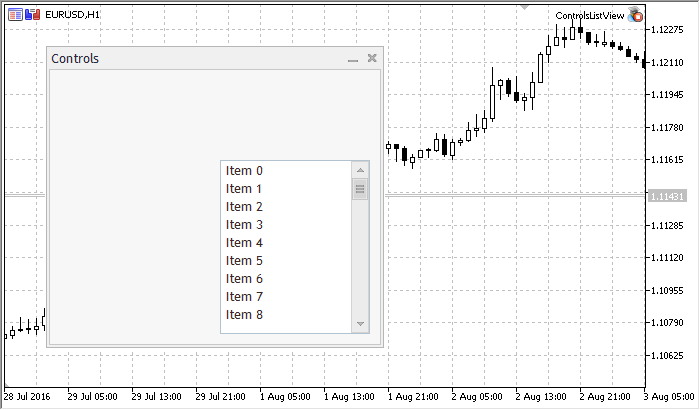

CListView


[MQL5 Reference](index.md)  /  [Standard Library](standardlibrary.md)  /  [Panels and Dialogs](controls.md) / CListView

[](cwndclientrebound.md) 
[](clistviewcreate.md)

CListView

CListView is a class of the ListView complex control (with dependent controls).

Description

CListView class encapsulates list-control functionality.

Declaration

```
   class CListView : public CWndClient
```

Title

```
   #include <Controls\ListView.mqh>
```

|  |
| --- |
| Inheritance hierarchy    [CObject](cobject.md)        [CWnd](cwnd.md)            [CWndContainer](cwndcontainer.md)                [CWndClient](cwndclient.md)                    CListView |

Result of the [code](clistview.md#sample) provided below:



Class Methods by Groups

| Create |  |
| --- | --- |
| [Create](clistviewcreate.md) | Creates control |
| Chart event handlers |  |
| [OnEvent](clistviewonevent.md) | Event handler of all chart events |
| Settings |  |
| [TotalView](clistviewtotalview.md) | Sets the number of items shown on the control |
| Add/Delete |  |
| [AddItem](clistviewadditem.md) | Adds an item to control list |
| Data |  |
| [Select](clistviewselect.md) | Selects current list element by index |
| [SelectByText](clistviewselectbytext.md) | Selects current list element by text |
| [SelectByValue](clistviewselectbyvalue.md) | Selects current list element by value |
| Read-only data |  |
| [Value](clistviewvalue.md) | Gets the value of the current list element |
| Dependent controls |  |
| [CreateRow](clistviewcreaterow.md) | Creates a row of the ListView |
| Internal event handlers |  |
| [OnResize](clistviewonresize.md) | "Resize" internal event handler (virtual) |
| Dependent controls event handlers |  |
| [OnVScrollShow](clistviewonvscrollshow.md) | "Show" internal event handler (virtual) of VScroll dependent control |
| [OnVScrollHide](clistviewonvscrollhide.md) | "Hide" internal event handler (virtual) of VScroll dependent control |
| [OnScrollLineDown](clistviewonscrolllinedown.md) | "ScrollLineDown" internal event handler (virtual) of VScroll dependent control |
| [OnScrollLineUp](clistviewonscrolllineup.md) | "ScrollLineUp" internal event handler (virtual) of VScroll dependent control |
| [OnItemClick](clistviewonitemclick.md) | "ItemClick" internal event handler (virtual) |
| Redraw |  |
| [Redraw](clistviewredraw.md) | Redraws the control |
| [RowState](clistviewrowstate.md) | Sets the state of the specified row |
| [CheckView](clistviewcheckview.md) | Checks the "visibility" of the specified row |

| Methods inherited from class CObject  Prev, Prev, Next, Next, [Type](cobjecttype.md), [Compare](cobjectcompare.md) |
| --- |
| Methods inherited from class CWnd  [Name](cwndname.md), [ControlsTotal](cwndcontrolstotal.md), [Control](cwndcontrol.md), [Rect](cwndrect.md), [Left](cwndleft.md), [Left](cwndleft.md), [Top](cwndtop.md), [Top](cwndtop.md), [Right](cwndright.md), [Right](cwndright.md), [Bottom](cwndbottom.md), [Bottom](cwndbottom.md), [Width](cwndwidth.md), [Width](cwndwidth.md), [Height](cwndheight.md), [Height](cwndheight.md), Size, Size, Size, [Contains](cwndcontains.md), [Contains](cwndcontains.md), [Alignment](cwndalignment.md), [Align](cwndalign.md), [Id](cwndid.md), [IsEnabled](cwndisenabled.md), [IsVisible](cwndisvisible.md), [Visible](cwndvisible.md), [IsActive](cwndisactive.md), [Activate](cwndactivate.md), [Deactivate](cwnddeactivate.md), [StateFlags](cwndstateflags.md), [StateFlags](cwndstateflags.md), [StateFlagsSet](cwndstateflagsset.md), [StateFlagsReset](cwndstateflagsreset.md), [PropFlags](cwndpropflags.md), [PropFlags](cwndpropflags.md), [PropFlagsSet](cwndpropflagsset.md), [PropFlagsReset](cwndpropflagsreset.md), [MouseX](cwndmousex.md), [MouseX](cwndmousex.md), [MouseY](cwndmousey.md), [MouseY](cwndmousey.md), [MouseFlags](cwndmouseflags.md), [MouseFlags](cwndmouseflags.md), [MouseFocusKill](cwndmousefocuskill.md), BringToTop |
| Methods inherited from class CWndContainer  [OnMouseEvent](cwndcontaineronmouseevent.md), [ControlsTotal](cwndcontainercontrolstotal.md), [Control](cwndcontainercontrol.md), [ControlFind](cwndcontainercontrolfind.md), [MouseFocusKill](cwndcontainermousefocuskill.md), [Add](cwndcontaineradd.md), [Add](cwndcontaineradd.md), [Delete](cwndcontainerdelete.md), [Delete](cwndcontainerdelete.md), [Move](cwndcontainermove.md), [Move](cwndcontainermove.md), [Shift](cwndcontainershift.md), [Enable](cwndcontainerenable.md), [Disable](cwndcontainerdisable.md), [Hide](cwndcontainerhide.md), [Save](cwndcontainersave.md), [Load](cwndcontainerload.md) |
| Methods inherited from class CWndClient  [ColorBackground](cwndclientcolorbackground.md), [ColorBorder](cwndclientcolorborder.md), [BorderType](cwndclientbordertype.md), [VScrolled](cwndclientvscrolled.md), [VScrolled](cwndclientvscrolled.md), [HScrolled](cwndclienthscrolled.md), [HScrolled](cwndclienthscrolled.md), Id |

Example of creating a panel with list view control:

```
//+------------------------------------------------------------------+
//|                                             ControlsListView.mq5 |
//|                         Copyright 2000-2024, MetaQuotes Ltd. |
//|                                             https://www.mql5.com |
//+------------------------------------------------------------------+
#property copyright "Copyright 2017, MetaQuotes Software Corp."
#property link      "https://www.mql5.com"
#property version   "1.00"
#property description "Control Panels and Dialogs. Demonstration class CListView"
#include <Controls\Dialog.mqh>
#include <Controls\ListView.mqh>
//+------------------------------------------------------------------+
//| defines                                                          |
//+------------------------------------------------------------------+
//--- indents and gaps
#define INDENT_LEFT                         (11)      // indent from left (with allowance for border width)
#define INDENT_TOP                          (11)      // indent from top (with allowance for border width)
#define INDENT_RIGHT                        (11)      // indent from right (with allowance for border width)
#define INDENT_BOTTOM                       (11)      // indent from bottom (with allowance for border width)
#define CONTROLS_GAP_X                      (5)       // gap by X coordinate
#define CONTROLS_GAP_Y                      (5)       // gap by Y coordinate
//--- for buttons
#define BUTTON_WIDTH                        (100)     // size by X coordinate
#define BUTTON_HEIGHT                       (20)      // size by Y coordinate
//--- for the indication area
#define EDIT_HEIGHT                         (20)      // size by Y coordinate
//--- for group controls
#define GROUP_WIDTH                         (150)     // size by X coordinate
#define LIST_HEIGHT                         (179)     // size by Y coordinate
#define RADIO_HEIGHT                        (56)      // size by Y coordinate
#define CHECK_HEIGHT                        (93)      // size by Y coordinate
//+------------------------------------------------------------------+
//| Class CControlsDialog                                            |
//| Usage: main dialog of the Controls application                   |
//+------------------------------------------------------------------+
class CControlsDialog : public CAppDialog
  {
private:
   CListView         m_list_view;                     // CListView object
 
public:
                     CControlsDialog(void);
                    ~CControlsDialog(void);
   //--- create
   virtual bool      Create(const long chart,const string name,const int subwin,const int x1,const int y1,const int x2,const int y2);
   //--- chart event handler
   virtual bool      OnEvent(const int id,const long &lparam,const double &dparam,const string &sparam);
 
protected:
   //--- create dependent controls
   bool              CreateListView(void);
   //--- handlers of the dependent controls events
   void              OnChangeListView(void);
  };
//+------------------------------------------------------------------+
//| Event Handling                                                   |
//+------------------------------------------------------------------+
EVENT_MAP_BEGIN(CControlsDialog)
ON_EVENT(ON_CHANGE,m_list_view,OnChangeListView)
EVENT_MAP_END(CAppDialog)
//+------------------------------------------------------------------+
//| Constructor                                                      |
//+------------------------------------------------------------------+
CControlsDialog::CControlsDialog(void)
  {
  }
//+------------------------------------------------------------------+
//| Destructor                                                       |
//+------------------------------------------------------------------+
CControlsDialog::~CControlsDialog(void)
  {
  }
//+------------------------------------------------------------------+
//| Create                                                           |
//+------------------------------------------------------------------+
bool CControlsDialog::Create(const long chart,const string name,const int subwin,const int x1,const int y1,const int x2,const int y2)
  {
   if(!CAppDialog::Create(chart,name,subwin,x1,y1,x2,y2))
      return(false);
//--- create dependent controls
   if(!CreateListView())
      return(false);
//--- succeed
   return(true);
  }
//+------------------------------------------------------------------+
//| Create the "ListView" element                                    |
//+------------------------------------------------------------------+
bool CControlsDialog::CreateListView(void)
  {
//--- coordinates
   int x1=INDENT_LEFT+GROUP_WIDTH+2*CONTROLS_GAP_X;
   int y1=INDENT_TOP+(EDIT_HEIGHT+CONTROLS_GAP_Y)+
          (BUTTON_HEIGHT+CONTROLS_GAP_Y)+
          (EDIT_HEIGHT+2*CONTROLS_GAP_Y);
   int x2=x1+GROUP_WIDTH;
   int y2=y1+LIST_HEIGHT-CONTROLS_GAP_Y;
//--- create
   if(!m_list_view.Create(m_chart_id,m_name+"ListView",m_subwin,x1,y1,x2,y2))
      return(false);
   if(!Add(m_list_view))
      return(false);
//--- fill out with strings
   for(int i=0;i<16;i++)
      if(!m_list_view.AddItem("Item "+IntegerToString(i)))
         return(false);
//--- succeed
   return(true);
  }
//+------------------------------------------------------------------+
//| Event handler                                                    |
//+------------------------------------------------------------------+
void CControlsDialog::OnChangeListView(void)
  {
   Comment(__FUNCTION__+" \""+m_list_view.Select()+"\"");
  }
//+------------------------------------------------------------------+
//| Global Variables                                                 |
//+------------------------------------------------------------------+
CControlsDialog ExtDialog;
//+------------------------------------------------------------------+
//| Expert initialization function                                   |
//+------------------------------------------------------------------+
int OnInit()
  {
//--- create application dialog
   if(!ExtDialog.Create(0,"Controls",0,40,40,380,344))
      return(INIT_FAILED);
//--- run application
   ExtDialog.Run();
//--- succeed
   return(INIT_SUCCEEDED);
  }
//+------------------------------------------------------------------+
//| Expert deinitialization function                                 |
//+------------------------------------------------------------------+
void OnDeinit(const int reason)
  {
//--- clear comments
   Comment("");
//--- destroy dialog
   ExtDialog.Destroy(reason);
  }
//+------------------------------------------------------------------+
//| Expert chart event function                                      |
//+------------------------------------------------------------------+
void OnChartEvent(const int id,         // event ID  
                  const long& lparam,   // event parameter of the long type
                  const double& dparam, // event parameter of the double type
                  const string& sparam) // event parameter of the string type
  {
   ExtDialog.ChartEvent(id,lparam,dparam,sparam);
  }
```