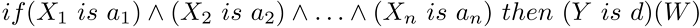

CMamdaniFuzzyRule


[MQL5 Reference](index.md)  /  [Standard Library](standardlibrary.md)  /  [Mathematics](mathematics.md)  /  [Fuzzy Logic](fuzzy_logic.md)  /  [Fuzzy systems rules](fuzzy_rule.md) / CMamdaniFuzzyRule

[](fuzzy_rule.md) 
[](cmamdanifuzzyruleconclusion.md)

CMamdaniFuzzyRule

Mamdani-type fuzzy inference one of the two basic types of fuzzy systems. Output variable values are set using fuzzy terms.

Description

Fuzzy logic rule for the Mamdani algorithm can be described as follows:



where:

* X = (X1, X2, X3 ... Xn) vector of input variables;
* Y output variable;
* a = (a1, a2, a3 ... an) vector of input variable values;
* d output variable value;
* W rule weight.

Declaration

```
   class CMamdaniFuzzyRule : public CGenericFuzzyRule
```

Title

```
   #include <Math\Fuzzy\fuzzyrule.mqh>
```

|  |
| --- |
| Inheritance hierarchy    [CObject](cobject.md)        IParsableRule            [CGenericFuzzyRule](cgenericfuzzyrule.md)                CMamdaniFuzzyRule |

Class methods

| Class method | Description |
| --- | --- |
| [Conclusion](cmamdanifuzzyruleconclusion.md) | Gets and sets the Mamdani fuzzy rule conclusion |
| [Weight](cmamdanifuzzyruleweight.md) | Gets and sets the Mamdani fuzzy rule weight |

| Methods inherited from class CObject  Prev, Prev, Next, Next, [Save](cobjectsave.md), [Load](cobjectload.md), [Type](cobjecttype.md), [Compare](cobjectcompare.md) |
| --- |
| Methods inherited from class CGenericFuzzyRule  [Condition](cgenericfuzzyrulecondition.md), [Condition](cgenericfuzzyrulecondition.md), [CreateCondition](cgenericfuzzyrulecreatecondition.md), [CreateCondition](cgenericfuzzyrulecreatecondition.md), [CreateCondition](cgenericfuzzyrulecreatecondition.md) |