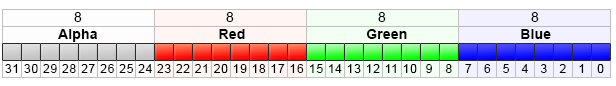

ColorToARGB


[MQL5 Reference](index.md)  /  [Conversion Functions](convert.md) / ColorToARGB

[](structtochararray.md) 
[](colortoprgb.md)

ColorToARGB

The function converts [color](color.md) type into [uint](integertypes.md#uint) type to get ARGB representation of the color. ARGB color format is used to generate a [graphical resource](resources.md), [text display](textout.md), as well as for CCanvas standard library class.

```
uint  ColorToARGB(
   color  clr,          // converted color in color format
   uchar  alpha=255     // alpha channel managing color transparency
   );
```

Parameters

clr

[in]  Color value in color type variable.

alpha

[in]  The value of the alpha channel used to receive the color in [ARGB](resourcecreate.md) format. The value may be set from 0 (a color of a foreground pixel does not change the display of an underlying one) up to 255 (a color of an underlying pixel is completely replaced by the foreground pixel's one). Color transparency in percentage terms is calculated as (1-alpha/255)*100%. In other words, the lesser value of the alpha channel leads to more transparent color.

Return Value

Presenting the color in ARGB format where Alfa, Red, Green, Blue (alpha channel, red, green, blue) values are set in series in four uint type bytes.

Note

RGB is a basic and commonly used format for pixel color description on a screen in computer graphics. Names of basic colors are used to set red, green and blue color components. Each component is described by one byte specifying the color saturation in the range of 0 to 255 (0x00 to 0XFF in hexadecimal format). Since the white color contains all colors, it is described as 0xFFFFFF, that is, each one of three components is presented by the maximum value of 0xFF.

However, some tasks require to specify the color transparency to describe the look of an image in case it is covered by the color with some degree of transparency. The concept of alpha channel is introduced for such cases. It is implemented as an additional component of RGB format. ARGB format structure is shown below.



ARGB values are typically expressed using hexadecimal format with each pair of digits representing the values of Alpha, Red, Green and Blue channels, respectively. For example, 80FFFF00 color represents 50.2% opaque yellow. Initially, 0x80 sets 50.2% alpha value, as it is 50.2% of 0xFF value. Then, the first FF pair defines the highest value of the red component; the next FF pair is like the previous but for the green component; the final 00 pair represents the lowest value the blue component can have (absence of blue). Combination of green and red colors yields yellow one. If the alpha channel is not used, the entry can be reduced down to 6 RRGGBB digits, this is why the alpha channel values are stored in the top bits of uint integer type.

Depending on the context, hexadecimal digits can be written with '0x' or '#' prefix, for example, 80FFFF00, 0x80FFFF00 or #80FFFF00.

 

Example:

```
//+------------------------------------------------------------------+
//| Script program start function                                    |
//+------------------------------------------------------------------+
void OnStart()
  {
//--- set transparency
   uchar alpha=0x55;  // 0x55 means 55/255=21.6 % of transparency   
   //--- derive conversion to ARGB for clrBlue color
   PrintFormat("0x%.8X - clrBlue",clrBlue);
   PrintFormat("0x%.8X - clrBlue ARGB with alpha=0x55 (transparency 21.6%%)",ColorToARGB(clrBlue,alpha));
   //--- derive conversion to ARGB for clrGreen color
   PrintFormat("0x%.8X - clrGreen",clrGreen);
   PrintFormat("0x%.8X - clrGreen ARGB with alpha=0x55 (transparency 21.6%%)",ColorToARGB(clrGreen,alpha));
   //--- derive conversion to ARGB for clrRed color
   PrintFormat("0x%.8X - clrRed",clrRed);
   PrintFormat("0x%.8X - clrRed ARGB with alpha=0x55 (transparency 21.6%%)",ColorToARGB(clrRed,alpha));
  }
```

See also

[Resources](resources.md), [ResourceCreate()](resourcecreate.md), [TextOut()](textout.md), [color type](color.md), [char, short, int and long types](integertypes.md)