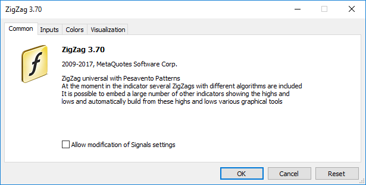
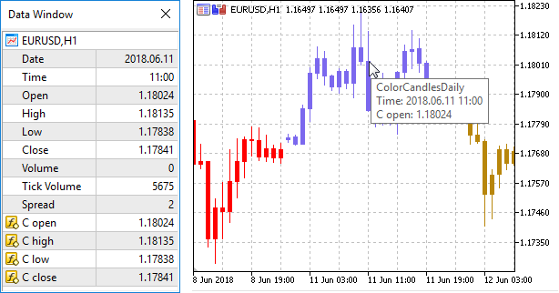

Program Properties (#property)


[MQL5 Reference](index.md)  /  [Language Basics](basis.md)  /  [Preprocessor](preprosessor.md) / Program Properties (#property)

[](constant.md) 
[](include.md)

Program Properties (#property)

Every mql5-program allows to specify additional specific parameters named #property that help client terminal in proper servicing for programs without the necessity to launch them explicitly. This concerns external settings of indicators, first of all. Properties described in included files are completely ignored. Properties must be specified in the main mq5-file.

```
#property identifier value
```

The compiler will write declared values in the configuration of the module executed.

| Constant | Type | Description |
| --- | --- | --- |
| icon | [string](stringconst.md) | Path to the file of an image that will be used as an icon of the EX5 program. Path specification rules are the same as for [resources](resources.md). The property must be specified in the main module with the MQL5 source code. The icon file must be in the [ICO](https://en.wikipedia.org/wiki/ICO_%28file_format%29 "ICO (File format)") format. |
| link | [string](stringconst.md) | Link to the company website |
| copyright | [string](stringconst.md) | The company name |
| version | [string](stringconst.md) | Program version, maximum 31 characters |
| description | [string](stringconst.md) | Brief text description of a mql5-program. Several description can be present, each of them describes one line of the text. The total length of all description can not exceed 511 characters including line feed. |
| stacksize | [int](integertypes.md) | MQL5 program [stack](local.md#stack) size. The stack of sufficient size is necessary when executing function recursive calls.  When launching a script or an Expert Advisor on the chart, the stack of at least 8 MB is allocated. In case of indicators, the stack size is always fixed and equal to 1 MB.  When a program is launched in the strategy tester, the stack of 16 MB is always allocated for it. |
| library |  | A library; no start function is assigned, functions with [the export modifier](export.md) can be [imported](import.md) in other mql5-programs |
| indicator\_applied\_price | [int](integertypes.md) | Specifies the default value for the ["Apply to"](icustom.md#applyto) field. You can specify one of the values of [ENUM\_APPLIED\_PRICE](prices.md#enum_applied_price_enum). If the property is not specified, the default value is PRICE\_CLOSE |
| indicator\_chart\_window |  | Show the indicator in the chart window |
| indicator\_separate\_window |  | Show the indicator in a separate window |
| indicator\_height | [int](integertypes.md) | Fixed height of the indicator subwindow in pixels (property [INDICATOR\_HEIGHT](customindicatorproperties.md#enum_customind_property_integer)) |
| indicator\_buffers | [int](integertypes.md) | Number of buffers for indicator calculation |
| indicator\_plots | [int](integertypes.md) | Number of [graphic series](drawstyles.md) in the indicator |
| indicator\_minimum | [double](double.md) | The bottom scaling limit for a separate indicator window |
| indicator\_maximum | [double](double.md) | The top scaling limit for a separate indicator window |
| indicator\_labelN | [string](stringconst.md) | Sets a label for the N-th [graphic series](drawstyles.md) displayed in DataWindow. For graphic series requiring multiple indicator buffers (DRAW\_CANDLES, DRAW\_FILLING and others), the label names are defined using the separator ';'. |
| indicator\_colorN | [color](color.md) | The color for displaying line N, where N is the number of [graphic series](drawstyles.md); numbering starts from 1 |
| indicator\_widthN | [int](integertypes.md) | Line thickness in [graphic series](drawstyles.md), where N is the number of graphic series; numbering starts from 1 |
| indicator\_styleN | [int](integertypes.md) | Line style in [graphic series](drawstyles.md), specified by the values of [ENUM\_LINE\_STYLE](drawstyles.md#enum_line_style). N is the number of graphic series; numbering starts from 1 |
| indicator\_typeN | [int](integertypes.md) | Type of graphical plotting, specified by the values of [ENUM\_DRAW\_TYPE](drawstyles.md#enum_draw_type). N is the number of graphic series; numbering starts from 1 |
| indicator\_levelN | [double](double.md) | Horizontal level of N in a separate indicator window |
| indicator\_levelcolor | [color](color.md) | Color of horizontal levels of the indicator |
| indicator\_levelwidth | [int](integertypes.md) | Thickness of horizontal levels of the indicator |
| indicator\_levelstyle | [int](integertypes.md) | Style of horizontal levels of the indicator |
| script\_show\_confirm |  | Display a confirmation window before running the script |
| script\_show\_inputs |  | Display a window with the properties before running the script and disable this confirmation window |
| tester\_indicator | [string](stringconst.md) | Name of a custom indicator in the format of "indicator\_name.ex5". Indicators that require testing are defined automatically from the call of the [iCustom()](icustom.md) function, if the corresponding parameter is set through a constant string. For all other cases (use of the [IndicatorCreate()](indicatorcreate.md) function or use of a non-constant string in the parameter that sets the indicator name) this property is required |
| tester\_file | [string](stringconst.md) | File name for a tester with the indication of extension, in double quotes (as a constant string). The specified file will be passed to tester. Input files to be tested, if there are necessary ones, must always be specified. |
| tester\_library | [string](stringconst.md) | Library name with the extension, in double quotes. A library can have 'dll' or 'ex5' as file extension. Libraries that require testing are defined automatically. However, if any of libraries is used by a [custom](customind.md) indicator, this property is required |
| tester\_set | [string](stringconst.md) | Name of the set file with the values ​​and the step of the input parameters. The file is passed to tester before testing and optimization. The file name is specified with an extension and double quotes as a constant string.     If you specify the EA name and the version number as "<expert\_name>\_<number>.set" in a set file name, then it is automatically added to the parameter versions download menu under the <number> version number. For example, the name "MACD Sample\_4.set" means that this is a set file for the "MACD Sample.mq5" EA with the version number equal to 4.     To study the format, we recommend that you manually save the test/optimization settings in the strategy tester and then open the set file created in this way. |
| tester\_no\_cache | [string](stringconst.md) | When performing [optimization](https://www.metatrader5.com/en/terminal/help/algotrading/strategy_optimization), the strategy tester saves all results of executed passes to the [optimization cache](https://www.metatrader5.com/en/terminal/help/algotrading/strategy_optimization#cache), in which the test result is saved for each set of the [input parameters](https://www.metatrader5.com/en/terminal/help/algotrading/strategy_optimization#inputs). This allows using the ready-made results during re-optimization on the same parameters without wasting time on re-calculation.     But in some tasks (for example, in math calculations), it may be necessary to carry out calculations regardless of the availability of ready-made results in the optimization cache. In this case, the file should include the tester\_no\_cache property. The test results are still stored in the cache, so that you can see all the data on performed passes in the strategy tester. |
| tester\_everytick\_calculate | [string](stringconst.md) | In the Strategy Tester, indicators are only calculated when their data are accessed, i.e. when the values of indicator buffers are requested. This provides a significantly faster testing and optimization speed, if you do not need to obtain indicator values on each tick.     By specifying the tester\_everytick\_calculate property, you can enable the forced calculation of the indicator on [every tick](https://www.metatrader5.com/en/terminal/help/algotrading/tick_generation#tick_mode).     Indicators in the Strategy Tester are also forcibly calculated on every tick in the following cases:   * when testing in the [visual mode](https://www.metatrader5.com/en/terminal/help/algotrading/visualization); * if the indicator has any of the following functions: [EventChartCustom](eventchartcustom.md), [OnChartEvent](onchartevent.md), [OnTimer](ontimer.md); * if the indicator was created using the compiler with [build number](compilemacros.md) below 1916.      This feature only applies in the Strategy Tester, while in the terminal indicators are always calculated on each received tick. |
| optimization\_chart\_mode | [string](stringconst.md) | Specifies the chart type and the names of two [input parameters](inputvariables.md) which will be used for the visualization of optimization results. For example, "3d, InpX, InpY" means that the results will be shown in a 3D chart with the coordinate axes based on the tested InpX and InpY parameter values. Thus, the property enables the specification of parameters that will be used to display the optimization chart and the chart type, directly in the program code.  Possible options:   * "3d, input\_parameter\_name1, input\_parameter\_name2" means a [3D visualization chart](https://www.metatrader5.com/en/terminal/help/algotrading/strategy_optimization#2d), which can be rotated, zoomed in and out. The chart is built using two parameters. * "2d, input\_parameter\_name1, input\_parameter\_name2" means a 2D grid chart, in which each cell is painted in a certain color depending on the result. The chart is built using two parameters. * "1d, input\_parameter\_name1, input\_parameter\_name2" means a [linear chart](https://www.metatrader5.com/en/terminal/help/algotrading/strategy_optimization#1d), in which the results are sorted by the specified parameter. Each pass is displayed as a point. The chart is built based on one parameter. * "0d, input\_parameter\_name1, input\_parameter\_name2" means a regular chart with results sorted by the pass result arrival time. Each pass is displayed as a point in the chart. Parameter indication is not required, but the specified parameters can be used for the manual switch to other chart types.   Optionally, you can indicate only the chart type, without specifying one or two input parameters. In this case, the terminal will select the required parameters to show the optimization chart. |

Sample Task of Description and Version Number

```
#property version     "3.70"      // Current version of the Expert Advisor
#property description "ZigZag universal with Pesavento Patterns"
#property description "At the moment in the indicator several ZigZags with different algorithms are included"
#property description "It is possible to embed a large number of other indicators showing the highs and"
#property description "lows and automatically build from these highs and lows various graphical tools"
```



 

Examples of Specifying a Separate Label for Each Indicator Buffer ( "C open; C high; C low; C close")

```
#property indicator_chart_window
#property indicator_buffers 4
#property indicator_plots   1
#property indicator_type1   DRAW_CANDLES
#property indicator_width1  3
#property indicator_label1  "C open;C high;C low;C close"
```

