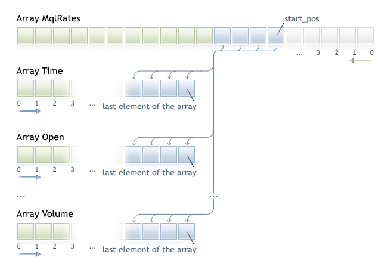

CopySeries


[MQL5 Reference](index.md)  /  [Timeseries and Indicators Access](series.md) / CopySeries

[](copyrates.md) 
[](copytime.md)

CopySeries

Gets the synchronized timeseries from the [MqlRates](mqlrates.md) structure for the specified symbol-period and the specified amount. The data is received into the specified set of arrays. Elements are counted down from the present to the past, which means that the starting position equal to 0 means the current bar.



If the data amount to be copied is unknown, it is recommended to use the [dynamic array](dynamic_array.md) for the receiving arrays, since if the data amount exceeds what an array can contain, this can cause the attempt to redistribute the array to fit all of the requested data.

If you need to copy a predetermined amount of data, it is recommended to use a [statistically allocated buffer](dynamic_array.md#static_array) to avoid unnecessary memory reallocation.

The property of the receiving array as\_series=true or as\_series=false will be ignored: during copying, the oldest timeseries element will be copied to the beginning of the physical memory allocated for the array.

```
int  CopySeries(
   string           symbol_name,       // symbol name
   ENUM_TIMEFRAMES  timeframe,         // period
   int              start_pos,         // start position
   int              count,             // amount to copy
   ulong            rates_mask,        // combination of flags to specify the requested series
   void&            array1[],          // array to receive the data of the first copies timeseries
   void&            array2[]           // array to receive the data of the second copied timeseries
   ...
   );
```

Parameters

symbol\_name

[in]  Symbol.

timeframe

[in]  Period.

start\_pos

[in]  First copied element index.

count

[in]  Number of copied elements.

rates\_mask

[in]  A combination of flags from the [ENUM\_COPY\_RATES](matrix_copyrates.md#enum_copy_rates) enumeration.

array1, array2,...

[out]  Array of the appropriate type to receive the timeseries from the [MqlRates](mqlrates.md) structure. The order of the arrays passed to the function must match the order of the fields in the MqlRates structure.

Return Value

The number of copied elements or -1 if [error](errorcodes.md) occurs.

Note

If the entire interval of the requested data is beyond the data available on the server, the function returns -1. If the requested data is beyond [TERMINAL\_MAXBARS](terminalstatus.md) (the maximum number of bars on the chart), the function also returns -1.

When requesting data from an indicator, the function immediately returns -1 if requested timeseries are not constructed yet or they should be downloaded from the server. However, this will initiate data download/constructing itself.

When requesting data from an Expert Advisor or a script, [download from the server](timeseries_access.md#synchronized) is initiated if the terminal does not have the appropriate data locally, or construction of the necessary timeseries starts if the data can be constructed from the local history but they are not ready yet. The function returns the amount of data that is ready by the time the timeout expires, however the history download continues, and the function returns more data during the next similar request.

 

Difference between CopySeries and CopyRates

The CopySeries function allows obtaining only the necessary timeseries into different specified arrays during one call, while all of timeseries data will be synchronized. This means that all values in the resulting arrays at a certain index N will belong to the same bar on the specified Symbol/Timeframe pair. Therefore, there is no need for the programmer to ensure the synchronization of all received timeseries by the bar opening time.

Unlike CopyRates, which returns the full set of timeseries as an MqlRates array, the CopySeries function allows the programmer to get only the required timeseries as separate arrays. This can be done by specifying a combination of flags to select the type of timeseries. The order of the arrays passed to the function must match the order of the fields in the [MqlRates](mqlrates.md) structure:

```
struct MqlRates
  {
   datetime time;         // period start time
   double   open;         // open price
   double   high;         // high price for the period
   double   low;          // low price for the period
   double   close;        // close price
   long     tick_volume;  // tick volume
   int      spread;       // spread
   long     real_volume;  // exchange volume
  }
```

Thus, if you need to get the values of the time, close and real\_volume timeseries for the last 100 bars of the current Symbol/Timeframe, you should use the following call:

```
datetime time[];
double   close[];
long     volume[];
CopySeries(NULL,0,0,100,COPY_RATES_TIME|COPY_RATES_CLOSE|COPY_RATES_VOLUME_REAL,time,close,volume);
```

Mind the order of the arrays "time, close, volume" it must match the order of the fields in the  [MqlRates](mqlrates.md) structure. The order of values in the rates\_mask does not matter. The mask could be as follows:

```
COPY_RATES_VOLUME_REAL|COPY_RATES_TIME|COPY_RATES_CLOSE
```

 

Example:

```
//--- input parameters
input datetime InpDateFrom=D'2022.01.01 00:00:00';
input datetime InpDateTo  =D'2023.01.01 00:00:00';
input uint     InpCount   =20;
//+------------------------------------------------------------------+
//| Script program start function                                    |
//+------------------------------------------------------------------+
void OnStart(void)
  {
//--- arrays to get timeseries from the MqlRates price structure
   double   open[];
   double   close[];
   float    closef[];
   datetime time1[], time2[];
//--- request close prices to a double array
   ResetLastError();
   int res1=CopySeries(NULL, PERIOD_CURRENT, 0, InpCount,
                       COPY_RATES_TIME|COPY_RATES_CLOSE, time1, close);
   PrintFormat("1. CopySeries  returns %d values. Error code=%d", res1, GetLastError());
   ArrayPrint(close);
  
//--- now also request open prices; use float array for close prices
   ResetLastError();
   int res2=CopySeries(NULL, PERIOD_CURRENT, 0, InpCount,
                       COPY_RATES_TIME|COPY_RATES_CLOSE|COPY_RATES_OPEN, time2, open, closef);
   PrintFormat("2. CopySeries  returns %d values. Error code=%d", res2, GetLastError());
   ArrayPrint(closef);
//--- Compare the received data
   if((res1==res2) && (time1[0]==time2[0]))
     {
      Print("  | Time             |    Open      | Close double | Close float |");
      for(int i=0; i<10; i++)
        {
         PrintFormat("%d | %s |   %.5f    |   %.5f    |   %.5f   |",
                     i, TimeToString(time1[i]), open[i], close[i], closef[i]);
        }
     }
//--- Result
 1. CopySeries  returns 20 values. Error code=0
 [ 0] 1.06722 1.06733 1.06653 1.06520 1.06573 1.06649 1.06694 1.06675 1.06684 1.06604
 [10] 1.06514 1.06557 1.06456 1.06481 1.06414 1.06394 1.06364 1.06386 1.06239 1.06247
 2. CopySeries  returns 20 values. Error code=0
 [ 0] 1.06722 1.06733 1.06653 1.06520 1.06573 1.06649 1.06694 1.06675 1.06684 1.06604
 [10] 1.06514 1.06557 1.06456 1.06481 1.06414 1.06394 1.06364 1.06386 1.06239 1.06247
   | Time             |    Open      | Close double | Close float |
 0 | 2023.03.01 17:00 |   1.06660    |   1.06722    |   1.06722   |
 1 | 2023.03.01 18:00 |   1.06722    |   1.06733    |   1.06733   |
 2 | 2023.03.01 19:00 |   1.06734    |   1.06653    |   1.06653   |
 3 | 2023.03.01 20:00 |   1.06654    |   1.06520    |   1.06520   |
 4 | 2023.03.01 21:00 |   1.06520    |   1.06573    |   1.06573   |
 5 | 2023.03.01 22:00 |   1.06572    |   1.06649    |   1.06649   |
 6 | 2023.03.01 23:00 |   1.06649    |   1.06694    |   1.06694   |
 7 | 2023.03.02 00:00 |   1.06683    |   1.06675    |   1.06675   |
 8 | 2023.03.02 01:00 |   1.06675    |   1.06684    |   1.06684   |
 9 | 2023.03.02 02:00 |   1.06687    |   1.06604    |   1.06604   |
//---
  }
```

 

See also

[Structures and classes](classes.md), [CopyRates](copyrates.md)