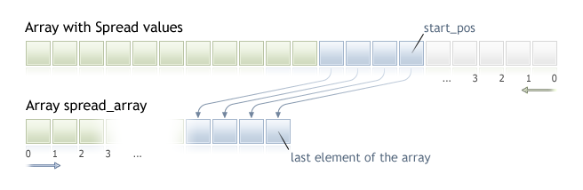

CopySpread


[MQL5 Reference](index.md)  /  [Timeseries and Indicators Access](series.md) / CopySpread

[](copyrealvolume.md) 
[](copyticks.md)

CopySpread

The function gets into spread\_array the history data of spread values for the selected symbol-period pair in the specified quantity. It should be noted that elements ordering is from present to past, i.e., starting position of 0 means the current bar.



When copying the yet unknown amount of data, it is recommended to use [dynamic array](dynamic_array.md) as a target array, because if the requested data count is less (or more) than the length of the target array, function tries to reallocate the memory so that the requested data fit entirely.

If you know the amount of data you need to copy, it should better be done to a [statically allocated buffer](dynamic_array.md#static_array), in order to prevent the allocation of excessive memory.

No matter what is the property of the target array - as\_series=true or as\_series=false. Data will be copied so that the oldest element will be located at the start of the physical memory allocated for the array. There are 3 variants of function calls.

Call by the first position and the number of required elements

```
int  CopySpread(
   string           symbol_name,      // symbol name
   ENUM_TIMEFRAMES  timeframe,        // period
   int              start_pos,        // start position
   int              count,            // data count to copy
   int              spread_array[]    // target array for spread values
   );
```

Call by the start date and the number of required elements

```
int  CopySpread(
   string           symbol_name,      // symbol name
   ENUM_TIMEFRAMES  timeframe,        // period
   datetime         start_time,       // start date and time
   int              count,            // data count to copy
   int              spread_array[]    // target array for spread values
   );
```

Call by the start and end dates of a required time interval

```
int  CopySpread(
   string           symbol_name,      // symbol name
   ENUM_TIMEFRAMES  timeframe,        // period
   datetime         start_time,       // start date and time
   datetime         stop_time,        // stop date and time
   int              spread_array[]    // target array for spread values
   );
```

Parameters

symbol\_name

[in]  Symbol name.

timeframe

[in]  Period.

start\_pos

[in]  The start position for the first element to copy.

count

[in]  Data count to copy.

start\_time

[in]  The start time for the first element to copy.

stop\_time

[in]  Bar time, corresponding to the last element to copy.

spread\_array[]

[out]  Array of [int](integertypes.md) type.

Return Value

Returns the copied data count or -1 in case of an [error](errorcodes.md).

Note

If the whole interval of requested data is out of the available data on the server, the function returns -1. If data outside [TERMINAL\_MAXBARS](terminalstatus.md) (maximal number of bars on the chart) is requested, the function will also return -1.

When requesting data from the indicator, if requested timeseries are not yet built or they need to be downloaded from the server, the function will immediately return -1, but the process of downloading/building will be initiated.

When requesting data from an Expert Advisor or script, [downloading from the server](timeseries_access.md#synchronized) will be initiated, if  the terminal does not have these data locally, or building of a required timeseries will start, if data can be built from the local history but they are not ready yet. The function will return the amount of data that will be ready by the moment of timeout expiration, but history downloading will continue, and at the next similar request the function will return more data.

When requesting data by the start date and the number of required elements, only data whose date is less than (earlier) or equal to the date specified will be returned. It means, the open time of any bar, for which value is returned (volume, spread, value on the indicator buffer, prices Open, High, Low, Close or open time Time) is always less or equal to the specified one.

When requesting data in a specified range of dates, only data from this interval will be returned. The interval is set and counted up to seconds. It means, the open time of any bar, for which value is returned (volume, spread, value on the indicator buffer, prices Open, High, Low, Close or open time Time) is always within the requested interval.

Thus, if the current day is Saturday, at the attempt to copy data on a week timeframe specifying start\_time=Last\_Tuesday and stop\_time=Last\_Friday the function will return 0, because the open time on a week timeframe is always Sunday, but one week bar does not fall into the specified interval.

If you need to return value corresponding to the current uncompleted bar, you can use the first form of call specifying start\_pos=0 and count=1.

Example:

```
#property indicator_separate_window
#property indicator_buffers 1
#property indicator_plots   1
//---- plot Spread
#property indicator_label1  "Spread"
#property indicator_type1   DRAW_HISTOGRAM
#property indicator_color1  clrRed
#property indicator_style1  STYLE_SOLID
#property indicator_width1  1
//--- input parameters
input int      bars=3000;
//--- indicator buffers
double         SpreadBuffer[];
//+------------------------------------------------------------------+
//| Custom indicator initialization function                         |
//+------------------------------------------------------------------+
void OnInit()
  {
//--- indicator buffers mapping
   SetIndexBuffer(0,SpreadBuffer,INDICATOR_DATA);
   IndicatorSetInteger(INDICATOR_DIGITS,0);
//---
  }
//+------------------------------------------------------------------+
//| Custom indicator iteration function                              |
//+------------------------------------------------------------------+
int OnCalculate(const int rates_total,
                 const int prev_calculated,
                 const datetime &time[],
                 const double &open[],
                 const double &high[],
                 const double &low[],
                 const double &close[],
                 const long &tick_volume[],
                 const long &volume[],
                 const int &spread[])
  {
//---
   if(prev_calculated==0)
     {
      int spread_int[];
      ArraySetAsSeries(spread_int,true);
      int spreads=CopySpread(Symbol(),0,0,bars,spread_int);
      Print("We have received the following number of Spread values: ",spreads);
      for (int i=0;i<spreads;i++) 
      {
      SpreadBuffer[rates_total-1-i]=spread_int[i];
      if(i<=30) Print("spread["+i+"] = ",spread_int[i]);
      }
     }
   else
     {
      double Ask,Bid;
      Ask=SymbolInfoDouble(Symbol(),SYMBOL_ASK);
      Bid=SymbolInfoDouble(Symbol(),SYMBOL_BID);
      Comment("Ask = ",Ask,"  Bid = ",Bid);
      SpreadBuffer[rates_total-1]=(Ask-Bid)/Point();
     }
//--- return value of prev_calculated for next call
   return(rates_total);
  }
```

See an example of history data requesting in section [Methods of Object Binding](enum_anchorpoint.md). The script available in that section shows how to get the values of indicator [iFractals](ifractals.md) on the last 1000 bars and how to display the last 10 up and 10 down fractals on the chart. A similar technique can be used for all indicators that have missing data and that are usually drawn using the following [styles](indicators_examples.md):

* [DRAW\_SECTION](draw_section.md),
* [DRAW\_ARROW](draw_arrow.md),
* [DRAW\_ZIGZAG](draw_zigzag.md),
* [DRAW\_COLOR\_SECTION](draw_color_section.md),
* [DRAW\_COLOR\_ARROW](draw_color_arrow.md),
* [DRAW\_COLOR\_ZIGZAG](draw_color_zigzag.md).