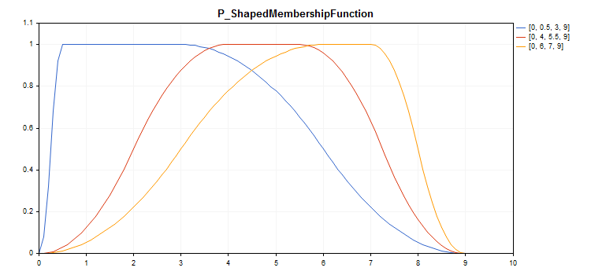

CP\_ShapedMembershipFunction


[MQL5 Reference](index.md)  /  [Standard Library](standardlibrary.md)  /  [Mathematics](mathematics.md)  /  [Fuzzy Logic](fuzzy_logic.md)  /  [Membership functions](fuzzy_membership.md) / CP\_ShapedMembershipFunction

[](cnormalmembershipfunctiongetvalue.md) 
[](cp_shapedmembershipfunctiona.md)

CP\_ShapedMembershipFunction

Class for implementing a pi-shaped membership function with the A, B, C and D parameters.  

Description

The pi-shaped membership function has the form of a curvilinear trapezoid. The function is used to set asymmetric membership functions with a smooth transition from pessimistic to optimistic fuzzy number assessment.  



[A sample code](cp_shapedmembershipfunction.md#sample) for plotting a chart is displayed below.

Declaration

```
   class CP_ShapedMembershipFuncion : public IMembershipFunction
```

Title

```
   #include <Math\Fuzzy\membershipfunction.mqh>
```

|  |
| --- |
| Inheritance hierarchy    [CObject](cobject.md)        [IMembershipFunction](imembershipfunction.md)            CP\_ShapedMembershipFunction |

Class methods

| Class method | Description |
| --- | --- |
| [A](cp_shapedmembershipfunctiona.md) | Gets and sets the parameter of the fuzzy set beginning. |
| [B](cp_shapedmembershipfunctionb.md) | Gets and sets the first parameter of the fuzzy set core. |
| [C](cp_shapedmembershipfunctionc.md) | Gets and sets the second parameter of the fuzzy set core. |
| [D](cp_shapedmembershipfunctiond.md) | Gets and sets the parameter of the fuzzy set end. |
| [GetValue](cp_shapedmembershipfunctiongetvalue.md) | Calculates the value of the membership function by a specified argument. |

|  |
| --- |
| Methods inherited from class CObject  Prev, Prev, Next, Next, [Save](cobjectsave.md), [Load](cobjectload.md), [Type](cobjecttype.md), [Compare](cobjectcompare.md) |

Example

```
//+------------------------------------------------------------------+
//|                                   P_ShapedMembershipFunction.mq5 |
//|                        Copyright 2016, MetaQuotes Software Corp. |
//|                                             https://www.mql5.com |
//+------------------------------------------------------------------+
#include <Math\Fuzzy\membershipfunction.mqh>
#include <Graphics\Graphic.mqh>
//--- Create membership functions
CP_ShapedMembershipFunction func1(0,0.5,3,9);
CP_ShapedMembershipFunction func2(0,4,5.5,9);
CP_ShapedMembershipFunction func3(0,6,7,9);
//--- Create wrappers for membership functions
double P_ShapedMembershipFunction1(double x) { return(func1.GetValue(x)); }
double P_ShapedMembershipFunction2(double x) { return(func2.GetValue(x)); }
double P_ShapedMembershipFunction3(double x) { return(func3.GetValue(x)); }
//+------------------------------------------------------------------+
//| Script program start function                                    |
//+------------------------------------------------------------------+
void OnStart()
  {
//--- create graphic
   CGraphic graphic;
   if(!graphic.Create(0,"P_ShapedMembershipFunction",0,30,30,780,380))
     {
      graphic.Attach(0,"P_ShapedMembershipFunction");
     }
   graphic.HistoryNameWidth(70);
   graphic.BackgroundMain("P_ShapedMembershipFunction");
   graphic.BackgroundMainSize(16);
//--- create curve
   graphic.CurveAdd(P_ShapedMembershipFunction1,0.0,10.0,0.1,CURVE_LINES,"[0, 0.5, 3, 9]");
   graphic.CurveAdd(P_ShapedMembershipFunction2,0.0,10.0,0.1,CURVE_LINES,"[0, 4, 5.5, 9]");
   graphic.CurveAdd(P_ShapedMembershipFunction3,0.0,10.0,0.1,CURVE_LINES,"[0, 6, 7, 9]");
//--- sets the X-axis properties
   graphic.XAxis().AutoScale(false);
   graphic.XAxis().Min(0.0);
   graphic.XAxis().Max(10.0);
   graphic.XAxis().DefaultStep(1.0);
//--- sets the Y-axis properties
   graphic.YAxis().AutoScale(false);
   graphic.YAxis().Min(0.0);
   graphic.YAxis().Max(1.1);
   graphic.YAxis().DefaultStep(0.2);
//--- plot
   graphic.CurvePlotAll();
   graphic.Update();
  }
```