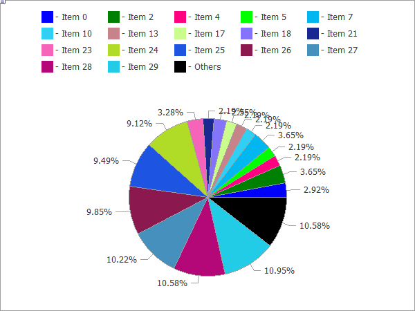

CPIECHART


[MQL5 Reference](index.md)  /  [Standard Library](standardlibrary.md)  /  [Custom Graphics](canvasgraphics.md) / CPieChart

[](clinechartcalcarea.md) 
[](cpiechartcreate.md)

CPieChart

Class for plotting pie charts.



The code of the above figure is provided [below](cpiechart.md#sample).

Description

The methods included in this class are designed for full-scale operation with pie charts, from the creating a graphical resource to designing labels to segments.

Declaration

```
   class CPieChart : public CChartCanvas
```

Title

```
   #include <Canvas\Charts\PieChart.mqh>
```

|  |
| --- |
| Inheritance hierarchy    [CCanvas](ccanvas.md)        [CChartCanvas](cchartcanvas.md)            CPieChart |

Class methods

| Method | Action |
| --- | --- |
| [Create](cpiechartcreate.md) | Virtual method that creates a graphical resource. |
| [SeriesSet](cpiechartseriesset.md) | Sets a series of values that will be shows on the pie chart. |
| [ValueAdd](cpiechartvalueadd.md) | Adds a new value to the pie chart (to the end). |
| [ValueInsert](cpiechartvalueinsert.md) | Inserts a new value to the pie chart (at the specified position). |
| [ValueUpdate](cpiechartvalueupdate.md) | Updates the value on the pie chart (at the specified position). |
| [ValueDelete](cpiechartvaluedelete.md) | Removes a value from the pie chart (at the specified position). |
| [DrawChart](cpiechartdrawchart.md) | Virtual method which draws a pie chart and all its elements. |
| [DrawPie](cpiechartdrawpie.md) | Draws a segment of the pie chart, which corresponds to a specified value. |
| [LabelMake](cpiechartlabelmake.md) | Generates a segment label based on its value and the original label. |

| Methods inherited from class CCanvas  [CreateBitmap](ccanvascreatebitmap.md), [CreateBitmap](ccanvascreatebitmap.md), [CreateBitmapLabel](ccanvascreatebitmaplabel.md), [CreateBitmapLabel](ccanvascreatebitmaplabel.md), [Attach](ccanvasattach.md), [Attach](ccanvasattach.md), [Destroy](ccanvasdestroy.md), [ChartObjectName](ccanvaschartobjectname.md), [ResourceName](ccanvasresourcename.md), [Width](ccanvaswidth.md), [Height](ccanvasheight.md), [Update](ccanvasupdate.md), [Resize](ccanvasresize.md), [Erase](ccanvaserase.md), [PixelGet](ccanvaspixelget.md), [PixelSet](ccanvaspixelset.md), [LineVertical](ccanvaslinevertical.md), [LineHorizontal](ccanvaslinehorizontal.md), [Line](ccanvasline.md), [Polyline](ccanvaspolyline.md), [Polygon](ccanvaspolygon.md), [Rectangle](ccanvasrectangle.md), [Triangle](ccanvastriangle.md), [Circle](ccanvascircle.md), [Ellipse](ccanvasellipse.md), [Arc](ccanvasarc.md), [Arc](ccanvasarc.md), [Arc](ccanvasarc.md), [Pie](ccanvaspie.md), [Pie](ccanvaspie.md), [FillRectangle](ccanvasfillrectangle.md), [FillTriangle](ccanvasfilltriangle.md), [FillPolygon](ccanvasfillpolygon.md), [FillCircle](ccanvasfillcircle.md), [FillEllipse](ccanvasfillellipse.md), [Fill](ccanvasfill.md), [Fill](ccanvasfill.md), [PixelSetAA](ccanvaspixelsetaa.md), [LineAA](ccanvaslineaa.md), [PolylineAA](ccanvaspolylineaa.md), [PolygonAA](ccanvaspolygonaa.md), [TriangleAA](ccanvastriangleaa.md), [CircleAA](ccanvascircleaa.md), [EllipseAA](ccanvasellipseaa.md), [LineWu](ccanvaslinewu.md), [PolylineWu](ccanvaspolylinewu.md), [PolygonWu](ccanvaspolygonwu.md), [TriangleWu](ccanvastrianglewu.md), [CircleWu](ccanvascirclewu.md), [EllipseWu](ccanvasellipsewu.md), [LineThickVertical](ccanvaslinethickvertical.md), [LineThickHorizontal](ccanvaslinethickhorizontal.md), [LineThick](ccanvaslinethick.md), [PolylineThick](ccanvaspolylinethick.md), [PolygonThick](ccanvaspolygonthick.md), [PolylineSmooth](ccanvaspolylinesmooth.md), [PolygonSmooth](ccanvaspolygonsmooth.md), [FontSet](ccanvasfontset.md), [FontNameSet](ccanvasfontnameset.md), [FontSizeSet](ccanvasfontsizeset.md), [FontFlagsSet](ccanvasfontflagsset.md), [FontAngleSet](ccanvasfontangleset.md), [FontGet](ccanvasfontget.md), [FontNameGet](ccanvasfontnameget.md), [FontSizeGet](ccanvasfontsizeget.md), [FontFlagsGet](ccanvasfontflagsget.md), [FontAngleGet](ccanvasfontangleget.md), [TextOut](ccanvastextout.md), [TextWidth](ccanvastextwidth.md), [TextHeight](ccanvastextheight.md), [TextSize](ccanvastextsize.md), [GetDefaultColor](ccanvasgetdefaultcolor.md), [TransparentLevelSet](ccanvastransparentlevelset.md), [LoadFromFile](ccanvasloadfromfile.md), LineStyleGet, [LineStyleSet](ccanvaslinestyleset.md) |
| --- |
| Methods inherited from class CChartCanvas  [ColorBackground](cchartcanvascolorbackground.md), [ColorBackground](cchartcanvascolorbackground.md), [ColorBorder](cchartcanvascolorborder.md), [ColorBorder](cchartcanvascolorborder.md), [ColorText](cchartcanvascolortext.md), [ColorText](cchartcanvascolortext.md), [ColorGrid](cchartcanvascolorgrid.md), [ColorGrid](cchartcanvascolorgrid.md), [MaxData](cchartcanvasmaxdata.md), [MaxData](cchartcanvasmaxdata.md), [MaxDescrLen](cchartcanvasmaxdescrlen.md), [MaxDescrLen](cchartcanvasmaxdescrlen.md), [AllowedShowFlags](cchartcanvasallowedshowflags.md), [ShowFlags](cchartcanvasshowflags.md), [ShowFlags](cchartcanvasshowflags.md), [IsShowLegend](cchartcanvasisshowlegend.md), [IsShowScaleLeft](cchartcanvasisshowscaleleft.md), [IsShowScaleRight](cchartcanvasisshowscaleright.md), [IsShowScaleTop](cchartcanvasisshowscaletop.md), [IsShowScaleBottom](cchartcanvasisshowscalebottom.md), [IsShowGrid](cchartcanvasisshowgrid.md), [IsShowDescriptors](cchartcanvasisshowdescriptors.md), [IsShowPercent](cchartcanvasisshowpercent.md), [ShowLegend](cchartcanvasshowlegend.md), [ShowScaleLeft](cchartcanvasshowscaleleft.md), [ShowScaleRight](cchartcanvasshowscaleright.md), [ShowScaleTop](cchartcanvasshowscaletop.md), [ShowScaleBottom](cchartcanvasshowscalebottom.md), [ShowGrid](cchartcanvasshowgrid.md), [ShowDescriptors](cchartcanvasshowdescriptors.md), [ShowValue](cchartcanvasshowvalue.md), [ShowPercent](cchartcanvasshowpercent.md), [LegendAlignment](cchartcanvaslegendalignment.md), [Accumulative](cchartcanvasaccumulative.md), [VScaleMin](cchartcanvasvscalemin.md), [VScaleMin](cchartcanvasvscalemin.md), [VScaleMax](cchartcanvasvscalemax.md), [VScaleMax](cchartcanvasvscalemax.md), [NumGrid](cchartcanvasnumgrid.md), [NumGrid](cchartcanvasnumgrid.md), [VScaleParams](cchartcanvasvscaleparams.md), [DataOffset](cchartcanvasdataoffset.md), [DataOffset](cchartcanvasdataoffset.md), [DataTotal](cchartcanvasdatatotal.md), [DescriptorUpdate](cchartcanvasdescriptorupdate.md), [ColorUpdate](cchartcanvascolorupdate.md) |

 

Example

```
//+------------------------------------------------------------------+
//|                                               PieChartSample.mq5 |
//|                   Copyright 2009-2017, MetaQuotes Software Corp. |
//|                                              http://www.mql5.com |
//+------------------------------------------------------------------+
#property copyright   "2009-2017, MetaQuotes Software Corp."
#property link        "http://www.mql5.com"
#property description "Example of using pie chart"
//---
#include <Canvas\Charts\PieChart.mqh>
//+------------------------------------------------------------------+
//| inputs                                                           |
//+------------------------------------------------------------------+
input int      Width=600;
input int      Height=450;
//+------------------------------------------------------------------+
//| Script program start function                                    |
//+------------------------------------------------------------------+
int OnStart(void)
  {
//--- check
   if(Width<=0 || Height<=0)
     {
      Print("Too simple.");
      return(-1);
     }
//--- create chart
   CPieChart pie_chart;
   if(!pie_chart.CreateBitmapLabel("PieChart",10,10,Width,Height))
     {
      Print("Error creating pie chart: ",GetLastError());
      return(-1);
     }
   pie_chart.ShowPercent();
//--- draw
   for(uint i=0;i<30;i++)
     {
      pie_chart.ValueAdd(100*(i+1),"Item "+IntegerToString(i));
      Sleep(10);
     }
   Sleep(2000);
//--- disable legend
   pie_chart.LegendAlignment(ALIGNMENT_LEFT);
   Sleep(2000);
//--- disable legend
   pie_chart.LegendAlignment(ALIGNMENT_RIGHT);
   Sleep(2000);
//--- disable legend
   pie_chart.LegendAlignment(ALIGNMENT_TOP);
   Sleep(2000);
//--- disable legend
   pie_chart.ShowLegend(false);
   Sleep(2000);
//--- disable percentage
   pie_chart.ShowPercent(false);
   Sleep(2000);
//--- disable descriptors
   pie_chart.ShowDescriptors(false);
   Sleep(2000);
//--- enable all
   pie_chart.ShowLegend();
   pie_chart.ShowValue();
   pie_chart.ShowDescriptors();
   Sleep(2000);
//--- or like this
   pie_chart.ShowFlags(FLAG_SHOW_LEGEND|FLAG_SHOW_DESCRIPTORS|FLAG_SHOW_PERCENT);
   uint total=pie_chart.DataTotal();
//--- play with values
   for(uint i=0;i<total && !IsStopped();i++)
     {
      pie_chart.ValueUpdate(i,100*(rand()%10+1));
      Sleep(1000);
     }
//--- play with colors
   for(uint i=0;i<total && !IsStopped();i++)
     {
      pie_chart.ColorUpdate(i%total,RandomRGB());
      Sleep(1000);
     }
//--- rotate
   while(!IsStopped())
     {
      pie_chart.DataOffset(pie_chart.DataOffset()+1);
      Sleep(200);
     }
//--- finish
   pie_chart.Destroy();
   return(0);
  }
//+------------------------------------------------------------------+
//| Random RGB color                                                 |
//+------------------------------------------------------------------+
uint RandomRGB(void)
  {
   return(XRGB(rand()%255,rand()%255,rand()%255));
  }
```