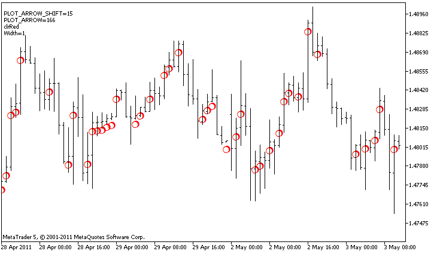

DRAW\_ARROW


[MQL5 Reference](index.md)  /  [Custom Indicators](customind.md)  /  [Indicator Styles in Examples](indicators_examples.md) / DRAW\_ARROW

[](draw_histogram2.md) 
[](draw_zigzag.md)

DRAW\_ARROW

The DRAW\_ARROW style draws arrows of the specified color (symbols of the set [Wingdings](wingdings.md)) based on the value of the indicator buffer. The width and color of the symbols can be specified like for the [DRAW\_LINE](draw_none.md) style - using [compiler directives](compilation.md) or dynamically using the [PlotIndexSetInteger()](plotindexsetinteger.md) function. Dynamic changes of the plotting properties allows changing the look of an indicator based on the current situation.

The symbol code is set using the [PLOT\_ARROW](customindicatorproperties.md#enum_customind_property_integer) property.

```
//--- Define the symbol code from the Wingdings font to draw in PLOT_ARROW
   PlotIndexSetInteger(0,PLOT_ARROW,code);
```

The default value of PLOT\_ARROW=159 (a circle).

Each arrow is actually a symbol that has the height and the anchor point, and can cover some important information on a chart (for example, the closing price at the bar). Therefore, we can additionally specify the vertical shift in pixels, which does not depend on the scale of the chart. The arrows will be shifted down by the specified number of pixels, although the values of the indicator will remain the same:

```
//--- Set the vertical shift of arrows in pixels
   PlotIndexSetInteger(0,PLOT_ARROW_SHIFT,shift);
```

A negative value of PLOT\_ARROW\_SHIFT means the shift of arrows upwards, a positive values shifts the arrow down.

The DRAW\_ARROW style can be used in a separate subwindow of a chart and in its main window. Empty values are not drawn and do not appear in the "Data Window", all the values in the indicator buffers should be set explicitly. Buffers are not initialized with a zero value.

```
//--- Set an empty value
   PlotIndexSetDouble(index_of_plot_DRAW_ARROW,PLOT_EMPTY_VALUE,0);
```

The number of buffers required for plotting DRAW\_ARROW is 1.

An example of the indicator, which draws arrows on each bar with the close price higher than the close price of the previous bar. The color, width, shift and symbol code of all arrows are changed randomly every N ticks.



In the example, for plot1 with the DRAW\_ARROW style, the properties, color and size are specified using the compiler directive [#property](compilation.md), and then in the [OnCalculate()](oncalculate.md) function the properties are set randomly. The N parameter is set in [external parameters](inputvariables.md) of the indicator for the possibility of manual configuration (the Parameters tab in the indicator's Properties window).

```
//+------------------------------------------------------------------+
//|                                                   DRAW_ARROW.mq5 |
//|                        Copyright 2011, MetaQuotes Software Corp. |
//|                                              https://www.mql5.com |
//+------------------------------------------------------------------+
#property copyright "Copyright 2000-2024, MetaQuotes Ltd."
#property link      "https://www.mql5.com"
#property version   "1.00"
 
#property description "An indicator to demonstrate DRAW_ARROW"
#property description "Draws arrows set by Unicode characters, on a chart"
#property description "The color, size, shift and symbol code of the arrow are changed in a random way"
#property description "after every N ticks"
#property description "The code parameter sets the base value: code=159 (a circle)"
 
#property indicator_chart_window
#property indicator_buffers 1
#property indicator_plots   1
//--- plot Arrows
#property indicator_label1  "Arrows"
#property indicator_type1   DRAW_ARROW
#property indicator_color1  clrGreen
#property indicator_width1  1
//--- input parameters
input int      N=5;         // Number of ticks to change 
input ushort   code=159;    // Symbol code to draw in DRAW_ARROW
//--- An indicator buffer for the plot
double         ArrowsBuffer[];
//--- An array to store colors
color colors[]={clrRed,clrBlue,clrGreen};
//+------------------------------------------------------------------+
//| Custom indicator initialization function                         |
//+------------------------------------------------------------------+
int OnInit()
  {
//--- indicator buffers mapping
   SetIndexBuffer(0,ArrowsBuffer,INDICATOR_DATA);
//--- Define the symbol code for drawing in PLOT_ARROW
   PlotIndexSetInteger(0,PLOT_ARROW,code);
//--- Set the vertical shift of arrows in pixels
   PlotIndexSetInteger(0,PLOT_ARROW_SHIFT,5);
//--- Set as an empty value 0
   PlotIndexSetDouble(0,PLOT_EMPTY_VALUE,0);
//---
   return(INIT_SUCCEEDED);
  }
//+------------------------------------------------------------------+
//| Custom indicator iteration function                              |
//+------------------------------------------------------------------+
int OnCalculate(const int rates_total,
                const int prev_calculated,
                const datetime &time[],
                const double &open[],
                const double &high[],
                const double &low[],
                const double &close[],
                const long &tick_volume[],
                const long &volume[],
                const int &spread[])
  {
   static int ticks=0;
//--- Calculate ticks to change the color, size, shift and code of the arrow
   ticks++;
//--- If a critical number of ticks has been accumulated
   if(ticks>=N)
     {
      //--- Change the line properties
      ChangeLineAppearance();
      //--- Reset the counter of ticks to zero
      ticks=0;
     }
 
//--- Block for calculating indicator values
   int start=1;
   if(prev_calculated>0) start=prev_calculated-1;
//--- Calculation loop
   for(int i=1;i<rates_total;i++)
     {
      //--- If the current Close price is higher than the previous one, draw an arrow
      if(close[i]>close[i-1])
         ArrowsBuffer[i]=close[i];
      //--- Otherwise specify the zero value
      else
         ArrowsBuffer[i]=0;
     }
//--- return value of prev_calculated for next call
   return(rates_total);
  }
//+------------------------------------------------------------------+
//| Change the appearance of symbols in the indicator                |
//+------------------------------------------------------------------+
void ChangeLineAppearance()
  {
//--- A string for the formation of information about the indicator properties
   string comm="";
//--- A block for changing the arrow color
   int number=MathRand(); // Get a random number
//--- The divisor is equal to the size of the colors[] array
   int size=ArraySize(colors);
//--- Get the index to select a new color as the remainder of integer division
   int color_index=number%size;
//--- Set the color as the PLOT_LINE_COLOR property
   PlotIndexSetInteger(0,PLOT_LINE_COLOR,colors[color_index]);
//--- Write the line color
   comm=comm+"\r\n"+(string)colors[color_index];
 
//--- A block for changing the size arrows
   number=MathRand();
//--- Get the width of the remainder of integer division
   int width=number%5;   // The size is set from 0 to 4
//--- Set the color as the PLOT_LINE_WIDTH property
   PlotIndexSetInteger(0,PLOT_LINE_WIDTH,width);
//--- Write the arrow size
   comm=comm+"\r\nWidth="+IntegerToString(width);
 
//--- A block for changing the arrow code (PLOT_ARROW)
   number=MathRand();
//--- Get the remainder of integer division to calculate a new code of the arrow (from 0 to 19)
   int code_add=number%20;
//--- Set the new symbol code as the result of code+code_add
   PlotIndexSetInteger(0,PLOT_ARROW,code+code_add);
//--- Write the symbol code PLOT_ARROW
   comm="\r\n"+"PLOT_ARROW="+IntegerToString(code+code_add)+comm;
 
//--- A block for changing the vertical shift of arrows in pixels
   number=MathRand();
//--- Get the shift as the remainder of the integer division
   int shift=20-number%41;
//--- Set the new shift from -20 to 20
   PlotIndexSetInteger(0,PLOT_ARROW_SHIFT,shift);
//--- Write the shift PLOT_ARROW_SHIFT
   comm="\r\n"+"PLOT_ARROW_SHIFT="+IntegerToString(shift)+comm;
 
//--- Show the information on the chart using a comment
   Comment(comm);
  }
```