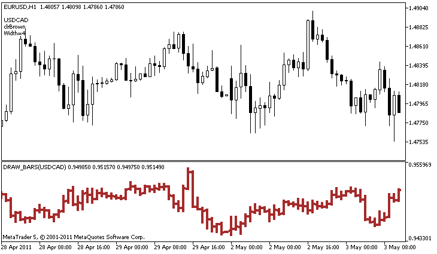

DRAW\_BARS


[MQL5 Reference](index.md)  /  [Custom Indicators](customind.md)  /  [Indicator Styles in Examples](indicators_examples.md) / DRAW\_BARS

[](draw_filling.md) 
[](draw_candles.md)

DRAW\_BARS

The DRAW\_BARS style draws bars on the values of four indicator buffers, which contain the Open, High, Low and Close prices. It is used for creating custom indicators as bars, including those in a separate subwindow of a chart and on other financial instruments.

The color of bars can be set using the [compiler directives](compilation.md) or dynamically using the [PlotIndexSetInteger()](plotindexsetinteger.md) function. Dynamic changes of the plotting properties allows "to enliven" indicators, so that their appearance changes depending on the current situation.

The indicator is drawn only to those bars, for which non-empty values of all four indicator buffers are set. To specify what value should be considered as "empty", set this value in the [PLOT\_EMPTY\_VALUE](customindicatorproperties.md#enum_customind_property_double) property:

```
//--- The 0 (empty) value will mot participate in drawing
   PlotIndexSetDouble(index_of_plot_DRAW_BARS,PLOT_EMPTY_VALUE,0);
```

Always explicitly fill in the values of the indicator buffers, set an empty value in a buffer to skip bars.

The number of required buffers for plotting DRAW\_BARS is 4. All buffers for the plotting should go one after the other in the given order: Open, High, Low and Close. None of the buffers can contain only empty values, since in this case nothing is plotted.

An example of the indicator that draws bars on a selected financial instrument in a separate window. The color of bars changes randomly every N ticks. The N parameter is set in [external parameters](inputvariables.md) of the indicator for the possibility of manual configuration (the Parameters tab in the indicator's Properties window).



Please note that for plot1 with the DRAW\_BARS style, the color is set using the compiler directive [#property](compilation.md), and then in the [OnCalculate()](oncalculate.md) function the color is set randomly from an earlier prepared list.

```
//+------------------------------------------------------------------+
//|                                                    DRAW_BARS.mq5 |
//|                        Copyright 2011, MetaQuotes Software Corp. |
//|                                              https://www.mql5.com |
//+------------------------------------------------------------------+
#property copyright "Copyright 2000-2024, MetaQuotes Ltd."
#property link      "https://www.mql5.com"
#property version   "1.00"
 
#property description "An indicator to demonstrate DRAW_BARS"
#property description "It draws bars of a selected symbol in a separate window"
#property description "The color and width of bars, as well as the symbol are changed randomly"
#property description "every N ticks"
 
#property indicator_separate_window
#property indicator_buffers 4
#property indicator_plots   1
//--- plot Bars
#property indicator_label1  "Bars"
#property indicator_type1   DRAW_BARS
#property indicator_color1  clrGreen
#property indicator_style1  STYLE_SOLID
#property indicator_width1  1
//--- input parameters
input int      N=5;              // The number of ticks to change the type
input int      bars=500;         // The number of bars to show
input bool     messages=false;   // Show messages in the "Expert Advisors" log
//--- Indicator buffers
double         BarsBuffer1[];
double         BarsBuffer2[];
double         BarsBuffer3[];
double         BarsBuffer4[];
//--- Symbol name
string symbol;
//--- An array to store colors
color colors[]={clrRed,clrBlue,clrGreen,clrPurple,clrBrown,clrIndianRed};
//+------------------------------------------------------------------+
//| Custom indicator initialization function                         |
//+------------------------------------------------------------------+
int OnInit()
  {
//--- If bars is very small - complete the work ahead of time
   if(bars<50)
     {
      Comment("Please specify a larger number of bars! The operation of the indicator has been terminated");
      return(INIT_PARAMETERS_INCORRECT);
     }
//--- indicator buffers mapping
   SetIndexBuffer(0,BarsBuffer1,INDICATOR_DATA);
   SetIndexBuffer(1,BarsBuffer2,INDICATOR_DATA);
   SetIndexBuffer(2,BarsBuffer3,INDICATOR_DATA);
   SetIndexBuffer(3,BarsBuffer4,INDICATOR_DATA);
//--- The name of the symbol, for which the bars are drawn
   symbol=_Symbol;
//--- Set the display of the symbol
   PlotIndexSetString(0,PLOT_LABEL,symbol+" Open;"+symbol+" High;"+symbol+" Low;"+symbol+" Close");
   IndicatorSetString(INDICATOR_SHORTNAME,"DRAW_BARS("+symbol+")");
//--- An empty value
   PlotIndexSetDouble(0,PLOT_EMPTY_VALUE,0.0);
//---
   return(INIT_SUCCEEDED);
  }
//+------------------------------------------------------------------+
//| Custom indicator iteration function                              |
//+------------------------------------------------------------------+
int OnCalculate(const int rates_total,
                const int prev_calculated,
                const datetime &time[],
                const double &open[],
                const double &high[],
                const double &low[],
                const double &close[],
                const long &tick_volume[],
                const long &volume[],
                const int &spread[])
  {
   static int ticks=0;
//--- Calculate ticks to change the style, color and width of the line
   ticks++;
//--- If a sufficient number of ticks has been accumulated
   if(ticks>=N)
     {
      //--- Select a new symbol from the Market watch window
      symbol=GetRandomSymbolName();
      //--- Change the line properties
      ChangeLineAppearance();
 
      int tries=0;
      //--- Make 5 attempts to fill in the buffers with the prices from symbol
      while(!CopyFromSymbolToBuffers(symbol,rates_total) && tries<5)
        {
         //--- A counter of calls of the CopyFromSymbolToBuffers() function
         tries++;
        }
      //--- Reset the counter of ticks to zero
      ticks=0;
     }
//--- return value of prev_calculated for next call
   return(rates_total);
  }
//+------------------------------------------------------------------+
//| Fill in the indicator buffers with prices                        |
//+------------------------------------------------------------------+
bool CopyFromSymbolToBuffers(string name,int total)
  {
//--- In the rates[] array, we will copy Open, High, Low and Close
   MqlRates rates[];
//--- The counter of attempts
   int attempts=0;
//--- How much has been copied
   int copied=0;
//--- Make 25 attempts to get a timeseries on the desired symbol
   while(attempts<25 && (copied=CopyRates(name,_Period,0,bars,rates))<0)
     {
      Sleep(100);
      attempts++;
      if(messages) PrintFormat("%s CopyRates(%s) attempts=%d",__FUNCTION__,name,attempts);
     }
//--- If failed to copy a sufficient number of bars
   if(copied!=bars)
     {
      //--- Form a message string
      string comm=StringFormat("For the symbol %s, managed to receive only %d bars of %d requested ones",
                               name,
                               copied,
                               bars
                               );
      //--- Show a message in a comment in the main chart window
      Comment(comm);
      //--- Show the message
      if(messages) Print(comm);
      return(false);
     }
   else
     {
      //--- Set the display of the symbol 
      PlotIndexSetString(0,PLOT_LABEL,name+" Open;"+name+" High;"+name+" Low;"+name+" Close");
      IndicatorSetString(INDICATOR_SHORTNAME,"DRAW_BARS("+name+")");
     }
//--- Initialize buffers with empty values
   ArrayInitialize(BarsBuffer1,0.0);   
   ArrayInitialize(BarsBuffer2,0.0);   
   ArrayInitialize(BarsBuffer3,0.0);   
   ArrayInitialize(BarsBuffer4,0.0);   
//--- Copy prices to the buffers
   for(int i=0;i<copied;i++)
     {
      //--- Calculate the appropriate index for the buffers
      int buffer_index=total-copied+i;
      //--- Write the prices to the buffers
      BarsBuffer1[buffer_index]=rates[i].open;
      BarsBuffer2[buffer_index]=rates[i].high;
      BarsBuffer3[buffer_index]=rates[i].low;
      BarsBuffer4[buffer_index]=rates[i].close;
     }
   return(true);
  }
//+------------------------------------------------------------------+
//| Randomly returns a symbol from the Market Watch                  |
//+------------------------------------------------------------------+
string GetRandomSymbolName()
  {
//--- The number of symbols shown in the Market watch window
   int symbols=SymbolsTotal(true);
//--- The position of a symbol in the list - a random number from 0 to symbols
   int number=MathRand()%symbols;
//--- Return the name of a symbol at the specified position
   return SymbolName(number,true);
  }
//+------------------------------------------------------------------+
//| Changes the appearance of bars                                   |
//+------------------------------------------------------------------+
void ChangeLineAppearance()
  {
//--- A string for the formation of information about the bar properties
   string comm="";
//--- A block for changing the color of bars
   int number=MathRand(); // Get a random number
//--- The divisor is equal to the size of the colors[] array
   int size=ArraySize(colors);
//--- Get the index to select a new color as the remainder of integer division
   int color_index=number%size;
//--- Set the color as the PLOT_LINE_COLOR property
   PlotIndexSetInteger(0,PLOT_LINE_COLOR,colors[color_index]);
//--- Write the line color
   comm=comm+"\r\n"+(string)colors[color_index];
 
//--- A block for changing the width of bars
   number=MathRand();
//--- Get the width of the remainder of integer division
   int width=number%5;   // The width is set from 0 to 4
//--- Set the color as the PLOT_LINE_WIDTH property
   PlotIndexSetInteger(0,PLOT_LINE_WIDTH,width);
//--- Write the line width
   comm=comm+"\r\nWidth="+IntegerToString(width);
 
//--- Write the symbol name
   comm="\r\n"+symbol+comm;
 
//--- Show the information on the chart using a comment
   Comment(comm);
  }
```