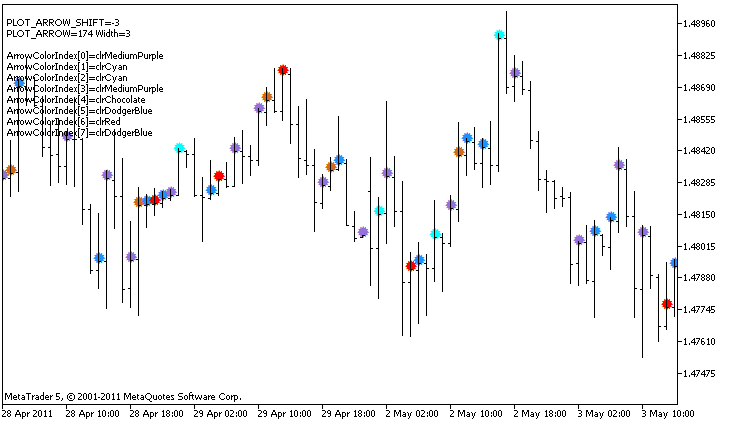

DRAW\_COLOR\_ARROW


[MQL5 Reference](index.md)  /  [Custom Indicators](customind.md)  /  [Indicator Styles in Examples](indicators_examples.md) / DRAW\_COLOR\_ARROW

[](draw_color_histogram2.md) 
[](draw_color_zigzag.md)

DRAW\_COLOR\_ARROW

The DRAW\_COLOR\_ARROW style draws colored arrows (symbols of the set [Wingdings](wingdings.md)) based on the value of the indicator buffer. In contrast to DRAW\_ARROW, in this style it is possible to set a color from a predefined set of colors specified by the indicator\_color1 property for each symbol.

The width and color of the symbols can be specified like for the[DRAW\_ARROW](draw_arrow.md) style using [compiler directives](compilation.md) or dynamically using the [PlotIndexSetInteger()](plotindexsetinteger.md) function. Dynamic changes of the plotting properties allows changing the look of an indicator based on the current situation.

The symbol code is set using the [PLOT\_ARROW](customindicatorproperties.md#enum_customind_property_integer) property.

```
//--- Define the symbol code from the Wingdings font to draw in PLOT_ARROW
   PlotIndexSetInteger(0,PLOT_ARROW,code);
```

The default value of PLOT\_ARROW=159 (a circle).

Each arrow is actually a symbol that has the height and the anchor point, and can cover some important information on a chart (for example, the closing price at the bar). Therefore, we can additionally specify the vertical shift in pixels, which does not depend on the scale of the chart. The arrows will be shifted down by the specified number of pixels, although the values of the indicator will remain the same:

```
//--- Set the vertical shift of arrows in pixels
   PlotIndexSetInteger(0,PLOT_ARROW_SHIFT,shift);
```

A negative value of PLOT\_ARROW\_SHIFT means the shift of arrows upwards, a positive values shifts the arrow down.

The DRAW\_COLOR\_ARROW style can be used in a separate subwindow of a chart and in its main window. Empty values are not drawn and do not appear in the "Data Window", all the values in the indicator buffers should be set explicitly. Buffers are not initialized with a zero value.

```
//--- Set an empty value
   PlotIndexSetDouble(DRAW_COLOR_ARROW_plot_index,PLOT_EMPTY_VALUE,0);
```

The number of buffers required for plotting DRAW\_COLOR\_ARROW is 2.

* a buffer to store the value of the price which is used to draw the symbol (plus a shift in pixels, given in the PLOT\_ARROW\_SHIFT property);
* a buffer to store the color index, which is used to draw an arrow (it makes sense to set only non-empty values).

An example of the indicator, which draws arrows on each bar with the close price higher than the close price of the previous bar. The width, shift and symbol code of all arrows are changed randomly every N ticks. The color of the symbol depends on the number of the bar on which it is drawn.



In the example, for plot1 with the DRAW\_COLOR\_ARROW style, the properties, color and size are specified using the compiler directive [#property](compilation.md), and then in the [OnCalculate()](oncalculate.md) function the properties are set randomly. The N parameter is set in [external parameters](inputvariables.md) of the indicator for the possibility of manual configuration (the Parameters tab in the indicator's Properties window).

Please note that initially 8 colors are set using the compiler directive [#property](compilation.md), and then in the [OnCalculate()](oncalculate.md) function, the color is set randomly from the 14 colors that are stored in the colors[] array.

```
//+------------------------------------------------------------------+
//|                                             DRAW_COLOR_ARROW.mq5 |
//|                        Copyright 2011, MetaQuotes Software Corp. |
//|                                              https://www.mql5.com |
//+------------------------------------------------------------------+
#property copyright "Copyright 2000-2024, MetaQuotes Ltd."
#property link      "https://www.mql5.com"
#property version   "1.00"
 
#property description "An indicator to demonstrate DRAW_COLOR_ARROW"
#property description "Draws different-color arrows set by Unicode characters, on a chart"
#property description "The color, size, shift and symbol code of the arrow are changed"
#property description " randomly every N ticks"
#property description "The code parameter sets the base value: code=159 (a circle)"
 
#property indicator_chart_window
#property indicator_buffers 2
#property indicator_plots   1
//--- plot ColorArrow
#property indicator_label1  "ColorArrow"
#property indicator_type1   DRAW_COLOR_ARROW
//--- Define 8 colors for coloring the histogram (they are stored in the special array)
#property indicator_color1  clrRed,clrBlue,clrSeaGreen,clrGold,clrDarkOrange,clrMagenta,clrYellowGreen,clrChocolate
#property indicator_style1  STYLE_SOLID
#property indicator_width1  1
 
//--- input parameters
input int      N=5;         // Number of ticks to change 
input ushort   code=159;    // Symbol code to draw in DRAW_ARROW
int            color_sections;
//--- An indicator buffer for the plot
double         ColorArrowBuffer[];
//--- A buffer to store color indexes
double         ColorArrowColors[];
//--- An array for storing colors contains 14 elements
color colors[]=
  {
   clrRed,clrBlue,clrGreen,clrChocolate,clrMagenta,clrDodgerBlue,clrGoldenrod,
   clrIndigo,clrLightBlue,clrAliceBlue,clrMoccasin,clrWhiteSmoke,clrCyan,clrMediumPurple
  };
//+------------------------------------------------------------------+
//| Custom indicator initialization function                         |
//+------------------------------------------------------------------+
int OnInit()
  {
//--- indicator buffers mapping
   SetIndexBuffer(0,ColorArrowBuffer,INDICATOR_DATA);
   SetIndexBuffer(1,ColorArrowColors,INDICATOR_COLOR_INDEX);
//--- Define the symbol code for drawing in PLOT_ARROW
   PlotIndexSetInteger(0,PLOT_ARROW,code);
//--- Set the vertical shift of arrows in pixels
   PlotIndexSetInteger(0,PLOT_ARROW_SHIFT,5);
//--- Set as an empty value 0
   PlotIndexSetDouble(0,PLOT_EMPTY_VALUE,0);   
//---- The number of colors to color the sinusoid
   color_sections=8;   //  see a comment to #property indicator_color1 
//---
   return(INIT_SUCCEEDED);
  }
//+------------------------------------------------------------------+
//| Custom indicator iteration function                              |
//+------------------------------------------------------------------+
int OnCalculate(const int rates_total,
                const int prev_calculated,
                const datetime &time[],
                const double &open[],
                const double &high[],
                const double &low[],
                const double &close[],
                const long &tick_volume[],
                const long &volume[],
                const int &spread[])
  {
   static int ticks=0;
//--- Calculate ticks to change the color, size, shift and code of the arrow
   ticks++;
//--- If a critical number of ticks has been accumulated
   if(ticks>=N)
     {
      //--- Change arrow properties
      ChangeLineAppearance();
      //--- Change the colors used to draw the histogram
      ChangeColors(colors,color_sections);
      //--- Reset the counter of ticks to zero
      ticks=0;
     }
 
//--- Block for calculating indicator values
   int start=1;
   if(prev_calculated>0) start=prev_calculated-1;
//--- Calculation loop
   for(int i=1;i<rates_total;i++)
     {
      //--- If the current Close price is higher than the previous one, draw an arrow
      if(close[i]>close[i-1])
         ColorArrowBuffer[i]=close[i];
      //--- Otherwise specify the null value
      else
         ColorArrowBuffer[i]=0;
      //--- Arrow color
      int index=i%color_sections;
      ColorArrowColors[i]=index;
     }
//--- return value of prev_calculated for next call
   return(rates_total);
  }
//+------------------------------------------------------------------+
//| Changes the color of line segments                               |
//+------------------------------------------------------------------+
void  ChangeColors(color  &cols[],int plot_colors)
  {
//--- The number of colors
   int size=ArraySize(cols);
//--- 
   string comm=ChartGetString(0,CHART_COMMENT)+"\r\n\r\n";
 
//--- For each color index define a new color randomly
   for(int plot_color_ind=0;plot_color_ind<plot_colors;plot_color_ind++)
     {
      //--- Get a random value
      int number=MathRand();
      //--- Get an index in the col[] array as a remainder of the integer division
      int i=number%size;
      //--- Set the color for each index as the property PLOT_LINE_COLOR
      PlotIndexSetInteger(0,                    //  The number of a graphical style
                          PLOT_LINE_COLOR,      //  Property identifier
                          plot_color_ind,       //  The index of the color, where we write the color
                          cols[i]);             //  A new color
      //--- Write the colors
      comm=comm+StringFormat("ArrowColorIndex[%d]=%s \r\n",plot_color_ind,ColorToString(cols[i],true));
      ChartSetString(0,CHART_COMMENT,comm);
     }
//---
  }
//+------------------------------------------------------------------+
//| Changes the appearance of a displayed line in the indicator      |
//+------------------------------------------------------------------+
void ChangeLineAppearance()
  {
//--- A string for the formation of information about the line properties
   string comm="";
//--- A block for changing the width of the line
   int number=MathRand();
//--- Get the width of the remainder of integer division
   int width=number%5; // The width is set from 0 to 4
//--- Set the color as the PLOT_LINE_WIDTH property
   PlotIndexSetInteger(0,PLOT_LINE_WIDTH,width);
//--- Write the line width
   comm=comm+" Width="+IntegerToString(width);
   
//--- A block for changing the arrow code (PLOT_ARROW)
   number=MathRand();
//--- Get the remainder of integer division to calculate a new code of the arrow (from 0 to 19)
   int code_add=number%20;
//--- Set the new symbol code as the result of code+code_add
   PlotIndexSetInteger(0,PLOT_ARROW,code+code_add);
//--- Write the symbol code PLOT_ARROW
   comm="\r\n"+"PLOT_ARROW="+IntegerToString(code+code_add)+comm;   
 
//--- A block for changing the vertical shift of arrows in pixels
   number=MathRand();
//--- Get the shift as the remainder of the integer division
   int shift=20-number%41;
//--- Set the new shift from
   PlotIndexSetInteger(0,PLOT_ARROW_SHIFT,shift);
//--- Write the shift PLOT_ARROW_SHIFT
   comm="\r\n"+"PLOT_ARROW_SHIFT="+IntegerToString(shift)+comm;
 
//--- Show the information on the chart using a comment
   Comment(comm);
  }
```