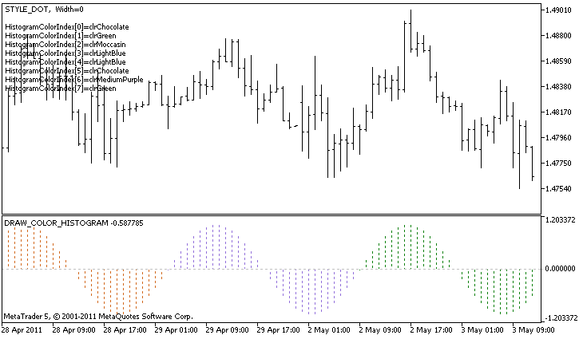

DRAW\_COLOR\_HISTOGRAM


[MQL5 Reference](index.md)  /  [Custom Indicators](customind.md)  /  [Indicator Styles in Examples](indicators_examples.md) / DRAW\_COLOR\_HISTOGRAM

[](draw_color_section.md) 
[](draw_color_histogram2.md)

DRAW\_COLOR\_HISTOGRAM

The DRAW\_COLOR\_HISTOGRAM style draws a histogram as a sequence of colored columns from zero to a specified value. Values are taken from the indicator buffer. Each column can have its own color from a predefined set of colors.

The width, color and style of the histogram can be specified like for the [DRAW\_HISTOGRAM](draw_histogram.md) style - using [compiler directives](compilation.md) or dynamically using the [PlotIndexSetInteger()](plotindexsetinteger.md) function. Dynamic changes of the plotting properties allows changing the look of the histogram based on the current situation.

Since a column from the zero level is drawn on each bar, DRAW\_COLOR\_HISTOGRAM should better be used in a separate chart window. Most often this type of plotting is used to create indicators of the oscillator type, for example, [Awesome Oscillator](iao.md) or [Market Facilitation Index](ibwmfi.md). For the empty non-displayable values the zero value should be specified.

The number of buffers required for plotting DRAW\_COLOR\_HISTOGRAM is 2.

* one buffer for storing a non-zero value of the vertical segment on each bar, the second end of the segment is always on the zero line of the indicator;
* one buffer to store the color index, which is used to draw the section (it makes sense to set only non-empty values).

Colors can be specified using the compiler directive #property indicator\_color1 separated by a comma. The number of colors cannot exceed 64.

An example of the indicator that draws a sinusoid of a specified color based on the [MathSin() function](mathsin.md). The color, width and style of all histogram columns change randomly each N ticks. The bars parameter specifies the period of the sinusoid, that is after the specified number of bars the sinusoid will repeat the cycle.



Please note that for plot1 with the DRAW\_COLOR\_HISTOGRAM style, 5 colors are set using the compiler directive [#property](compilation.md), and then in the [OnCalculate()](oncalculate.md) function the colors are selected randomly from the 14 colors stored in the colors[] array. The N parameter is set in [external parameters](inputvariables.md) of the indicator for the possibility of manual configuration (the Parameters tab in the indicator's Properties window).

```
//+------------------------------------------------------------------+
//|                                         DRAW_COLOR_HISTOGRAM.mq5 |
//|                        Copyright 2011, MetaQuotes Software Corp. |
//|                                              https://www.mql5.com |
//+------------------------------------------------------------------+
#property copyright "Copyright 2000-2024, MetaQuotes Ltd."
#property link      "https://www.mql5.com"
#property version   "1.00"
 
#property description "An indicator to demonstrate DRAW_COLOR_HISTOGRAM"
#property description "It draws a sinusoid as a histogram in a separate window"
#property description "The color and width of columns are changed randomly"
#property description "after every N ticks"
#property description "The bars parameter sets the number of bars to repeat the sinusoid"
 
#property indicator_separate_window
#property indicator_buffers 2
#property indicator_plots   1
//--- input parameters
input int      bars=30;          // The period of a sinusoid in bars
input int      N=5;              // The number of ticks to change the histogram
//--- plot Color_Histogram
#property indicator_label1  "Color_Histogram"
#property indicator_type1   DRAW_COLOR_HISTOGRAM
//--- Define 8 colors for coloring sections (they are stored in a special array)
#property indicator_color1  clrRed,clrGreen,clrBlue,clrYellow,clrMagenta,clrCyan,clrMediumSeaGreen,clrGold
#property indicator_style1  STYLE_SOLID
#property indicator_width1  1
//--- A buffer of values
double         Color_HistogramBuffer[];
//--- A buffer of color indexes
double         Color_HistogramColors[];
//--- A factor to get the 2Pi angle in radians, when multiplied by the bars parameter
double         multiplier;
int            color_sections;
//--- An array for storing colors contains 14 elements
color colors[]=
  {
   clrRed,clrBlue,clrGreen,clrChocolate,clrMagenta,clrDodgerBlue,clrGoldenrod,
   clrIndigo,clrLightBlue,clrAliceBlue,clrMoccasin,clrWhiteSmoke,clrCyan,clrMediumPurple
  };
//--- An array to store the line styles
ENUM_LINE_STYLE styles[]={STYLE_SOLID,STYLE_DASH,STYLE_DOT,STYLE_DASHDOT,STYLE_DASHDOTDOT};
//+------------------------------------------------------------------+
//| Custom indicator initialization function                         |
//+------------------------------------------------------------------+
int OnInit()
  {
//--- indicator buffers mapping
   SetIndexBuffer(0,Color_HistogramBuffer,INDICATOR_DATA);
   SetIndexBuffer(1,Color_HistogramColors,INDICATOR_COLOR_INDEX);
//---- The number of colors to color the sinusoid
   color_sections=8;   //  see A comment to #property indicator_color1   
//--- Calculate the multiplier
   if(bars>1)multiplier=2.*M_PI/bars;
   else
     {
      PrintFormat("Set the value of bars=%d greater than 1",bars);
      //--- Early termination of the indicator
      return(INIT_PARAMETERS_INCORRECT);
     }   
//---
   return(INIT_SUCCEEDED);
  }
//+------------------------------------------------------------------+
//| Custom indicator iteration function                              |
//+------------------------------------------------------------------+
int OnCalculate(const int rates_total,
                const int prev_calculated,
                const datetime &time[],
                const double &open[],
                const double &high[],
                const double &low[],
                const double &close[],
                const long &tick_volume[],
                const long &volume[],
                const int &spread[])
  {
   static int ticks=0;
//--- Calculate ticks to change the style, color and width of the line
   ticks++;
//--- If a critical number of ticks has been accumulated
   if(ticks>=N)
     {
      //--- Change the line properties
      ChangeLineAppearance();
      //--- Change colors used for the histogram
      ChangeColors(colors,color_sections);      
      //--- Reset the counter of ticks to zero
      ticks=0;
     }
 
//--- Calculate the indicator values
   int start=0;
//--- If already calculated during the previous starts of OnCalculate
   if(prev_calculated>0) start=prev_calculated-1; // set the beginning of the calculation with the last but one bar
//--- Fill in the indicator buffer with values
   for(int i=start;i<rates_total;i++)
     {
      //--- A value
      Color_HistogramBuffer[i]=sin(i*multiplier);
      //--- Color
      int color_index=i%(bars*color_sections);
      color_index/=bars;
      Color_HistogramColors[i]=color_index;
     }
//--- Return the prev_calculated value for the next call of the function
   return(rates_total);
  }
//+------------------------------------------------------------------+
//| Changes the color of line segments                               |
//+------------------------------------------------------------------+
void  ChangeColors(color  &cols[],int plot_colors)
  {
//--- The number of colors
   int size=ArraySize(cols);
//--- 
   string comm=ChartGetString(0,CHART_COMMENT)+"\r\n\r\n";
 
//--- For each color index define a new color randomly
   for(int plot_color_ind=0;plot_color_ind<plot_colors;plot_color_ind++)
     {
      //--- Get a random value
      int number=MathRand();
      //--- Get an index in the col[] array as a remainder of the integer devision
      int i=number%size;
      //--- Set the color for each index as the property PLOT_LINE_COLOR
      PlotIndexSetInteger(0,                    //  The number of a graphical style
                          PLOT_LINE_COLOR,      //  Property identifier
                          plot_color_ind,       //  The index of the color, where we write the color
                          cols[i]);             //  A new color
      //--- Write the colors
      comm=comm+StringFormat("HistogramColorIndex[%d]=%s \r\n",plot_color_ind,ColorToString(cols[i],true));
      ChartSetString(0,CHART_COMMENT,comm);
     }
//---
  }
//+------------------------------------------------------------------+
//| Changes the appearance of a displayed line in the indicator      |
//+------------------------------------------------------------------+
void ChangeLineAppearance()
  {
//--- A string for the formation of information about the line properties
   string comm="";
//--- A block for changing the width of the line
   int number=MathRand();
//--- Get the width of the remainder of integer division
   int width=number%5; // The width is set from 0 to 4
//--- Set the color as the PLOT_LINE_WIDTH property
   PlotIndexSetInteger(0,PLOT_LINE_WIDTH,width);
//--- Write the line width
   comm=comm+" Width="+IntegerToString(width);
 
//--- A block for changing the style of the line
   number=MathRand();
//--- The divisor is equal to the size of the styles array
   int size=ArraySize(styles);
//--- Get the index to select a new style as the remainder of integer division
   int style_index=number%size;
//--- Set the color as the PLOT_LINE_COLOR property
   PlotIndexSetInteger(0,PLOT_LINE_STYLE,styles[style_index]);
//--- Write the line style
   comm=EnumToString(styles[style_index])+", "+comm;
//--- Show the information on the chart using a comment
   Comment(comm);
  }
```