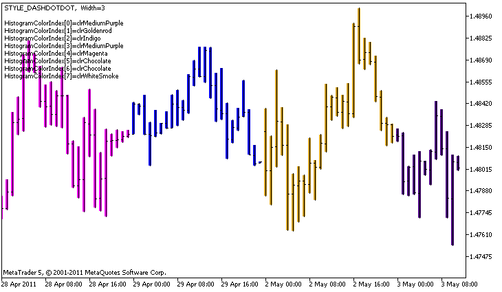

DRAW\_COLOR\_HISTOGRAM2


[MQL5 Reference](index.md)  /  [Custom Indicators](customind.md)  /  [Indicator Styles in Examples](indicators_examples.md) / DRAW\_COLOR\_HISTOGRAM2

[](draw_color_histogram.md) 
[](draw_color_arrow.md)

DRAW\_COLOR\_HISTOGRAM2

The DRAW\_COLOR\_HISTOGRAM2 style draws a histogram of a specified color vertical segments using the values of two indicator buffers. But unlike the one-color DRAW\_HISTOGRAM2, in this style each column of the histogram can have its own color from a predefined set. The values of all the segments are taken from the indicator buffer.

The width, style and color of the histogram can be specified like for the[DRAW\_HISTOGRAM2](draw_histogram2.md) style using [compiler directives](compilation.md) or dynamically using the [PlotIndexSetInteger()](plotindexsetinteger.md) function. Dynamic changes of the plotting properties allows changing the look of the histogram based on the current situation.

The DRAW\_COLOR\_HISTOGRAM2 style can be used in a separate subwindow of a chart and in its main window. For empty values nothing is drawn, all the values in the indicator buffers need to be set explicitly. Buffers are not initialized with empty values.

The number of buffers required for plotting DRAW\_COLOR\_HISTOGRAM2 is 3:

* two buffers to store the upper and lower end of the vertical segment on each bar;
* one buffer to store the color index, which is used to draw the segment (it makes sense to set only non-empty values).

An example of the indicator that draws a histogram of a specified color between the High and Low prices. For each day of week, the histogram lines have a different color. The color of the day, width and style of the histogram change randomly each N ticks.



Please note that for plot1 with the DRAW\_COLOR\_HISTOGRAM2 style, 5 colors are set using the compiler directive [#property](compilation.md), and then in the [OnCalculate()](oncalculate.md) function the colors are selected randomly from the 14 colors stored in the colors[] array.

The N parameter is set in [external parameters](inputvariables.md) of the indicator for the possibility of manual configuration (the Parameters tab in the indicator's Properties window).

```
//+------------------------------------------------------------------+
//|                                        DRAW_COLOR_HISTOGRAM2.mq5 |
//|                        Copyright 2011, MetaQuotes Software Corp. |
//|                                              https://www.mql5.com |
//+------------------------------------------------------------------+
#property copyright "Copyright 2000-2024, MetaQuotes Ltd."
#property link      "https://www.mql5.com"
#property version   "1.00"
 
#property description "An indicator to demonstrate DRAW_COLOR_HISTOGRAM2"
#property description "It draws a segment between Open and Close on each bar"
#property description "The color, width and style are changed randomly"
#property description "after every N ticks"
 
#property indicator_chart_window
#property indicator_buffers 3
#property indicator_plots   1
//--- plot ColorHistogram_2
#property indicator_label1  "ColorHistogram_2"
#property indicator_type1   DRAW_COLOR_HISTOGRAM2
//--- Define 5 colors for coloring the histogram based on the days of week (they are stored in the special array)
#property indicator_color1  clrRed,clrBlue,clrGreen,clrYellow,clrMagenta
#property indicator_style1  STYLE_SOLID
#property indicator_width1  1
 
//--- input parameter
input int      N=5;              // The number of ticks to change the histogram
int            color_sections;
//--- Value buffers
double         ColorHistogram_2Buffer1[];
double         ColorHistogram_2Buffer2[];
//--- A buffer of color indexes
double         ColorHistogram_2Colors[];
//--- An array for storing colors contains 14 elements
color colors[]=
  {
   clrRed,clrBlue,clrGreen,clrChocolate,clrMagenta,clrDodgerBlue,clrGoldenrod,
   clrIndigo,clrLightBlue,clrAliceBlue,clrMoccasin,clrWhiteSmoke,clrCyan,clrMediumPurple
  };
//--- An array to store the line styles
ENUM_LINE_STYLE styles[]={STYLE_SOLID,STYLE_DASH,STYLE_DOT,STYLE_DASHDOT,STYLE_DASHDOTDOT};
//+------------------------------------------------------------------+
//| Custom indicator initialization function                         |
//+------------------------------------------------------------------+
int OnInit()
  {
//--- indicator buffers mapping
   SetIndexBuffer(0,ColorHistogram_2Buffer1,INDICATOR_DATA);
   SetIndexBuffer(1,ColorHistogram_2Buffer2,INDICATOR_DATA);
   SetIndexBuffer(2,ColorHistogram_2Colors,INDICATOR_COLOR_INDEX);
//--- Set an empty value
   PlotIndexSetDouble(0,PLOT_EMPTY_VALUE,0);
//---- The number of colors to color the sinusoid
   color_sections=8;   //  See a comment to #property indicator_color1      
//---
   return(INIT_SUCCEEDED);
  }
//+------------------------------------------------------------------+
//| Custom indicator iteration function                              |
//+------------------------------------------------------------------+
int OnCalculate(const int rates_total,
                const int prev_calculated,
                const datetime &time[],
                const double &open[],
                const double &high[],
                const double &low[],
                const double &close[],
                const long &tick_volume[],
                const long &volume[],
                const int &spread[])
  {
   static int ticks=0;
//--- Calculate ticks to change the style, color and width of the line
   ticks++;
//--- If a critical number of ticks has been accumulated
   if(ticks>=N)
     {
      //--- Change the line properties
      ChangeLineAppearance();
      //--- Change the colors used to draw the histogram
      ChangeColors(colors,color_sections);      
      //--- Reset the counter of ticks to zero
      ticks=0;
     }
 
//--- Calculate the indicator values
   int start=0;
//--- To get the day of week by the open price of each bar
   MqlDateTime dt;
//--- If already calculated during the previous starts of OnCalculate
   if(prev_calculated>0) start=prev_calculated-1; // set the beginning of the calculation with the last but one bar
//--- Fill in the indicator buffer with values
   for(int i=start;i<rates_total;i++)
     {
      TimeToStruct(time[i],dt);
      //--- value
      ColorHistogram_2Buffer1[i]=high[i];
      ColorHistogram_2Buffer2[i]=low[i];
      //--- Set the color index according to the day of week
      int day=dt.day_of_week;
      ColorHistogram_2Colors[i]=day;
     }
//--- Return the prev_calculated value for the next call of the function
   return(rates_total);
  }
//+------------------------------------------------------------------+
//| Changes the color of line segments                               |
//+------------------------------------------------------------------+
void  ChangeColors(color  &cols[],int plot_colors)
  {
//--- The number of colors
   int size=ArraySize(cols);
//--- 
   string comm=ChartGetString(0,CHART_COMMENT)+"\r\n\r\n";
 
//--- For each color index define a new color randomly
   for(int plot_color_ind=0;plot_color_ind<plot_colors;plot_color_ind++)
     {
      //--- Get a random value
      int number=MathRand();
      //--- Get an index in the col[] array as a remainder of the integer division
      int i=number%size;
      //--- Set the color for each index as the property PLOT_LINE_COLOR
      PlotIndexSetInteger(0,                    //  The number of a graphical style
                          PLOT_LINE_COLOR,      //  Property identifier
                          plot_color_ind,       //  The index of the color, where we write the color
                          cols[i]);             //  A new color
      //--- Write the colors
      comm=comm+StringFormat("HistogramColorIndex[%d]=%s \r\n",plot_color_ind,ColorToString(cols[i],true));
      ChartSetString(0,CHART_COMMENT,comm);
     }
//---
  }
//+------------------------------------------------------------------+
//| Changes the appearance of a displayed line in the indicator      |
//+------------------------------------------------------------------+
void ChangeLineAppearance()
  {
//--- A string for the formation of information about the line properties
   string comm="";
//--- A block for changing the width of the line
   int number=MathRand();
//--- Get the width of the remainder of integer division
   int width=number%5; // The width is set from 0 to 4
//--- Set the color as the PLOT_LINE_WIDTH property
   PlotIndexSetInteger(0,PLOT_LINE_WIDTH,width);
//--- Write the line width
   comm=comm+" Width="+IntegerToString(width);
 
//--- A block for changing the style of the line
   number=MathRand();
//--- The divisor is equal to the size of the styles array
   int size=ArraySize(styles);
//--- Get the index to select a new style as the remainder of integer division
   int style_index=number%size;
//--- Set the color as the PLOT_LINE_COLOR property
   PlotIndexSetInteger(0,PLOT_LINE_STYLE,styles[style_index]);
//--- Write the line style
   comm=EnumToString(styles[style_index])+", "+comm;
//--- Show the information on the chart using a comment
   Comment(comm);
  }
```