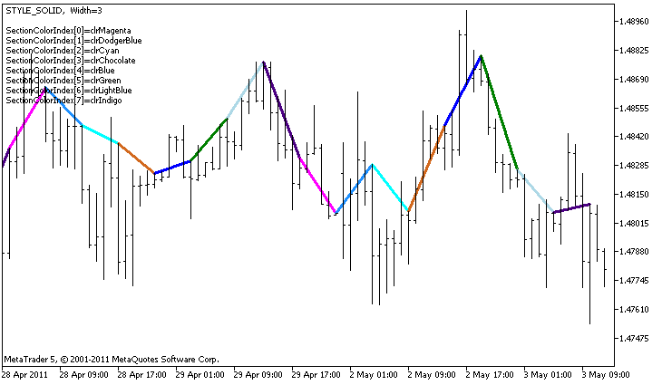

DRAW\_COLOR\_SECTION


[MQL5 Reference](index.md)  /  [Custom Indicators](customind.md)  /  [Indicator Styles in Examples](indicators_examples.md) / DRAW\_COLOR\_SECTION

[](draw_color_line.md) 
[](draw_color_histogram.md)

DRAW\_COLOR\_SECTION

The DRAW\_COLOR\_SECTION style is a color version of [DRAW\_SECTION](draw_section.md), but unlike the latter, it allows drawing sections of different colors. The DRAW\_COLOR\_SECTION style, like all color styles with the word COLOR in their title, contains an additional special indicator buffer that stores the color index (number) from a specially set array of colors. Thus, the color of each section can be defined by specifying the color index of the index of the bar that corresponds to the section end.

The width, color and style of the sections can be specified like for the [DRAW\_SECTION](draw_section.md) style - using [compiler directives](compilation.md) or dynamically using the [PlotIndexSetInteger()](plotindexsetinteger.md) function. Dynamic changes of the plotting properties allows "to enliven" indicators, so that their appearance changes depending on the current situation.

Sections are drawn from one non-empty value to another non-empty value of the indicator buffer, empty values are ignored. To specify what value should be considered as "empty", set this value in the [PLOT\_EMPTY\_VALUE](customindicatorproperties.md#enum_customind_property_double) property: For example, if the indicator should be drawn as a sequence of sections on non-zero values, then you need to set the zero value as an empty one:

```
//--- The 0 (empty) value will mot participate in drawing
   PlotIndexSetDouble(index_of_plot_DRAW_COLOR_SECTION,PLOT_EMPTY_VALUE,0);
```

Always explicitly fill in the values of the indicator buffers, set an empty value in a buffer to the elements that should not be plotted.

The number of buffers required for plotting DRAW\_COLOR\_SECTION is 2.

* one buffer to store the indicator values used for drawing a line;
* one buffer to store the color index, which is used to draw the section (it makes sense to set only non-empty values).

Colors can be specified by the compiler directive #property indicator\_color1 separated by a comma. The number of colors cannot exceed 64.

An example of the indicator that draws colored sections each 5 bars long, using the High price values. The color, width and style of sections change randomly every N ticks.



Note that initially for plot1 with DRAW\_COLOR\_SECTION 8 colors are set using the compiler directive [#property](compilation.md). Then in the [OnCalculate()](oncalculate.md) function, colors are set randomly from the array of colors colors[].

The N parameter is set in [external parameters](inputvariables.md) of the indicator for the possibility of manual configuration (the Parameters tab in the indicator's Properties window).

```
//+------------------------------------------------------------------+
//|                                           DRAW_COLOR_SECTION.mq5 |
//|                        Copyright 2011, MetaQuotes Software Corp. |
//|                                              https://www.mql5.com |
//+------------------------------------------------------------------+
#property copyright "Copyright 2000-2024, MetaQuotes Ltd."
#property link      "https://www.mql5.com"
#property version   "1.00"
 
#property description "An indicator to demonstrate DRAW_COLOR_SECTION"
#property description "It draws colored sections with the length equal to the specified number of bars"
#property description "The color, width and style of sections are changed randomly"
#property description "after every N ticks"
 
#property indicator_chart_window
#property indicator_buffers 2
#property indicator_plots   1
//--- plot ColorSection
#property indicator_label1  "ColorSection"
#property indicator_type1   DRAW_COLOR_SECTION
//--- Define 8 colors for coloring sections (they are stored in a special array)
#property indicator_color1  clrRed,clrGold,clrMediumBlue,clrLime,clrMagenta,clrBrown,clrTan,clrMediumVioletRed
#property indicator_style1  STYLE_SOLID
#property indicator_width1  1
//--- input parameters
input int      N=5;                      // Number of ticks to change 
input int      bars_in_section=5;        // The length of sections in bars
//--- An auxiliary variable to calculate ends of sections
int            divider;
int            color_sections;
//--- A buffer for plotting
double         ColorSectionBuffer[];
//--- A buffer for storing the line color on each bar
double         ColorSectionColors[];
//--- An array for storing colors contains 14 elements
color colors[]=
  {
   clrRed,clrBlue,clrGreen,clrChocolate,clrMagenta,clrDodgerBlue,clrGoldenrod,
   clrIndigo,clrLightBlue,clrAliceBlue,clrMoccasin,clrWhiteSmoke,clrCyan,clrMediumPurple
  };
//--- An array to store the line styles
ENUM_LINE_STYLE styles[]={STYLE_SOLID,STYLE_DASH,STYLE_DOT,STYLE_DASHDOT,STYLE_DASHDOTDOT};
//+------------------------------------------------------------------+
//| Custom indicator initialization function                         |
//+------------------------------------------------------------------+
int OnInit()
  {
//--- indicator buffers mapping
   SetIndexBuffer(0,ColorSectionBuffer,INDICATOR_DATA);
   SetIndexBuffer(1,ColorSectionColors,INDICATOR_COLOR_INDEX);
//--- The 0 (empty) value will mot participate in drawing
   PlotIndexSetDouble(0,PLOT_EMPTY_VALUE,0);
//---- The number of colors to color the sections
   int color_sections=8;   //  see A comment to #property indicator_color1
//--- Check the indicator parameter
   if(bars_in_section<=0)
     {
      PrintFormat("Invalid section length=%d",bars_in_section);
      return(INIT_PARAMETERS_INCORRECT);
     }
   else divider=color_sections*bars_in_section;
//---
   return(INIT_SUCCEEDED);
  }
//+------------------------------------------------------------------+
//| Custom indicator iteration function                              |
//+------------------------------------------------------------------+
int OnCalculate(const int rates_total,
                const int prev_calculated,
                const datetime &time[],
                const double &open[],
                const double &high[],
                const double &low[],
                const double &close[],
                const long &tick_volume[],
                const long &volume[],
                const int &spread[])
  {
   static int ticks=0;
//--- Calculate ticks to change the style, color and width of the line
   ticks++;
//--- If a critical number of ticks has been accumulated
   if(ticks>=N)
     {
      //--- Change the line properties
      ChangeLineAppearance();
      //--- Change colors used to plot the sections
      ChangeColors(colors,color_sections);
      //--- Reset the counter of ticks to zero
      ticks=0;
     }
 
//--- The number of the bar from which the calculation of indicator values starts
   int start=0;
//--- If the indicator has been calculated before, then set start on the previous bar
   if(prev_calculated>0) start=prev_calculated-1;
//--- Here are all the calculations of the indicator values
   for(int i=start;i<rates_total;i++)
     {
      //--- If the bar number is divisible by the section_length, it means this is the end of the sections
      if(i%bars_in_section==0)
        {
         //--- Set the end of the section at the High price of this bar
         ColorSectionBuffer[i]=high[i];
         //--- A remainder of the division of the bar number by scetion_length*number_of_colors
         int rest=i%divider;
         //Get the number of the color =  from 0 to number_of_colors-1
         int color_indext=rest/bars_in_section;
         ColorSectionColors[i]=color_indext;
        }
      //---If the remainder of the division is equal to bars, 
      else
        {
         //--- If nothing happened, ignore the bar - set 0
         else ColorSectionBuffer[i]=0;
        }
     }
//--- Return the prev_calculated value for the next call of the function
   return(rates_total);
  }
//+------------------------------------------------------------------+
//| Changes the color of line segments                               |
//+------------------------------------------------------------------+
void  ChangeColors(color  &cols[],int plot_colors)
  {
//--- The number of colors
   int size=ArraySize(cols);
//--- 
   string comm=ChartGetString(0,CHART_COMMENT)+"\r\n\r\n";
 
//--- For each color index define a new color randomly
   for(int plot_color_ind=0;plot_color_ind<plot_colors;plot_color_ind++)
     {
      //--- Get a random value
      int number=MathRand();
      //--- Get an index in the col[] array as a remainder of the integer devision
      int i=number%size;
      //--- Set the color for each index as the property PLOT_LINE_COLOR
      PlotIndexSetInteger(0,                    //  The number of a graphical style
                          PLOT_LINE_COLOR,      //  Property identifier
                          plot_color_ind,       //  The index of the color, where we write the color
                          cols[i]);             //  A new color
      //--- Write the colors
      comm=comm+StringFormat("SectionColorIndex[%d]=%s \r\n",plot_color_ind,ColorToString(cols[i],true));
      ChartSetString(0,CHART_COMMENT,comm);
     }
//---
  }
//+------------------------------------------------------------------+
//| Changes the appearance of a displayed line in the indicator      |
//+------------------------------------------------------------------+
void ChangeLineAppearance()
  {
//--- A string for the formation of information about the line properties
   string comm="";
//--- A block for changing the width of the line
   int number=MathRand();
//--- Get the width of the remainder of integer division
   int width=number%5; // The width is set from 0 to 4
//--- Set the color as the PLOT_LINE_WIDTH property
   PlotIndexSetInteger(0,PLOT_LINE_WIDTH,width);
//--- Write the line width
   comm=comm+" Width="+IntegerToString(width);
 
//--- A block for changing the style of the line
   number=MathRand();
//--- The divisor is equal to the size of the styles array
   int size=ArraySize(styles);
//--- Get the index to select a new style as the remainder of integer division
   int style_index=number%size;
//--- Set the color as the PLOT_LINE_COLOR property
   PlotIndexSetInteger(0,PLOT_LINE_STYLE,styles[style_index]);
//--- Write the line style
   comm=EnumToString(styles[style_index])+", "+comm;
//--- Show the information on the chart using a comment
   Comment(comm);
  }
```