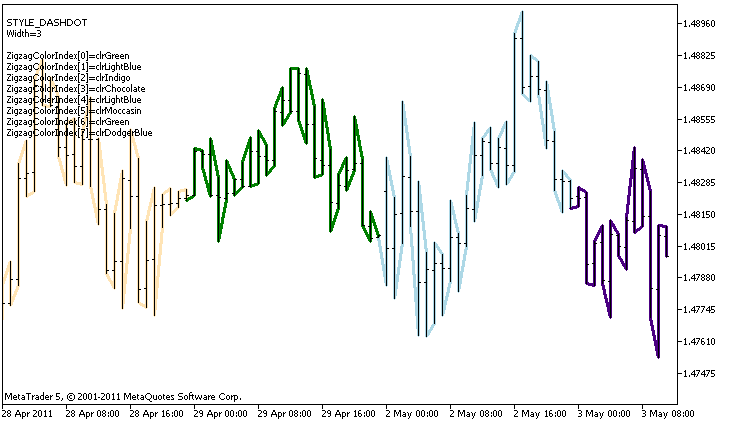

DRAW\_COLOR\_ZIGZAG


[MQL5 Reference](index.md)  /  [Custom Indicators](customind.md)  /  [Indicator Styles in Examples](indicators_examples.md) / DRAW\_COLOR\_ZIGZAG

[](draw_color_arrow.md) 
[](draw_color_bars.md)

DRAW\_COLOR\_ZIGZAG

The DRAW\_COLOR\_ZIGZAG style draws segments of different colors, using the values of two indicator buffers. This style is a colored version of [DRAW\_ZIGZAG](draw_zigzag.md), i.e. allows specifying for each segment an individual color from the predefined set of colors. The segments are plotted from a value in the first buffer to a value in the second indicator buffer. None of the buffers can contain only empty values, since in this case nothing is plotted.

The width, color and style of the line can be specified like for the [DRAW\_ZIGZAG](draw_zigzag.md) style - using [compiler directives](compilation.md) or dynamically using the [PlotIndexSetInteger()](plotindexsetinteger.md) function. Dynamic changes of the plotting properties allows "to enliven" indicators, so that their appearance changes depending on the current situation.

Sections are drawn from a non-empty value of one buffer to a non-empty value of another indicator buffer. To specify what value should be considered as "empty", set this value in the [PLOT\_EMPTY\_VALUE](customindicatorproperties.md#enum_customind_property_double) property:

```
//--- The 0 (empty) value will mot participate in drawing
   PlotIndexSetDouble(index_of_plot_DRAW_COLOR_ZIGZAG,PLOT_EMPTY_VALUE,0);
```

Always explicitly fill in the of the indicator buffers, set an empty value in a buffer to skip bars.

The number of buffers required for plotting DRAW\_COLOR\_ZIGZAG is 3:

* two buffers to store the values of ends of the zigzag sections;
* one buffer to store the color index, which is used to draw the section (it makes sense to set only non-empty values).

An example of the indicator that plots a saw based on the High and Low prices. The color, width and style of the zigzag lines change randomly every N ticks.



Please note that for plot1 with the DRAW\_COLOR\_ZIGZAG style, 8 colors are set using the compiler directive [#property](compilation.md), and then in the [OnCalculate()](oncalculate.md) function the color is selected randomly from the 14 colors stored in the colors[] array.

The N parameter is set in [external parameters](inputvariables.md) of the indicator for the possibility of manual configuration (the Parameters tab in the indicator's Properties window).

```
//+------------------------------------------------------------------+
//|                                            DRAW_COLOR_ZIGZAG.mq5 |
//|                        Copyright 2011, MetaQuotes Software Corp. |
//|                                              https://www.mql5.com |
//+------------------------------------------------------------------+
#property copyright "Copyright 2000-2024, MetaQuotes Ltd."
#property link      "https://www.mql5.com"
#property version   "1.00"
 
#property description "An indicator to demonstrate DRAW_COLOR_ZIGZAG"
#property description "It draws a broken line as a sequence of colored sections, the color depends on the number of the day of the week"
#property description "The color, width and style of segments are changed randomly"
#property description " every N ticks"
 
#property indicator_chart_window
#property indicator_buffers 3
#property indicator_plots   1
//--- plot Color_Zigzag
#property indicator_label1  "Color_Zigzag"
#property indicator_type1   DRAW_COLOR_ZIGZAG
//--- Define 8 colors for coloring sections (they are stored in a special array)
#property indicator_color1  clrRed,clrBlue,clrGreen,clrYellow,clrMagenta,clrCyan,clrLime,clrOrange
#property indicator_style1  STYLE_SOLID
#property indicator_width1  1
//--- input parameter
input int      N=5;              // Number of ticks to change 
int            color_sections;
//--- Buffers of values of segment ends
double         Color_ZigzagBuffer1[];
double         Color_ZigzagBuffer2[];
//--- Buffers of color indexes of segment ends
double         Color_ZigzagColors[];
//--- An array for storing colors contains 14 elements
color colors[]=
  {
   clrRed,clrBlue,clrGreen,clrChocolate,clrMagenta,clrDodgerBlue,clrGoldenrod,
   clrIndigo,clrLightBlue,clrAliceBlue,clrMoccasin,clrWhiteSmoke,clrCyan,clrMediumPurple
  };
//--- An array to store the line styles
ENUM_LINE_STYLE styles[]={STYLE_SOLID,STYLE_DASH,STYLE_DOT,STYLE_DASHDOT,STYLE_DASHDOTDOT};
//+------------------------------------------------------------------+
//| Custom indicator initialization function                         |
//+------------------------------------------------------------------+
int OnInit()
  {
//--- indicator buffers mapping
   SetIndexBuffer(0,Color_ZigzagBuffer1,INDICATOR_DATA);
   SetIndexBuffer(1,Color_ZigzagBuffer2,INDICATOR_DATA);
   SetIndexBuffer(2,Color_ZigzagColors,INDICATOR_COLOR_INDEX);
//----Number of color for coloring the zigzag
   color_sections=8;   //  see a comment to the #property indicator_color1 property
//---
   return(INIT_SUCCEEDED);
  }
//+------------------------------------------------------------------+
//| Custom indicator iteration function                              |
//+------------------------------------------------------------------+
int OnCalculate(const int rates_total,
                const int prev_calculated,
                const datetime &time[],
                const double &open[],
                const double &high[],
                const double &low[],
                const double &close[],
                const long &tick_volume[],
                const long &volume[],
                const int &spread[])
  {
   static int ticks=0;
//--- Calculate ticks to change the style, color and width of the line
   ticks++;
//--- If a sufficient number of ticks has been accumulated
   if(ticks>=N)
     {
      //--- Change the line properties
      ChangeLineAppearance();
      //--- Change colors used to plot the sections
      ChangeColors(colors,color_sections);
      //--- Reset the counter of ticks to zero
      ticks=0;
     }
 
//--- The structure of time is required to get the day of week of each bar
   MqlDateTime dt;
      
//--- The start position of calculations
   int start=0;
//--- If the indicator was calculated on the previous tick, then start the calculation with the last but one tick
   if(prev_calculated!=0) start=prev_calculated-1;
//--- Calculation loop
   for(int i=start;i<rates_total;i++)
     {
      //--- Write the bar open time in the structure
      TimeToStruct(time[i],dt);
 
      //--- If the bar number is even
      if(i%2==0)
        {
         //---  Write High in the 1st buffer and Low in the 2nd one
         Color_ZigzagBuffer1[i]=high[i];
         Color_ZigzagBuffer2[i]=low[i];
         //--- The color of the segment
         Color_ZigzagColors[i]=dt.day_of_year%color_sections;
        }
      //--- the bar number is odd
      else
        {
         //--- Fill in the bar in a reverse order
         Color_ZigzagBuffer1[i]=low[i];
         Color_ZigzagBuffer2[i]=high[i];
         //--- The color of the segment
         Color_ZigzagColors[i]=dt.day_of_year%color_sections;         
        }
     }
//--- return value of prev_calculated for next call
   return(rates_total);
  }
//+------------------------------------------------------------------+
//| Changes the color of the zigzag segments                         |
//+------------------------------------------------------------------+
void  ChangeColors(color  &cols[],int plot_colors)
  {
//--- The number of colors
   int size=ArraySize(cols);
//--- 
   string comm=ChartGetString(0,CHART_COMMENT)+"\r\n\r\n";
 
//--- For each color index define a new color randomly
   for(int plot_color_ind=0;plot_color_ind<plot_colors;plot_color_ind++)
     {
      //--- Get a random value
      int number=MathRand();
      //--- Get an index in the col[] array as a remainder of the integer division
      int i=number%size;
      //--- Set the color for each index as the property PLOT_LINE_COLOR
      PlotIndexSetInteger(0,                    //  The number of a graphical style
                          PLOT_LINE_COLOR,      //  Property identifier
                          plot_color_ind,       //  The index of the color, where we write the color
                          cols[i]);             //  A new color
      //--- Write the colors
      comm=comm+StringFormat("ZigzagColorIndex[%d]=%s \r\n",plot_color_ind,ColorToString(cols[i],true));
      ChartSetString(0,CHART_COMMENT,comm);
     }
//---
  }
//+------------------------------------------------------------------+
//| Changes the appearance of the zigzag segments                    |
//+------------------------------------------------------------------+
void ChangeLineAppearance()
  {
//--- A string for the formation of information about the properties of Color_ZigZag
   string comm="";
//--- A block for changing the width of the line
   int number=MathRand();
//--- Get the width of the remainder of integer division
   int width=number%5;   // The width is set from 0 to 4
//--- Set the color as the PLOT_LINE_WIDTH property
   PlotIndexSetInteger(0,PLOT_LINE_WIDTH,width);
//--- Write the line width
   comm=comm+"\r\nWidth="+IntegerToString(width);
 
//--- A block for changing the style of the line
   number=MathRand();
//--- The divisor is equal to the size of the styles array
   int size=ArraySize(styles);
//--- Get the index to select a new style as the remainder of integer division
   int style_index=number%size;
//--- Set the color as the PLOT_LINE_COLOR property
   PlotIndexSetInteger(0,PLOT_LINE_STYLE,styles[style_index]);
//--- Write the line style
   comm="\r\n"+EnumToString(styles[style_index])+""+comm;
//--- Show the information on the chart using a comment
   Comment(comm);
  }
```