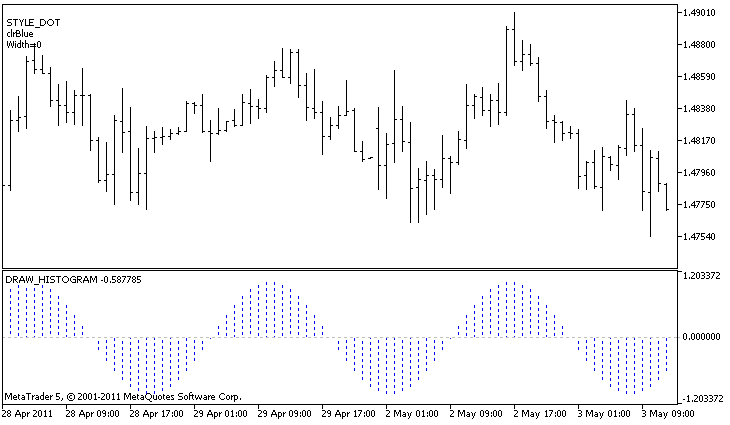

DRAW\_HISTOGRAM


[MQL5 Reference](index.md)  /  [Custom Indicators](customind.md)  /  [Indicator Styles in Examples](indicators_examples.md) / DRAW\_HISTOGRAM

[](draw_section.md) 
[](draw_histogram2.md)

DRAW\_HISTOGRAM

The DRAW\_HISTOGRAM style draws a histogram as a sequence of columns of a specified color from zero to a specified value. Values are taken from the indicator buffer. The width, color and style of the column can be specified like for the [DRAW\_LINE](draw_none.md) style - using [compiler directives](compilation.md) or dynamically using the [PlotIndexSetInteger()](plotindexsetinteger.md) function. Dynamic changes of the plotting properties allows changing the look of the histogram based on the current situation.

Since a column from the zero level is drawn on each bar, DRAW\_HISTOGRAM should better be used in a separate chart window. Most often this type of plotting is used to create indicators of the oscillator type, for example, [Bears Power](ibearspower.md) or [OsMA](iosma.md). For the empty non-displayable values the zero value should be specified.

The number of buffers required for plotting DRAW\_HISTOGRAM is 1.

An example of the indicator that draws a sinusoid of a specified color based on the [MathSin() function](mathsin.md). The color, width and style of all histogram columns change randomly each N ticks. The bars parameter specifies the period of the sinusoid, that is after the specified number of bars the sinusoid will repeat the cycle.



Note that initially for plot1 with DRAW\_HISTOGRAM the properties are set using the compiler directive [#property](compilation.md), and then in the [OnCalculate()](oncalculate.md) function these three properties are set randomly. The N parameter is set in [external parameters](inputvariables.md) of the indicator for the possibility of manual configuration (the Parameters tab in the indicator's Properties window).

```
//+------------------------------------------------------------------+
//|                                               DRAW_HISTOGRAM.mq5 |
//|                        Copyright 2011, MetaQuotes Software Corp. |
//|                                              https://www.mql5.com |
//+------------------------------------------------------------------+
#property copyright "Copyright 2000-2024, MetaQuotes Ltd."
#property link      "https://www.mql5.com"
#property version   "1.00"
 
#property description "An indicator to demonstrate DRAW_HISTOGRAM"
#property description "It draws a sinusoid as a histogram in a separate window"
#property description "The color and width of columns are changed randomly"
#property description "after every N ticks"
#property description "The bars parameter sets the number of bars in the cycle of the sinusoid"
 
#property indicator_separate_window
#property indicator_buffers 1
#property indicator_plots   1
//--- plot Histogram
#property indicator_label1  "Histogram"
#property indicator_type1   DRAW_HISTOGRAM
#property indicator_color1  clrBlue
#property indicator_style1  STYLE_SOLID
#property indicator_width1  1
//--- input parameters
input int      bars=30;          // The period of a sinusoid in bars
input int      N=5;              // The number of ticks to change the histogram
//--- indicator buffers
double         HistogramBuffer[];
//--- A factor to get the 2Pi angle in radians, when multiplied by the bars parameter
double    multiplier;
//--- An array to store colors
color colors[]={clrRed,clrBlue,clrGreen};
//--- An array to store the line styles
ENUM_LINE_STYLE styles[]={STYLE_SOLID,STYLE_DASH,STYLE_DOT,STYLE_DASHDOT,STYLE_DASHDOTDOT};
//+------------------------------------------------------------------+
//| Custom indicator initialization function                         |
//+------------------------------------------------------------------+
int OnInit()
  {
//--- indicator buffers mapping
   SetIndexBuffer(0,HistogramBuffer,INDICATOR_DATA);
//--- Calculate the multiplier
   if(bars>1)multiplier=2.*M_PI/bars;
   else
     {
      PrintFormat("Set the value of bars=%d greater than 1",bars);
      //--- Early termination of the indicator
      return(INIT_PARAMETERS_INCORRECT);
     }
//---
   return(INIT_SUCCEEDED);
  }
//+------------------------------------------------------------------+
//| Custom indicator iteration function                              |
//+------------------------------------------------------------------+
int OnCalculate(const int rates_total,
                const int prev_calculated,
                const datetime &time[],
                const double &open[],
                const double &high[],
                const double &low[],
                const double &close[],
                const long &tick_volume[],
                const long &volume[],
                const int &spread[])
  {
   static int ticks=0;
//--- Calculate ticks to change the style, color and width of the line
   ticks++;
//--- If a critical number of ticks has been accumulated
   if(ticks>=N)
     {
      //--- Change the line properties
      ChangeLineAppearance();
      //--- Reset the counter of ticks to zero
      ticks=0;
     }
 
//--- Calculate the indicator values
   int start=0;
//--- If already calculated during the previous starts of OnCalculate
   if(prev_calculated>0) start=prev_calculated-1; // set the beginning of the calculation with the last but one bar
//--- Fill in the indicator buffer with values
   for(int i=start;i<rates_total;i++)
     {
      HistogramBuffer[i]=sin(i*multiplier);
     }
//--- Return the prev_calculated value for the next call of the function
   return(rates_total);
  }
//+------------------------------------------------------------------+
//| Changes the appearance of lines in the indicator                 |
//+------------------------------------------------------------------+
void ChangeLineAppearance()
  {
//--- A string for the formation of information about the line properties
   string comm="";
//--- A block for changing the color of the line
   int number=MathRand(); // Get a random number
//--- The divisor is equal to the size of the colors[] array
   int size=ArraySize(colors);
//--- Get the index to select a new color as the remainder of integer division
   int color_index=number%size;
//--- Set the color as the PLOT_LINE_COLOR property
   PlotIndexSetInteger(0,PLOT_LINE_COLOR,colors[color_index]);
//--- Write the line color
   comm=comm+"\r\n"+(string)colors[color_index];
 
//--- A block for changing the width of the line
   number=MathRand();
//--- Get the width of the remainder of integer division
   int width=number%5;   // The width is set from 0 to 4
//--- Set the width
   PlotIndexSetInteger(0,PLOT_LINE_WIDTH,width);
//--- Write the line width
   comm=comm+"\r\nWidth="+IntegerToString(width);
 
//--- A block for changing the style of the line
   number=MathRand();
//--- The divisor is equal to the size of the styles array
   size=ArraySize(styles);
//--- Get the index to select a new style as the remainder of integer division
   int style_index=number%size;
//--- Set the line style
   PlotIndexSetInteger(0,PLOT_LINE_STYLE,styles[style_index]);
//--- Write the line style
   comm="\r\n"+EnumToString(styles[style_index])+""+comm;
//--- Show the information on the chart using a comment
   Comment(comm);
  }
```