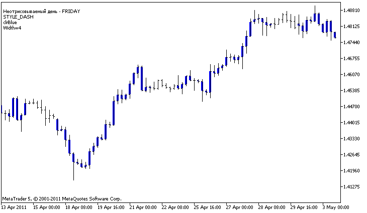

DRAW\_HISTOGRAM2


[MQL5 Reference](index.md)  /  [Custom Indicators](customind.md)  /  [Indicator Styles in Examples](indicators_examples.md) / DRAW\_HISTOGRAM2

[](draw_histogram.md) 
[](draw_arrow.md)

DRAW\_HISTOGRAM2

The DRAW\_HISTOGRAM2 style draws a histogram of a specified color vertical segments using the values of two indicator buffers. The width, color and style of the segments can be specified like for the [DRAW\_LINE](draw_none.md) style - using [compiler directives](compilation.md) or dynamically using the [PlotIndexSetInteger()](plotindexsetinteger.md) function. Dynamic changes of the plotting properties allows changing the look of the histogram based on the current situation.

The DRAW\_HISTOGRAM2 style can be used in a separate subwindow of a chart and in its main window. For empty values nothing is drawn, all the values in the indicator buffers need to be set explicitly. Buffers are not initialized with a zero value.

The number of buffers required for plotting DRAW\_HISTOGRAM2 is 2.

An example of the indicator that plots a vertical segment of the specified color and width between the Open and Close prices of each bar. The color, width and style of all histogram columns change randomly each N ticks. During the start of the indicator, in the [OnInit()](oninit.md) function, the number of the day of week for which the histogram will not be drawn - invisible\_day - is set randomly. For this purpose an empty value is set [PLOT\_EMPTY\_VALUE](drawstyles.md#enum_plot_property_double)=0:

```
//--- Set an empty value
   PlotIndexSetDouble(index_of_plot_DRAW_SECTION,PLOT_EMPTY_VALUE,0);
```



Note that initially for plot1 with DRAW\_HISTOGRAM2 the properties are set using the compiler directive [#property](compilation.md), and then in the [OnCalculate()](oncalculate.md) function these three properties are set randomly. The N parameter is set in [external parameters](inputvariables.md) of the indicator for the possibility of manual configuration (the Parameters tab in the indicator's Properties window).

```
//+------------------------------------------------------------------+
//|                                              DRAW_HISTOGRAM2.mq5 |
//|                        Copyright 2011, MetaQuotes Software Corp. |
//|                                              https://www.mql5.com |
//+------------------------------------------------------------------+
#property copyright "Copyright 2000-2024, MetaQuotes Ltd."
#property link      "https://www.mql5.com"
#property version   "1.00"
 
#property description "An indicator to demonstrate DRAW_HISTOGRAM2"
#property description "It draws a segment between Open and Close on each bar"
#property description "The color, width and style are changed randomly"
#property description "after every N ticks"
 
#property indicator_chart_window
#property indicator_buffers 2
#property indicator_plots   1
//--- plot Histogram_2
#property indicator_label1  "Histogram_2"
#property indicator_type1   DRAW_HISTOGRAM2
#property indicator_color1  clrRed
#property indicator_style1  STYLE_SOLID
#property indicator_width1  1
//--- input parameters
input int      N=5;              // The number of ticks to change the histogram
//--- indicator buffers
double         Histogram_2Buffer1[];
double         Histogram_2Buffer2[];
//--- The day of the week for which the indicator is not plotted
int invisible_day;
//--- An array to store colors
color colors[]={clrRed,clrBlue,clrGreen};
//--- An array to store the line styles
ENUM_LINE_STYLE styles[]={STYLE_SOLID,STYLE_DASH,STYLE_DOT,STYLE_DASHDOT,STYLE_DASHDOTDOT};
//+------------------------------------------------------------------+
//| Custom indicator initialization function                         |
//+------------------------------------------------------------------+
int OnInit()
  {
//--- indicator buffers mapping
   SetIndexBuffer(0,Histogram_2Buffer1,INDICATOR_DATA);
   SetIndexBuffer(1,Histogram_2Buffer2,INDICATOR_DATA);
//--- Set an empty value
   PlotIndexSetDouble(0,PLOT_EMPTY_VALUE,0);
//--- Get a random number from 0 to 5
   invisible_day=MathRand()%6;
//---
   return(INIT_SUCCEEDED);
  }
//+------------------------------------------------------------------+
//| Custom indicator iteration function                              |
//+------------------------------------------------------------------+
int OnCalculate(const int rates_total,
                const int prev_calculated,
                const datetime &time[],
                const double &open[],
                const double &high[],
                const double &low[],
                const double &close[],
                const long &tick_volume[],
                const long &volume[],
                const int &spread[])
  {
   static int ticks=0;
//--- Calculate ticks to change the style, color and width of the line
   ticks++;
//--- If a critical number of ticks has been accumulated
   if(ticks>=N)
     {
      //--- Change the line properties
      ChangeLineAppearance();
      //--- Reset the counter of ticks to zero
      ticks=0;
     }
 
//--- Calculate the indicator values
   int start=0;
//--- To get the day of week by the open price of each bar
   MqlDateTime dt;
//--- If already calculated during the previous starts of OnCalculate
   if(prev_calculated>0) start=prev_calculated-1; // set the beginning of the calculation with the last but one bar
//--- Fill in the indicator buffer with values
   for(int i=start;i<rates_total;i++)
     {
      TimeToStruct(time[i],dt);
      if(dt.day_of_week==invisible_day)
        {
         Histogram_2Buffer1[i]=0;
         Histogram_2Buffer2[i]=0;
        }
      else
        {
         Histogram_2Buffer1[i]=open[i];
         Histogram_2Buffer2[i]=close[i];
        }
     }
//--- Return the prev_calculated value for the next call of the function
   return(rates_total);
  }
//+------------------------------------------------------------------+
//| Changes the appearance of lines in the indicator                 |
//+------------------------------------------------------------------+
void ChangeLineAppearance()
  {
//--- A string for the formation of information about the line properties
   string comm="";
//--- A block of line color change
   int number=MathRand(); // Get a random number
//--- The divisor is equal to the size of the colors[] array
   int size=ArraySize(colors);
//--- Get the index to select a new color as the remainder of integer division
   int color_index=number%size;
//--- Set the color as the PLOT_LINE_COLOR property
   PlotIndexSetInteger(0,PLOT_LINE_COLOR,colors[color_index]);
//--- Write the line color
   comm=comm+"\r\n"+(string)colors[color_index];
 
//--- A block for changing the width of the line
   number=MathRand();
//--- Get the width of the remainder of integer division
   int width=number%5;   // The width is set from 0 to 4
//--- Set the line width
   PlotIndexSetInteger(0,PLOT_LINE_WIDTH,width);
//--- Write the line width
   comm=comm+"\r\nWidth="+IntegerToString(width);
 
//--- A block for changing the style of the line
   number=MathRand();
//--- The divisor is equal to the size of the styles array
   size=ArraySize(styles);
//--- Get the index to select a new style as the remainder of integer division
   int style_index=number%size;
//--- Set the line style
   PlotIndexSetInteger(0,PLOT_LINE_STYLE,styles[style_index]);
//--- Write the line style
   comm="\r\n"+EnumToString(styles[style_index])+""+comm;
//--- Add information about the day that is omitted in calculations
   comm="\r\nNot plotted day - "+EnumToString((ENUM_DAY_OF_WEEK)invisible_day)+comm;
//--- Show the information on the chart using a comment
   Comment(comm);
  }
```