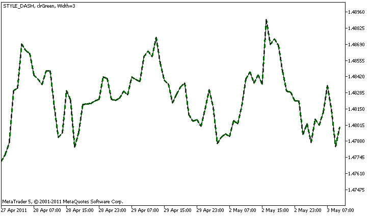

DRAW\_LINE


[MQL5 Reference](index.md)  /  [Custom Indicators](customind.md)  /  [Indicator Styles in Examples](indicators_examples.md) / DRAW\_LINE

[](draw_none.md) 
[](draw_section.md)

DRAW\_LINE

DRAW\_LINE draws a line of the specified color by the values of the indicator buffer. The width, style and color of the line can be set using the [compiler directives](compilation.md) and dynamically using the [PlotIndexSetInteger()](plotindexsetinteger.md) function. Dynamic changes of the plotting properties allows "to enliven" indicators, so that their appearance changes depending on the current situation.

The number of buffers required for plotting DRAW\_LINE is 1.

An example of the indicator that draws a line using Close prices of bars. The line color, width and style change randomly every N=5 ticks.



Note that initially for plot1 with DRAW\_LINE the properties are set using the compiler directive [#property](compilation.md), and then in the [OnCalculate()](oncalculate.md) function these three properties are set randomly. The N parameter is set in [external parameters](inputvariables.md) of the indicator for the possibility of manual configuration (the Parameters tab in the indicator's Properties window).

```
//+------------------------------------------------------------------+
//|                                                    DRAW_LINE.mq5 |
//|                        Copyright 2011, MetaQuotes Software Corp. |
//|                                              https://www.mql5.com |
//+------------------------------------------------------------------+
#property copyright "Copyright 2000-2024, MetaQuotes Ltd."
#property link      "https://www.mql5.com"
#property version   "1.00"
 
#property description "An indicator to demonstrate DRAW_LINE"
#property description "It draws a line of a specified color at Close prices"
#property description "Color, width and style of lines is changed randomly"
#property description "after every N ticks"
 
#property indicator_chart_window
#property indicator_buffers 1
#property indicator_plots   1
//--- Line properties are set using the compiler directives
#property indicator_label1  "Line"      // Name of a plot for the Data Window
#property indicator_type1   DRAW_LINE   // Type of plotting is line
#property indicator_color1  clrRed      // Line color
#property indicator_style1  STYLE_SOLID // Line style
#property indicator_width1  1           // Line Width
//--- input parameter
input int      N=5;         // Number of ticks to change 
//--- An indicator buffer for the plot
double         LineBuffer[];
//--- An array to store colors
color colors[]={clrRed,clrBlue,clrGreen};
//--- An array to store the line styles
ENUM_LINE_STYLE styles[]={STYLE_SOLID,STYLE_DASH,STYLE_DOT,STYLE_DASHDOT,STYLE_DASHDOTDOT};
//+------------------------------------------------------------------+
//| Custom indicator initialization function                         |
//+------------------------------------------------------------------+
int OnInit()
  {
//--- Binding an array and an indicator buffer
   SetIndexBuffer(0,LineBuffer,INDICATOR_DATA);
//--- Initializing the generator of pseudo-random numbers
   MathSrand(GetTickCount());
//---
   return(INIT_SUCCEEDED);
  }
//+------------------------------------------------------------------+
//| Custom indicator iteration function                              |
//+------------------------------------------------------------------+
int OnCalculate(const int rates_total,
                const int prev_calculated,
                const datetime &time[],
                const double &open[],
                const double &high[],
                const double &low[],
                const double &close[],
                const long &tick_volume[],
                const long &volume[],
                const int &spread[])
  {
   static int ticks=0;
//--- Calculate ticks to change the style, color and width of the line
   ticks++;
//--- If a critical number of ticks has been accumulated
   if(ticks>=N)
     {
      //--- Change the line properties
      ChangeLineAppearance();
      //--- Reset the counter of ticks to zero
      ticks=0;
     }
 
//--- Block for calculating indicator values
   for(int i=0;i<rates_total;i++)
     {
      LineBuffer[i]=close[i];
     }
 
//--- Return the prev_calculated value for the next call of the function
   return(rates_total);
  }
//+------------------------------------------------------------------+
//| Changes the appearance of the drawn line in the indicator        |
//+------------------------------------------------------------------+
void ChangeLineAppearance()
  {
//--- A string for the formation of information about the line properties
   string comm="";
//--- A block for changing the color of the line
//--- Get a random number
   int number=MathRand();
//--- The divisor is equal to the size of the colors[] array
   int size=ArraySize(colors);
//--- Get the index to select a new color as the remainder of integer division
   int color_index=number%size;
//--- Set the color as the PLOT_LINE_COLOR property
   PlotIndexSetInteger(0,PLOT_LINE_COLOR,colors[color_index]);
//--- Write the line color
   comm=comm+(string)colors[color_index];
 
//--- A block for changing the width of the line
   number=MathRand();
//--- Get the width of the remainder of integer division
   int width=number%5; // The width is set from 0 to 4
//--- Set the color as the PLOT_LINE_WIDTH property
   PlotIndexSetInteger(0,PLOT_LINE_WIDTH,width);
//--- Write the line width
   comm=comm+", Width="+IntegerToString(width);
 
//--- A block for changing the style of the line
   number=MathRand();
//--- The divisor is equal to the size of the styles array
   size=ArraySize(styles);
//--- Get the index to select a new style as the remainder of integer division
   int style_index=number%size;
//--- Set the color as the PLOT_LINE_COLOR property
   PlotIndexSetInteger(0,PLOT_LINE_STYLE,styles[style_index]);
//--- Write the line style
   comm=EnumToString(styles[style_index])+", "+comm;
//--- Show the information on the chart using a comment
   Comment(comm);
  }
```