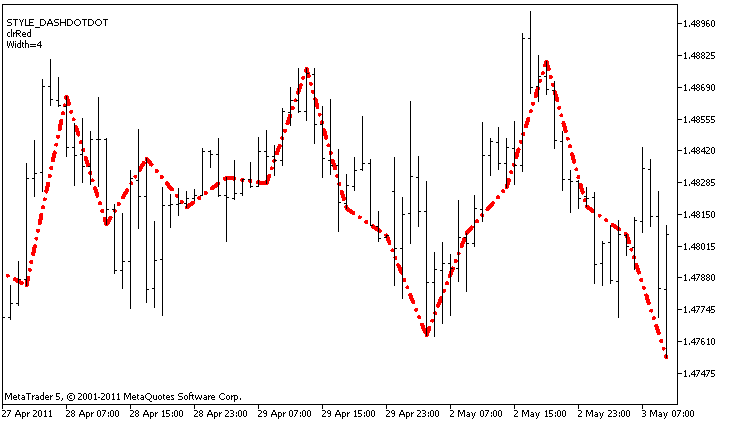

DRAW\_SECTION


[MQL5 Reference](index.md)  /  [Custom Indicators](customind.md)  /  [Indicator Styles in Examples](indicators_examples.md) / DRAW\_SECTION

[](draw_line.md) 
[](draw_histogram.md)

DRAW\_SECTION

DRAW\_SECTION draws sections of the specified color by the values of the indicator buffer. The width, color and style of the line can be specified like for the [DRAW\_LINE](draw_none.md) style - using [compiler directives](compilation.md) or dynamically using the [PlotIndexSetInteger()](plotindexsetinteger.md) function. Dynamic changes of the plotting properties allows "to enliven" indicators, so that their appearance changes depending on the current situation.

Sections are drawn from one non-empty value to another non-empty value of the indicator buffer, empty values are ignored. To specify what value should be considered as "empty", set this value in the [PLOT\_EMPTY\_VALUE](customindicatorproperties.md#enum_customind_property_double) property: For example, if the indicator should be drawn as a sequence of sections on non-zero values, then you need to set the zero value as an empty one:

```
//--- The 0 (empty) value will mot participate in drawing
   PlotIndexSetDouble(index_of_plot_DRAW_SECTION,PLOT_EMPTY_VALUE,0);
```

Always explicitly fill in the values of the indicator buffers, set an empty value in a buffer to the elements that should not be plotted.

The number of buffers required for plotting DRAW\_SECTION is 1.

An example of the indicator that draws sections between the High and Low prices. The color, width and style of all sections change randomly every N ticks.



Note that initially for plot1 with DRAW\_SECTION the properties are set using the compiler directive [#property](compilation.md), and then in the [OnCalculate()](oncalculate.md) function these three properties are set randomly. The N parameter is set in [external parameters](inputvariables.md) of the indicator for the possibility of manual configuration (the Parameters tab in the indicator's Properties window).

```
//+------------------------------------------------------------------+
//|                                                 DRAW_SECTION.mq5 |
//|                        Copyright 2011, MetaQuotes Software Corp. |
//|                                              https://www.mql5.com |
//+------------------------------------------------------------------+
#property copyright "Copyright 2000-2024, MetaQuotes Ltd."
#property link      "https://www.mql5.com"
#property version   "1.00"
 
#property description "An indicator to demonstrate DRAW_SECTION"
#property description "Draws straight sections every bars bars"
#property description "The color, width and style of sections are changed randomly"
#property description "after every N ticks"
 
#property indicator_chart_window
#property indicator_buffers 1
#property indicator_plots   1
//--- plot Section
#property indicator_label1  "Section"
#property indicator_type1   DRAW_SECTION
#property indicator_color1  clrRed
#property indicator_style1  STYLE_SOLID
#property indicator_width1  1
//--- input parameter
input int      bars=5;           // The length of sections in bars
input int      N=5;              // The number of ticks to change the style of sections
//--- An indicator buffer for the plot
double         SectionBuffer[];
//--- An auxiliary variable to calculate ends of sections
int            divider;
//--- An array to store colors
color colors[]={clrRed,clrBlue,clrGreen};
//--- An array to store the line styles
ENUM_LINE_STYLE styles[]={STYLE_SOLID,STYLE_DASH,STYLE_DOT,STYLE_DASHDOT,STYLE_DASHDOTDOT};
//+------------------------------------------------------------------+
//| Custom indicator initialization function                         |
//+------------------------------------------------------------------+
int OnInit()
  {
//--- Binding an array and an indicator buffer
   SetIndexBuffer(0,SectionBuffer,INDICATOR_DATA);
//--- The 0 (empty) value will mot participate in drawing
   PlotIndexSetDouble(0,PLOT_EMPTY_VALUE,0);
//--- Check the indicator parameter
   if(bars<=0)
     {
      PrintFormat("Invalid value of parameter bar=%d",bars);
      return(INIT_PARAMETERS_INCORRECT);
     }
   else divider=2*bars;
//---+
   return(INIT_SUCCEEDED);
  }
//+------------------------------------------------------------------+
//| Custom indicator iteration function                              |
//+------------------------------------------------------------------+
int OnCalculate(const int rates_total,
                const int prev_calculated,
                const datetime &time[],
                const double &open[],
                const double &high[],
                const double &low[],
                const double &close[],
                const long &tick_volume[],
                const long &volume[],
                const int &spread[])
  {
   static int ticks=0;
//--- Calculate ticks to change the style, color and width of the line
   ticks++;
//--- If a critical number of ticks has been accumulated
   if(ticks>=N)
     {
      //--- Change the line properties
      ChangeLineAppearance();
      //--- Reset the counter of ticks to zero
      ticks=0;
     }
 
//--- The number of the bar from which the calculation of indicator values starts
   int start=0;
//--- If the indicator has been calculated before, then set start on the previous bar
   if(prev_calculated>0) start=prev_calculated-1;
//--- Here are all the calculations of the indicator values
   for(int i=start;i<rates_total;i++)
     {
      //--- Get a remainder of the division of the bar number by 2*bars
      int rest=i%divider;
      //--- If the bar number is divisible by 2*bars
      if(rest==0)
        {
         //--- Set the end of the section at the High price of this bar
         SectionBuffer[i]=high[i];
        }
      //---If the remainder of the division is equal to bars, 
      else
        {
         //--- Set the end of the section at the High price of this bar
         if(rest==bars) SectionBuffer[i]=low[i];
         //--- If nothing happened, ignore the bar - set 0
         else SectionBuffer[i]=0;
        }
     }
//--- Return the prev_calculated value for the next call of the function
   return(rates_total);
  }
//+------------------------------------------------------------------+
//| Changes the appearance of sections in the indicator              |
//+------------------------------------------------------------------+
void ChangeLineAppearance()
  {
//--- A string for the formation of information about the line properties
   string comm="";
//--- A block of line color change
   int number=MathRand(); // Get a random number
//--- The divisor is equal to the size of the colors[] array
   int size=ArraySize(colors);
//--- Get the index to select a new color as the remainder of integer division
   int color_index=number%size;
//--- Set the color as the PLOT_LINE_COLOR property
   PlotIndexSetInteger(0,PLOT_LINE_COLOR,colors[color_index]);
//--- Write the line color
   comm=comm+"\r\n"+(string)colors[color_index];
 
//--- A block for changing the width of the line
   number=MathRand();
//--- Get the width of the remainder of integer division
   int width=number%5;   // The width is set from 0 to 4
//--- Set the width
   PlotIndexSetInteger(0,PLOT_LINE_WIDTH,width);
//--- Write the line width
   comm=comm+"\r\nWidth="+IntegerToString(width);
 
//--- A block for changing the style of the line
   number=MathRand();
//--- The divisor is equal to the size of the styles array
   size=ArraySize(styles);
//--- Get the index to select a new style as the remainder of integer division
   int style_index=number%size;
//--- Set the line style
   PlotIndexSetInteger(0,PLOT_LINE_STYLE,styles[style_index]);
//--- Write the line style
   comm="\r\n"+EnumToString(styles[style_index])+""+comm;
//--- Show the information on the chart using a comment
   Comment(comm);
  }
```