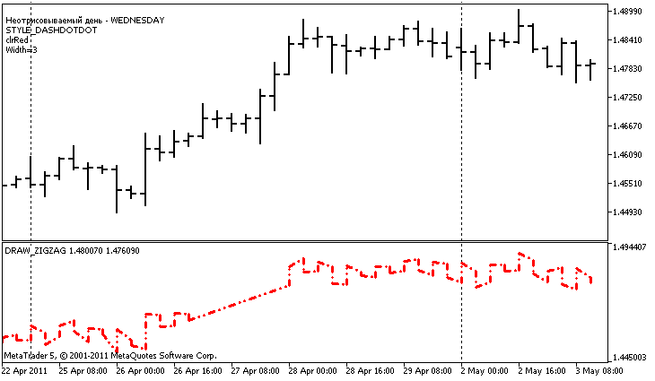

DRAW\_ZIGZAG


[MQL5 Reference](index.md)  /  [Custom Indicators](customind.md)  /  [Indicator Styles in Examples](indicators_examples.md) / DRAW\_ZIGZAG

[](draw_arrow.md) 
[](draw_filling.md)

DRAW\_ZIGZAG

The DRAW\_ZIGZAG style draws segments of a specified color based on the values of two indicator buffers. This style is very similar to [DRAW\_SECTION](draw_section.md), but unlike the latter, it allows drawing vertical segments within one bar, if values ​​of both indicator buffers are set for this bar. The segments are plotted from a value in the first buffer to a value in the second indicator buffer. None of the buffers can contain only empty values, since in this case nothing is plotted.

The width, color and style of the line can be specified like for the [DRAW\_SECTION](compilation.md) style - using [compiler directives](plotindexsetinteger.md) or dynamically using the [PlotIndexSetInteger()](plotindexsetinteger.md) function. Dynamic changes of the plotting properties allows "to enliven" indicators, so that their appearance changes depending on the current situation.

Sections are drawn from a non-empty value of one buffer to a non-empty value of another indicator buffer. To specify what value should be considered as "empty", set this value in the [PLOT\_EMPTY\_VALUE](customindicatorproperties.md#enum_customind_property_double) property:

```
//--- The 0 (empty) value will mot participate in drawing
   PlotIndexSetDouble(index_of_plot_DRAW_ZIGZAG,PLOT_EMPTY_VALUE,0);
```

Always explicitly fill in the values of the indicator buffers, set an empty value in a buffer to skip bars.

The number of buffers required for plotting DRAW\_ZIGZAG is 2.

An example of the indicator that plots a saw based on the High and Low prices. The color, width and style of the zigzag lines change randomly every N ticks.



Note that initially for plot1 with DRAW\_ZIGZAG the properties are set using the compiler directive [#property](compilation.md), and then in the [OnCalculate()](oncalculate.md) function these properties are set randomly. The N parameter is set in [external parameters](inputvariables.md) of the indicator for the possibility of manual configuration (the Parameters tab in the indicator's Properties window).

```
//+------------------------------------------------------------------+
//|                                                  DRAW_ZIGZAG.mq5 |
//|                        Copyright 2011, MetaQuotes Software Corp. |
//|                                              https://www.mql5.com |
//+------------------------------------------------------------------+
#property copyright "Copyright 2000-2024, MetaQuotes Ltd."
#property link      "https://www.mql5.com"
#property version   "1.00"
 
#property description "An indicator to demonstrate DRAW_ZIGZAG"
#property description "It draws a \"saw\" as straight segments, skipping the bars of one day"
#property description "The day to skip is selected randomly during indicator start"
#property description "The color, width and style of segments are changed randomly"
#property description " every N ticks"
 
#property indicator_separate_window
#property indicator_buffers 2
#property indicator_plots   1
//--- plot ZigZag
#property indicator_label1  "ZigZag"
#property indicator_type1   DRAW_ZIGZAG
#property indicator_color1  clrBlue
#property indicator_style1  STYLE_SOLID
#property indicator_width1  1
//--- input parameters
input int      N=5;              // Number of ticks to change 
//--- indicator buffers
double         ZigZagBuffer1[];
double         ZigZagBuffer2[];
//--- The day of the week for which the indicator is not plotted
int invisible_day;
//--- An array to store colors
color colors[]={clrRed,clrBlue,clrGreen};
//--- An array to store the line styles
ENUM_LINE_STYLE styles[]={STYLE_SOLID,STYLE_DASH,STYLE_DOT,STYLE_DASHDOT,STYLE_DASHDOTDOT};
//+------------------------------------------------------------------+
//| Custom indicator initialization function                         |
//+------------------------------------------------------------------+
int OnInit()
  {
//--- Binding arrays and indicator buffers
   SetIndexBuffer(0,ZigZagBuffer1,INDICATOR_DATA);
   SetIndexBuffer(1,ZigZagBuffer2,INDICATOR_DATA);
//--- Get a random value from 0 to 6, for this day the indicator is not plotted
   invisible_day=MathRand()%6;
//--- The 0 (empty) value will mot participate in drawing
   PlotIndexSetDouble(0,PLOT_EMPTY_VALUE,0);
//--- The 0 (empty) value will mot participate in drawing
   PlotIndexSetString(0,PLOT_LABEL,"ZigZag1;ZigZag2");
//---
   return(INIT_SUCCEEDED);
  }
//+------------------------------------------------------------------+
//| Custom indicator iteration function                              |
//+------------------------------------------------------------------+
int OnCalculate(const int rates_total,
                const int prev_calculated,
                const datetime &time[],
                const double &open[],
                const double &high[],
                const double &low[],
                const double &close[],
                const long &tick_volume[],
                const long &volume[],
                const int &spread[])
  {
   static int ticks=0;
//--- Calculate ticks to change the style, color and width of the line
   ticks++;
//--- If a sufficient number of ticks has been accumulated
   if(ticks>=N)
     {
      //--- Change the line properties
      ChangeLineAppearance();
      //--- Reset the counter of ticks to zero
      ticks=0;
     }
 
//--- The structure of time is required to get the day of week of each bar
   MqlDateTime dt;
 
//--- The start position of calculations
   int start=0;
//--- If the indicator was calculated on the previous tick, then start the calculation with the last but one tick
   if(prev_calculated!=0) start=prev_calculated-1;
//--- Calculation loop
   for(int i=start;i<rates_total;i++)
     {
      //--- Write the bar open time in the structure
      TimeToStruct(time[i],dt);
      //--- If the day of the week of this bar is equal to invisible_day
      if(dt.day_of_week==invisible_day)
        {
         //--- Write empty values to buffers for this bar
         ZigZagBuffer1[i]=0;
         ZigZagBuffer2[i]=0;
        }
      //--- If the day of the week is ok, fill in the buffers
      else
        {
         //--- If the bar number if even
         if(i%2==0)
           {
            //---  Write High in the 1st buffer and Low in the 2nd one
            ZigZagBuffer1[i]=high[i];
            ZigZagBuffer2[i]=low[i];
           }
         //--- The bar number is odd
         else
           {
            //--- Fill in the bar in a reverse order
            ZigZagBuffer1[i]=low[i];
            ZigZagBuffer2[i]=high[i];
           }
        }
     }
//--- return value of prev_calculated for next call
   return(rates_total);
  }
//+------------------------------------------------------------------+
//| Changes the appearance of the zigzag segments                    |
//+------------------------------------------------------------------+
void ChangeLineAppearance()
  {
//--- A string for the formation of information about the ZigZag properties
   string comm="";
//--- A block for changing the color of the ZigZag
   int number=MathRand(); // Get a random number
//--- The divisor is equal to the size of the colors[] array
   int size=ArraySize(colors);
//--- Get the index to select a new color as the remainder of integer division
   int color_index=number%size;
//--- Set the color as the PLOT_LINE_COLOR property
   PlotIndexSetInteger(0,PLOT_LINE_COLOR,colors[color_index]);
//--- Write the line color
   comm=comm+"\r\n"+(string)colors[color_index];
 
//--- A block for changing the width of the line
   number=MathRand();
//--- Get the width of the remainder of integer division
   int width=number%5;   // The width is set from 0 to 4
//--- Set the color as the PLOT_LINE_WIDTH property
   PlotIndexSetInteger(0,PLOT_LINE_WIDTH,width);
//--- Write the line width
   comm=comm+"\r\nWidth="+IntegerToString(width);
 
//--- A block for changing the style of the line
   number=MathRand();
//--- The divisor is equal to the size of the styles array
   size=ArraySize(styles);
//--- Get the index to select a new style as the remainder of integer division
   int style_index=number%size;
//--- Set the color as the PLOT_LINE_COLOR property
   PlotIndexSetInteger(0,PLOT_LINE_STYLE,styles[style_index]);
//--- Write the line style
   comm="\r\n"+EnumToString(styles[style_index])+""+comm;
//--- Add information about the day that is omitted in calculations
   comm="\r\nNot plotted day - "+EnumToString((ENUM_DAY_OF_WEEK)invisible_day)+comm;
//--- Show the information on the chart using a comment
   Comment(comm);
  }
```