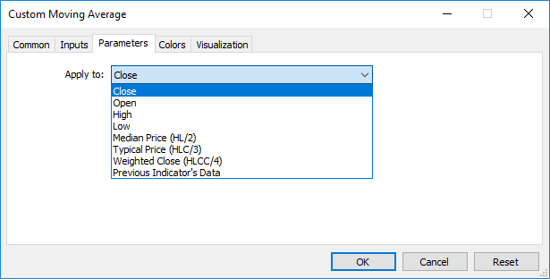

Event Handling Functions


[MQL5 Reference](index.md)  /  [Language Basics](basis.md)  /  [Functions](function.md) / Event Handling Functions

[](export.md) 
[](variables.md)

Event Handling Functions

The MQL5 language provides processing of some [predefined events](event_fire.md). Functions for handling these events must be defined in a MQL5 program; function name, return type, composition of parameters (if there are any) and their types must strictly conform to the description of the event handler function.

The event handler of the client terminal identifies functions, handling this or that event, by the type of return value and type of parameters. If other parameters, not corresponding to below descriptions, are specified for a corresponding function, or another return type is indicated for it, such a function will not be used as an event handler.

OnStart

The OnStart() function is the [Start](event_fire.md#start) event handler, which is automatically generated only for running scripts. It must be of void type, with no parameters:

```
void OnStart();
```

For the OnStart() function, the int return type can be specified.

OnInit

The OnInit() function is the [Init](event_fire.md#init) event handler. It must be of void or int type, with no parameters:

```
void OnInit();
```

The Init event is generated immediately after an Expert Advisor or an indicator is downloaded; this event is not generated for scripts. The OnInit() function is used for initialization. If OnInit() has the int type of the return value, the non-zero return code means unsuccessful initialization, and it generates the [Deinit](event_fire.md#deinit) event with the code of deinitialization reason [REASON\_INITFAILED](uninit.md#reason_initfailed).

When returning [INIT\_FAILED](events.md), the EA is forcibly unloaded from the chart.

When returning [INIT\_FAILED](events.md), the indicator is not unloaded from the chart. The indicator remaining on the chart is non-operational [event handlers](event_handlers.md) are not called in the indicator.

To optimize input parameters of an Expert Advisor, it is recommended to use values of the [ENUM\_INIT\_RETCODE](events.md#enum_init_retcode) enumeration as the return code. These values are used for organizing the course of optimization, including the selection of the most appropriate [testing agents](testing.md#agents). During initialization of an Expert Advisor before the start of testing you can request information about the configuration and resources of an agent (the number of cores, amount of free memory, etc.) using the [TerminalInfoInteger()](terminalinfointeger.md) function. Based on the information obtained, you can either allow to use this testing agent, or reject using it during the optimization of this Expert Advisor.

ENUM\_INIT\_RETCODE

| Identifier | Description |
| --- | --- |
| INIT\_SUCCEEDED | Successful initialization, testing of the Expert Advisor can be continued.  This code means the same as a null value the Expert Advisor has been successfully initialized in the tester. |
| INIT\_FAILED | Initialization failed; there is no point in continuing testing because of fatal errors. For example, failed to create an indicator that is required for the work of the Expert Advisor.  This return value means the same as a value other than zero - initialization of the Expert Advisor in the tester failed. |
| INIT\_PARAMETERS\_INCORRECT | This value means the incorrect set of input parameters. The result string containing this return code is highlighted in red in the general optimization table.  Testing for the given set of parameters of the Expert Advisor will not be executed, the agent is free to receive a new task.  Upon receiving this value, the strategy tester will reliably not pass this task to other agents for retry. |
| INIT\_AGENT\_NOT\_SUITABLE | No errors during initialization, but for some reason the agent is not suitable for testing. For example, not enough memory, no [OpenCL support](opencl.md), etc.  After the return of this code, the agent will not receive tasks until the end of [this optimization](testing.md). |

The OnInit() function of the void type always denotes successful initialization.

OnDeinit

The OnDeinit() function is called during deinitialization and is the [Deinit](event_fire.md#deinit) event handler. It must be declared as the void type and should have one parameter of the const int type, which contains [the code of deinitialization reason](uninit.md). If a different type is declared, the compiler will generate a warning, but the function will not be called. For scripts the Deinit event is not generated and therefore the OnDeinit() function can't be used in scripts.

```
void OnDeinit(const int reason);
```

The Deinit event is generated for Expert Advisors and indicators in the following cases:

* before reinitialization due to the change of a symbol or chart period, to which the mql5 program is attached;
* before reinitialization due to the change of [input parameters](inputvariables.md);
* before unloading the mql5 program.

OnTick

The [NewTick](event_fire.md#newtick) event is generated for Expert Advisors only when a new tick for a symbol is received, to the chart of which the Expert Advisor is attached. It's useless to define the OnTick() function in a custom indicator or script, because the NewTick event is not generated for them.

The Tick event is generated only for Expert Advisors, but this does not mean that Expert Advisors required the OnTick() function, since not only NewTick events are generated for Expert Advisors, but also events of Timer, BookEvent and ChartEvent are generated. It must be declared as the void type, with no parameters:

```
void OnTick();
```

OnTimer

The OnTimer() function is called when the [Timer](event_fire.md#timer) event occurs, which is generated by the system timer only for Expert Advisors and indicators - it can't be used in scripts. The frequency of the event occurrence is set when subscribing to notifications about this event to be received by the [EventSetTimer()](eventsettimer.md) function.

You can unsubscribe from receiving timer events for a particular Expert Advisor using the [EventKillTimer()](eventkilltimer.md) function. The function must be defined with the void type, with no parameters:

```
void OnTimer();
```

It is recommended to call the EventSetTimer() function once in the OnInit() function, and the EventKillTimer() function should be called once in OnDeinit().

Every Expert Advisor, as well as every indicator works with its own timer and receives events only from it. As soon as the mql5 program stops operating, the timer is destroyed forcibly, if it was created but hasn't been disabled by the [EventKillTimer()](eventkilltimer.md) function.

OnTrade

The function is called  when the [Trade](event_fire.md#trade) event occurs, which appears when you change the list of [placed orders](orderstotal.md) and [open positions](positionstotal.md), [the history of orders](historyorderstotal.md) and [history of deals](historydealstotal.md). When a trade activity is performed (pending order opening, position opening/closing, stops setting, pending order triggering, etc.) the history of orders and deals and/or list of positions and current orders is changed accordingly.

```
void OnTrade();
```

Users must independently implement in the code the verification of a trade account state when such an event is received (if this is required by the trade strategy conditions). If the OrderSend() function call has been completed successfully and returned a value of true, this means that the trading server has put the order into the queue for execution and assigned a ticket number to it. As soon as the server processes this order, the Trade event will be generated. And if a user remembers the ticket value, he/she will be able to find out what happened to the order using this value during OnTrade() event handling.

OnTradeTransaction

When performing some definite actions on a trade account, its state changes. Such actions include:

* Sending a trade request from any MQL5 application in the client terminal using [OrderSend](ordersend.md) and [OrderSendAsync](ordersendasync.md) functions and its further execution;
* Sending a trade request via the terminal graphical interface and its further execution;

* Pending orders and stop orders activation on the server;
* Performing operations on a trade server side.

The following trade transactions are performed as a result of these actions:

* handling a trade request;
* changing open orders;
* changing orders history;
* changing deals history;
* changing positions.

For example, when sending a market buy order, it is handled, an appropriate buy order is created for the account, the order is then executed and removed from the list of the open ones, then it is added to the orders history, an appropriate deal is added to the history and a new position is created. All these actions are trade transactions. Arrival of such a transaction at the terminal is a [TradeTransaction](event_fire.md#tradetransaction) event. It calls OnTradeTransaction handler

```
void  OnTradeTransaction(
   const MqlTradeTransaction&    trans,        // trade transaction structure
   const MqlTradeRequest&        request,      // request structure
   const MqlTradeResult&         result        // result structure
   );
```

The handler contains three parameters:

* trans - this parameter gets [MqlTradeTransaction](mqltradetransaction.md) structure describing a trade transaction applied to a trade account;
* request - this parameter gets [MqlTradeRequest](mqltraderequest.md) structure describing a trade request;
* result - this parameter gets [MqlTradeResult](mqltraderesult.md) structure describing a trade request execution result.

The last two request and result parameters are filled by values only for [TRADE\_TRANSACTION\_REQUEST](enum_trade_transaction_type.md) type transaction, data on transaction can be received from type parameter of trans variable. Note that in this case, request\_id field in result variable contains ID of request [trade request](mqltraderequest.md), after the execution of which the [trade transaction](mqltradetransaction.md) described in trans variable has been performed. Request ID allows to associate the performed action (OrderSend or OrderSendAsync functions call) with the result of this action sent to [OnTradeTransaction()](ontradetransaction.md).

One trade request manually sent from the terminal or via [OrderSend()](ordersend.md)/[OrderSendAsync()](ordersendasync.md) functions can generate several consecutive transactions on the trade server. Priority of these transactions' arrival at the terminal is not guaranteed. Thus, you should not expect that one group of transactions will arrive after another one when developing your trading algorithm.

|  |
| --- |
| * All types of trade transactions are described in [ENUM\_TRADE\_TRANSACTION\_TYPE](enum_trade_transaction_type.md) enumeration. * MqlTradeTransaction structure describing a trade transaction is filled in different ways depending on a transaction type. For example, only type field (trade transaction type) must be analyzed for TRADE\_TRANSACTION\_REQUEST type transactions. The second and third parameters of OnTradeTransaction function (request and result) must be analyzed for additional data. For more information, see ["Structure of a Trade Transaction"](mqltradetransaction.md). * A trade transaction description does not deliver all available information concerning orders, deals and positions (e.g., comments). [OrderGet*](ordergetdouble.md), [HistoryOrderGet*](historyordergetdouble.md), [HistoryDealGet*](historydealgetdouble.md) and [PositionGet*](positiongetdouble.md) functions should be used to get extended information. |

After applying trade transactions for a client account, they are consistently placed to the terminal trade transactions queue, from which they consistently sent to OnTradeTransaction entry point in order of arrival at the terminal.

When handling trade transactions by an Expert Advisor using OnTradeTransaction handler, the terminal continues handling newly arrived trade transactions. Therefore, the state of a trade account can change during OnTradeTransaction operation already. For example, while an MQL5 program handles an event of adding a new order, it may be executed, deleted from the list of the open ones and moved to the history. Further on, the application will be notified of these events.

Transactions queue length comprises 1024 elements. If OnTradeTransaction handles a new transaction for too long, the old ones in the queue may be superseded by the newer ones.

|  |
| --- |
| * Generally, there is no accurate ratio of the number of OnTrade and OnTradeTransaction calls. One OnTrade call corresponds to one or several OnTradeTransaction calls. * OnTrade is called after appropriate OnTradeTransaction calls. |

OnTester

The OnTester() function is the handler of the [Tester](event_fire.md#tester) event that is automatically generated after a history testing of an Expert Advisor on the chosen interval is over. The function must be defined with the double type, with no parameters:

```
double OnTester();
```

The function is called right before the call of OnDeinit() and has the same type of the return value - double. OnTester() can be used only in the testing of Expert Advisors. Its main purpose is to calculate a certain value that is used as the Custom max criterion in the genetic optimization of input parameters.

In the genetic optimization descending sorting is applied to results within one generation. I.e. from the point of view of the optimization criterion, the best results are those with largest values (for the Custom max optimization criterion values returned by the OnTester function are taken into account). In such a sorting, the worst values are positioned at the end and further thrown off and do not participate in the forming of the next generation.

OnTesterInit

The function is called in EAs when the [TesterInit](event_fire.md#testerinit) event occurs to perform necessary actions before optimization in the strategy tester. There are two function types.

The version that returns the result

```
int  OnTesterInit(void);
```

Return Value

[int](integertypes.md) type value, zero means successful initialization of an EA launched on a chart before optimization starts.

The OnTesterInit() call that returns the execution result is recommended for use since it not only allows for program initialization, but also returns an error code in case of an early optimization stop. Return of any value other than INIT\_SUCCEEDED (0) means an error, no optimization is launched.

The version without a result return is left only for compatibility with old codes. Not recommended for use

```
void  OnTesterInit(void);
```

With the start of optimization, an Expert Advisor with the OnTesterDeinit() or OnTesterPass() handler is automatically loaded in a separate terminal chart with the symbol and period specified in the tester, and receives the TesterInit event. The function is used for Expert Advisor initialization before the start of optimization for further [processing of optimization results](optimization_frames.md).

OnTesterPass

The OnTesterPass() function is the handler of the [TesterPass](event_fire.md#tester) event, which is automatically generated when a frame is received during Expert Advisor optimization in the strategy tester. The function must be defined with the void type. It has no parameters:

```
void OnTesterPass();
```

An Expert Advisor with the OnTesterPass() handler is automatically loaded in a separate terminal chart with the symbol/period specified for testing, and gets TesterPass events when a frame is received during optimization. The function is used for dynamic handling of [optimization results](optimization_frames.md) "on the spot" without waiting for its completion. Frames are added using the [FrameAdd()](frameadd.md) function, which can be called after the end of a single pass in the [OnTester()](ontester.md) handler.

OnTesterDeinit

OnTesterDeinit() is the handler of the [TesterDeinit](event_fire.md#tester) event, which is automatically generated after the end of Expert Advisor optimization in the strategy tester. The function must be defined with the void type. It has no parameters:

```
void OnTesterDeinit();
```

An Expert Advisor with the TesterDeinit() handler is automatically loaded on a chart at the start of optimization, and receives TesterDeinit after its completion. The function is used for final processing of all [optimization results](optimization_frames.md).

OnBookEvent

The OnBookEvent() function is the [BookEvent](event_fire.md#bookevent) handler. BookEvent is generated for Expert Advisors and indicators when Depth of Market changes. It must be of the void type and have one parameter of the string type:

```
void OnBookEvent (const string& symbol);
```

To receive BookEvent events for any symbol, you just need to pre-subscribe to receive these events for this symbol using the [MarketBookAdd()](marketbookadd.md) function. In order to unsubscribe from receiving the BookEvent events for a particular symbol, call [MarketBookRelease()](marketbookrelease.md).

Unlike other events, the BookEvent event is broadcast. This means that if one Expert Advisor subscribes to receiving BookEvent events using MarketBookAdd, all the other Experts Advisors that have the OnBookEvent() handler will receive this event. It is therefore necessary to analyze the name of the symbol, which is passed to the handler as the const string& symbol parameter.

OnChartEvent

OnChartEvent() is the handler of a group of [ChartEvent](event_fire.md#chartevent) events:

* CHARTEVENT\_KEYDOWN event of a keystroke, when the chart window is focused;

* CHARTEVENT\_MOUSE\_MOVE mouse move events and mouse click events (if [CHART\_EVENT\_MOUSE\_MOVE](enum_chart_property.md#enum_chart_property_integer)=true is set for the chart);

* CHARTEVENT\_OBJECT\_CREATE event of graphical object creation (if [CHART\_EVENT\_OBJECT\_CREATE](enum_chart_property.md#enum_chart_property_integer)=true is set for the chart);

* CHARTEVENT\_OBJECT\_CHANGE event of change of an object property via the properties dialog;

* CHARTEVENT\_OBJECT\_DELETE event of graphical object deletion (if [CHART\_EVENT\_OBJECT\_DELETE](enum_chart_property.md#enum_chart_property_integer)=true is set for the chart);

* CHARTEVENT\_CLICK event of a mouse click on the chart;

* CHARTEVENT\_OBJECT\_CLICK event of a mouse click in a graphical object belonging to the chart;

* CHARTEVENT\_OBJECT\_DRAG event of a graphical object move using the mouse;
* CHARTEVENT\_OBJECT\_ENDEDIT event of the finished text editing in the entry box of the LabelEdit graphical object;

* CHARTEVENT\_CHART\_CHANGE   event of chart changes;

* CHARTEVENT\_CUSTOM+n ID of the user event, where n is in the range from 0 to 65535.
* CHARTEVENT\_CUSTOM\_LAST the last acceptable ID of a custom event (CHARTEVENT\_CUSTOM +65535).

The function can be called only in Expert Advisors and indicators. The function should be of void type with 4 parameters:

```
void OnChartEvent(const int id,         // Event ID
                  const long& lparam,   // Parameter of type long event
                  const double& dparam, // Parameter of type double event
                  const string& sparam  // Parameter of type string events
  );
```

For each type of event, the input parameters of the OnChartEvent() function have definite values that are required for the processing of this event. The events and values passed through these parameters are listed in the table below.

| Event | Value of the id parameter | Value of the lparam parameter | Value of the dparam parameter | Value of the sparam parameter |
| --- | --- | --- | --- | --- |
| Event of a keystroke | CHARTEVENT\_KEYDOWN | code of a pressed key | Repeat count (the number of times the keystroke is repeated as a result of the user holding down the key) | The string value of a bit mask describing the status of keyboard buttons |
| Mouse events (if property [CHART\_EVENT\_MOUSE\_MOVE](enum_chart_property.md#enum_chart_property_integer)=true is set for the chart) | CHARTEVENT\_MOUSE\_MOVE | the X coordinate | the Y coordinate | The string value of a bit mask describing the status of mouse buttons |
| Event of graphical object creation (if [CHART\_EVENT\_OBJECT\_CREATE](enum_chart_property.md#enum_chart_property_integer)=true is set for the chart) | CHARTEVENT\_OBJECT\_CREATE |  |  | Name of the created graphical object |
| Event of change of an object property via the properties dialog | CHARTEVENT\_OBJECT\_CHANGE |  |  | Name of the modified graphical object |
| Event of graphical object deletion (if [CHART\_EVENT\_OBJECT\_DELETE](enum_chart_property.md#enum_chart_property_integer)=true is set for the chart) | CHARTEVENT\_OBJECT\_DELETE |  |  | Name of the deleted graphical object |
| Event of a mouse click on the chart | CHARTEVENT\_CLICK | the X coordinate | the Y coordinate |  |
| Event of a mouse click in a graphical object belonging to the chart | CHARTEVENT\_OBJECT\_CLICK | the X coordinate | the Y coordinate | Name of the graphical object, on which the event occurred |
| Event of a graphical object dragging using the mouse | CHARTEVENT\_OBJECT\_DRAG |  |  | Name of the moved graphical object |
| Event of the finished text editing in the entry box of the LabelEdit graphical object | CHARTEVENT\_OBJECT\_ENDEDIT |  |  | Name of the LabelEdit graphical object, in which text editing has completed |
| Event of chart Changes | CHARTEVENT\_CHART\_CHANGE |  |  |  |
| ID of the user event under the N number | CHARTEVENT\_CUSTOM+N | Value set by the [EventChartCustom()](eventchartcustom.md) function | Value set by the [EventChartCustom()](eventchartcustom.md) function | Value set by the [EventChartCustom()](eventchartcustom.md) function |

OnCalculate

The OnCalculate() function is called only in custom indicators when it's necessary to calculate the indicator values by the [Calculate](event_fire.md#calculate) event. This usually happens when a new tick is received for the symbol, for which the indicator is calculated. This indicator is not required to be attached to any price chart of this symbol.

The OnCalculate() function must have a return type int. There are two possible definitions. Within one indicator you cannot use both versions of the function.

The first form is intended for those indicators that can be calculated on a single data buffer. An example of such an indicator is Custom Moving Average.

```
int OnCalculate (const int rates_total,      // size of the price[] array
                 const int prev_calculated,  // bars handled on a previous call
                 const int begin,            // where the significant data start from
                 const double& price[]       // array to calculate
   );
```

As the price[] array, one of timeseries or a calculated buffer of some indicator can be passed. To determine the direction of indexing in the price[] array, call [ArrayGetAsSeries()](arraygetasseries.md). In order not to depend on the default values, you must unconditionally call the [ArraySetAsSeries()](arraysetasseries.md) function for those arrays, that are expected to work with.

Necessary time series or an indicator to be used as the price[] array can be selected by the user in the "Parameters" tab when starting the indicator. To do this, you should specify the necessary item in the drop-down list of "Apply to" field.



To receive values of a custom indicator from other mql5 programs, the [iCustom()](icustom.md) function is used, which returns the indicator handle for subsequent operations. You can also specify the appropriate price[] array or the handle of another indicator. This parameter should be transmitted last in the list of input variables of the custom indicator.  
Example:

```
void OnStart()
  {
//---
   string terminal_path=TerminalInfoString(STATUS_TERMINAL_PATH);
   int handle_customMA=iCustom(Symbol(),PERIOD_CURRENT, "Custom Moving Average",13,0, MODE_EMA,PRICE_TYPICAL);
   if(handle_customMA>0)
      Print("handle_customMA = ",handle_customMA);
   else
      Print("Cannot open or not EX5 file '"+terminal_path+"\\MQL5\\Indicators\\"+"Custom Moving Average.ex5'");
  }
```

In this example, the last parameter passed is the PRICE\_TYPICAL value (from the [ENUM\_APPLIED\_PRICE](prices.md#enum_applied_price_enum) enumeration), which indicates that the custom indicator will be built on typical prices obtained as (High+Low+Close)/3. If this parameter is not specified, the indicator is built based on PRICE\_CLOSE values, i.e. closing prices of each bar.

Another example that shows passing of the indicator handler as the last parameter to specify the price[] array, is given in the description of the [iCustom()](icustom.md) function.  
 

The second form is intended for all other indicators, in which more than one time series is used for calculations.

```
int OnCalculate (const int rates_total,      // size of input time series
                 const int prev_calculated,  // bars handled in previous call
                 const datetime& time[],     // Time
                 const double& open[],       // Open
                 const double& high[],       // High
                 const double& low[],        // Low
                 const double& close[],      // Close
                 const long& tick_volume[],  // Tick Volume
                 const long& volume[],       // Real Volume
                 const int& spread[]         // Spread
   );
```

Parameters of open[], high[], low[] and close[] contain arrays with open prices, high and low prices and close prices of the current time frame. The time[] parameter contains an array with open time values, the spread[] parameter has an array containing the history of spreads (if any spread is provided for the traded security). The parameters of volume[] and tick\_volume[] contain the history of trade and tick volume, respectively.

To determine the indexing direction of time[], open[], high[], low[], close[], tick\_volume[], volume[] and spread[], call [ArrayGetAsSeries()](arraygetasseries.md). In order not to depend on default values, you should unconditionally call the [ArraySetAsSeries()](arraysetasseries.md) function for those arrays, which are expected to work with.

The first rates\_total parameter contains the number of bars, available to the indicator for calculation, and corresponds to the number of bars available in the chart.

We should note the connection between the return value of OnCalculate() and the second input parameter prev\_calculated. During the function call, the prev\_calculated parameter contains a value returned by OnCalculate() during previous call. This allows for economical algorithms for calculating the custom indicator in order to avoid repeated calculations for those bars that haven't changed since the previous run of this function.

For this, it is usually enough to return the value of the rates\_total parameter, which contains the number of bars in the current function call. If since the last call of OnCalculate() price data has changed (a deeper history downloaded or history blanks filled), the value of the input parameter prev\_calculated will be set to zero by the terminal.

Note: if OnCalculate returns zero, then the indicator values are not shown in the DataWindow of the client terminal.

To understand it better, it would be useful to start the indicator, which code is attached below.

Indicator Example:

```
#property indicator_chart_window
#property indicator_buffers 1
#property indicator_plots   1
//---- plot Line
#property indicator_label1  "Line"
#property indicator_type1   DRAW_LINE
#property indicator_color1  clrDarkBlue
#property indicator_style1  STYLE_SOLID
#property indicator_width1  1
//--- indicator buffers
double         LineBuffer[];
//+------------------------------------------------------------------+
//| Custom indicator initialization function                         |
//+------------------------------------------------------------------+
int OnInit()
  {
//--- indicator buffers mapping
   SetIndexBuffer(0,LineBuffer,INDICATOR_DATA);
//---
   return(INIT_SUCCEEDED);
  }
//+------------------------------------------------------------------+
//| Custom indicator iteration function                              |
//+------------------------------------------------------------------+
int OnCalculate(const int rates_total,
                const int prev_calculated,
                const datetime& time[],
                const double& open[],
                const double& high[],
                const double& low[],
                const double& close[],
                const long& tick_volume[],
                const long& volume[],
                const int& spread[])
  {
//--- Get the number of bars available for the current symbol and chart period
   int bars=Bars(Symbol(),0);
   Print("Bars = ",bars,", rates_total = ",rates_total,",  prev_calculated = ",prev_calculated);
   Print("time[0] = ",time[0]," time[rates_total-1] = ",time[rates_total-1]);
//--- return value of prev_calculated for next call
   return(rates_total);
  }
//+------------------------------------------------------------------+
```

See also

[Running Programs](running.md), [Client Terminal Events](event_fire.md), [Working with Events](eventfunctions.md)