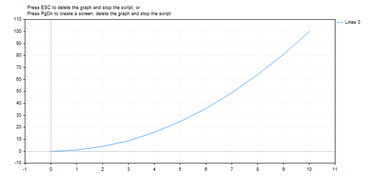

MathPow


[MQL5 Reference](index.md)  /  [Math Functions](math.md) / MathPow

[](mathmod.md) 
[](mathrand.md)

MathPow

The function raises a base to a specified power.

```
double  MathPow(
   double  base,         // base 
   double  exponent      // exponent value
   );
```

Parameters

base

[in]  Base.

exponent

[in]  Exponent value.

Return Value

Value of base raised to the specified power.

Note

Instead of MathPow() you can use pow().

 

Example:

```
#define GRAPH_WIDTH  750
#define GRAPH_HEIGHT 350
 
#property script_show_inputs
 
#include <Graphics\Graphic.mqh>
 
//--- input parameters
input double   InpExponentValue  =  2;    // exponent value
 
CGraphic ExtGraph;
//+------------------------------------------------------------------+
//| Script program start function                                    |
//+------------------------------------------------------------------+
void OnStart()
  {
//--- get 11 values from 0 to 10 with step 1
   vector X(11,VectorArange);
   Print("vector X = \n",X);
//--- calculate each value of the X vector raised to the InpExponentValue power
   X=MathPow(X,InpExponentValue);
   Print("MathPow(X,",(string)InpExponentValue,") = \n",X);
   
//--- transfer the calculated values from the vector to the array
   double y_array[];
   X.Swap(y_array);
 
//--- draw a graph of the calculated vector values
   CurvePlot(y_array,clrDodgerBlue);
 
//--- wait for pressing the Escape or PgDn keys to delete the graph (take a screenshot) and exit
   while(!IsStopped())
     {
      if(StopKeyPressed())
         break;
      Sleep(16);
     }
 
//--- clean up
   ExtGraph.Destroy();
   /*
   result:
   vector X = 
   [0,1,2,3,4,5,6,7,8,9,10]
   MathPow(X,2.0) = 
   [0,1,4,9,16,25,36,49,64,81,100]
   */
  }
//+------------------------------------------------------------------+
//| Fill a vector with 'value' in 'step' increments                  |
//+------------------------------------------------------------------+
template<typename T> 
void VectorArange(vector<T> &vec,T value=0.0,T step=1.0) 
  { 
   for(ulong i=0; i<vec.Size(); i++,value+=step) 
      vec[i]=value; 
  }
//+------------------------------------------------------------------+
//| When pressing ESC, return 'true'                                 |
//| When pressing PgDn, take a graph screenshot and return 'true'    |
//| Otherwise, return 'false'                                        |
//+------------------------------------------------------------------+
bool StopKeyPressed()
  {
//--- if ESC is pressed, return 'true'
   if(TerminalInfoInteger(TERMINAL_KEYSTATE_ESCAPE)!=0)
      return(true);
//--- if PgDn is pressed and a graph screenshot is successfully taken, return 'true'
   if(TerminalInfoInteger(TERMINAL_KEYSTATE_PAGEDOWN)!=0 && MakeAndSaveScreenshot(MQLInfoString(MQL_PROGRAM_NAME)+"_Screenshot"))
      return(true);
//--- return 'false' 
   return(false);
  }
//+------------------------------------------------------------------+
//| Create a graph object and draw a curve                           |
//+------------------------------------------------------------------+
void CurvePlot(double &x_array[], double &y_array[], const color colour)
  {
   ExtGraph.Create(ChartID(), "Graphic", 0, 0, 0, GRAPH_WIDTH, GRAPH_HEIGHT);
   ExtGraph.CurveAdd(x_array, y_array, ColorToARGB(colour), CURVE_LINES);
   ExtGraph.IndentUp(30);
   ExtGraph.CurvePlotAll();
   string text1="Press ESC to delete the graph and stop the script, or";
   string text2="Press PgDn to create a screen, delete the graph and stop the script";
   ExtGraph.TextAdd(54, 9, text1, ColorToARGB(clrBlack));
   ExtGraph.TextAdd(54,21, text2, ColorToARGB(clrBlack));
   ExtGraph.Update();
  }
//+------------------------------------------------------------------+
//| Take a screenshot and save the image to a file                   |
//+------------------------------------------------------------------+
bool MakeAndSaveScreenshot(const string file_name)
  {
   string file_names[];
   ResetLastError();
   int selected=FileSelectDialog("Save Picture", NULL, "All files (*.*)|*.*", FSD_WRITE_FILE, file_names, file_name+".png");
   if(selected<1)
     {
      if(selected<0)
         PrintFormat("%s: FileSelectDialog() function returned error %d", __FUNCTION__, GetLastError());
      return false;
     }
   
   bool res=false;
   if(ChartSetInteger(0,CHART_SHOW,false))
      res=ChartScreenShot(0, file_names[0], GRAPH_WIDTH, GRAPH_HEIGHT);
   ChartSetInteger(0,CHART_SHOW,true);
   return(res);
  }
```

 

Result:



 

See also

[Real types (double, float)](double.md), [Statistics](stat.md), [Scientific Charts](graphics.md), [Client Terminal Properties](terminalstatus.md)