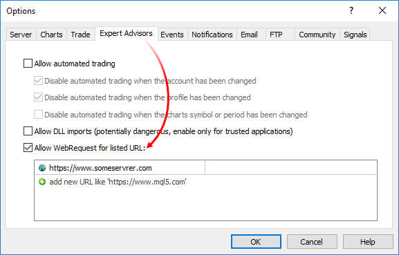

Network Functions

[MQL5 Reference](index.md) / Network Functions

 

Network functions

MQL5 programs can exchange data with remote servers, as well as send push notifications, emails and data via FTP.

* The [Socket*](socketcreate.md) group of functions allows establishing a TCP connection (including a secure TLS) with a remote host via system sockets. The operation principle is simple: [create a socket](socketcreate.md), [connect to the server](socketconnect.md) and start [reading](socketread.md) and [writing](socketsend.md) data.
* The [WebRequest](webrequest.md) function is designed to work with web resources and allows sending HTTP requests (including GET and POST) easily.
* [SendFTP](sendftp.md), [SendMail](sendmail.md) and [SendNotification](sendnotification.md) are more simple functions for sending files, emails and mobile notifications.

For end-user security, the list of allowed IP addresses is implemented on the client terminal side. The list contains IP addresses the MQL5 program is allowed to connect to via the Socket* and WebRequest functions. For example, if the program needs to connect to https://www.someserver.com, this address should be explicitly indicated by a terminal user in the list. An address cannot be added programmatically.

Add an explicit message to the MQL5 program to notify a user of the need for additional configuration. You can do that via [#property description](compilation.md), [Alert](alert.md) or [Print](print.md).

| Function | Action |
| --- | --- |
| [SocketCreate](socketcreate.md) | Create a socket with specified flags and return its handle |
| [SocketClose](socketclose.md) | Close a socket |
| [SocketConnect](socketconnect.md) | Connect to the server with timeout control |
| [SocketIsConnected](socketisconnected.md) | Checks if the socket is currently connected |
| [SocketIsReadable](socketisreadable.md) | Get a number of bytes that can be read from a socket |
| [SocketIsWritable](socketiswritable.md) | Check whether data can be written to a socket at the current time |
| [SocketTimeouts](sockettimeouts.md) | Set timeouts for receiving and sending data for a socket system object |
| [SocketRead](socketread.md) | Read data from a socket |
| [SocketSend](socketsend.md) | Write data to a socket |
| [SocketTlsHandshake](sockettlshandshake.md) | Initiate secure TLS (SSL) connection to a specified host via TLS Handshake protocol |
| [SocketTlsCertificate](sockettlscertificate.md) | Get data on the certificate used to secure network connection |
| [SocketTlsRead](sockettlsread.md) | Read data from secure TLS connection |
| [SocketTlsReadAvailable](sockettlsreadavailable.md) | Read all available data from secure TLS connection |
| [SocketTlsSend](sockettlssend.md) | Send data via secure TLS connection |
| [WebRequest](webrequest.md) | Send an HTTP request to a specified server |
| [SendFTP](sendftp.md) | Send a file to an address specified on the FTP tab |
| [SendMail](sendmail.md) | Send an email to an address specified in the Email tab of the options window |
| [SendNotification](sendnotification.md) | Send push notifications to mobile terminals whose MetaQuotes IDs are specified in the Notifications tab |