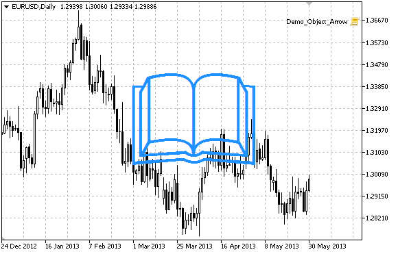

OBJ\_ARROW


[MQL5 Reference](index.md)  /  [Constants, Enumerations and Structures](constants.md)  /  [Objects Constants](objectconstants.md)  /  [Object Types](enum_object.md) / OBJ\_ARROW

[](obj_arrow_sell.md) 
[](obj_text.md)

OBJ\_ARROW

Arrow object.



Note

Anchor point position relative to the object can be selected from [ENUM\_ARROW\_ANCHOR](enum_anchorpoint.md#enum_arrow_anchor).

Large arrows (more than 5) can only be created by setting the appropriate [OBJPROP\_WIDTH](enum_object_property.md#enum_object_property_integer) property value when writing a code in MetaEditor.

The necessary arrow type can be selected by setting one of the [Wingdings](wingdings.md) font's symbol codes.

Example

The following script creates Arrow object on the chart and changes its type. Special functions have been developed to create and change graphical object's properties. You can use these functions "as is" in your own applications.

 

```
//--- description
#property description "Script creates a random arrow in the chart window."
#property description "Anchor point coordinate is set in"
#property description "percentage of the chart window size."
//--- display window of the input parameters during the script's launch
#property script_show_inputs
//--- input parameters of the script
input string            InpName="Arrow";        // Arrow name
input int               InpDate=50;             // Anchor point date in %
input int               InpPrice=50;            // Anchor point price in %
input ENUM_ARROW_ANCHOR InpAnchor=ANCHOR_TOP;   // Anchor type
input color             InpColor=clrDodgerBlue; // Arrow color
input ENUM_LINE_STYLE   InpStyle=STYLE_SOLID;   // Border line style
input int               InpWidth=10;            // Arrow size
input bool              InpBack=false;          // Background arrow
input bool              InpSelection=false;     // Highlight to move
input bool              InpHidden=true;         // Hidden in the object list
input long              InpZOrder=0;            // Priority for mouse click
//+------------------------------------------------------------------+
//| Create the arrow                                                 |
//+------------------------------------------------------------------+
bool ArrowCreate(const long              chart_ID=0,           // chart's ID
                 const string            name="Arrow",         // arrow name
                 const int               sub_window=0,         // subwindow index
                 datetime                time=0,               // anchor point time
                 double                  price=0,              // anchor point price
                 const uchar             arrow_code=252,       // arrow code
                 const ENUM_ARROW_ANCHOR anchor=ANCHOR_BOTTOM, // anchor point position
                 const color             clr=clrRed,           // arrow color
                 const ENUM_LINE_STYLE   style=STYLE_SOLID,    // border line style
                 const int               width=3,              // arrow size
                 const bool              back=false,           // in the background
                 const bool              selection=true,       // highlight to move
                 const bool              hidden=true,          // hidden in the object list
                 const long              z_order=0)            // priority for mouse click
  {
//--- set anchor point coordinates if they are not set
   ChangeArrowEmptyPoint(time,price);
//--- reset the error value
   ResetLastError();
//--- create an arrow
   if(!ObjectCreate(chart_ID,name,OBJ_ARROW,sub_window,time,price))
     {
      Print(__FUNCTION__,
            ": failed to create an arrow! Error code = ",GetLastError());
      return(false);
     }
//--- set the arrow code
   ObjectSetInteger(chart_ID,name,OBJPROP_ARROWCODE,arrow_code);
//--- set anchor type
   ObjectSetInteger(chart_ID,name,OBJPROP_ANCHOR,anchor);
//--- set the arrow color
   ObjectSetInteger(chart_ID,name,OBJPROP_COLOR,clr);
//--- set the border line style
   ObjectSetInteger(chart_ID,name,OBJPROP_STYLE,style);
//--- set the arrow's size
   ObjectSetInteger(chart_ID,name,OBJPROP_WIDTH,width);
//--- display in the foreground (false) or background (true)
   ObjectSetInteger(chart_ID,name,OBJPROP_BACK,back);
//--- enable (true) or disable (false) the mode of moving the arrow by mouse
//--- when creating a graphical object using ObjectCreate function, the object cannot be
//--- highlighted and moved by default. Inside this method, selection parameter
//--- is true by default making it possible to highlight and move the object
   ObjectSetInteger(chart_ID,name,OBJPROP_SELECTABLE,selection);
   ObjectSetInteger(chart_ID,name,OBJPROP_SELECTED,selection);
//--- hide (true) or display (false) graphical object name in the object list
   ObjectSetInteger(chart_ID,name,OBJPROP_HIDDEN,hidden);
//--- set the priority for receiving the event of a mouse click in the chart
   ObjectSetInteger(chart_ID,name,OBJPROP_ZORDER,z_order);
//--- successful execution
   return(true);
  }
//+------------------------------------------------------------------+
//| Move the anchor point                                            |
//+------------------------------------------------------------------+
bool ArrowMove(const long   chart_ID=0,   // chart's ID
               const string name="Arrow", // object name
               datetime     time=0,       // anchor point time coordinate
               double       price=0)      // anchor point price coordinate
  {
//--- if point position is not set, move it to the current bar having Bid price
   if(!time)
      time=TimeCurrent();
   if(!price)
      price=SymbolInfoDouble(Symbol(),SYMBOL_BID);
//--- reset the error value
   ResetLastError();
//--- move the anchor point
   if(!ObjectMove(chart_ID,name,0,time,price))
     {
      Print(__FUNCTION__,
            ": failed to move the anchor point! Error code = ",GetLastError());
      return(false);
     }
//--- successful execution
   return(true);
  }
//+------------------------------------------------------------------+
//| Change the arrow code                                            |
//+------------------------------------------------------------------+
bool ArrowCodeChange(const long   chart_ID=0,   // chart's ID
                     const string name="Arrow", // object name
                     const uchar  code=252)     // arrow code
  {
//--- reset the error value
   ResetLastError();
//--- change the arrow code
   if(!ObjectSetInteger(chart_ID,name,OBJPROP_ARROWCODE,code))
     {
      Print(__FUNCTION__,
            ": failed to change the arrow code! Error code = ",GetLastError());
      return(false);
     }
//--- successful execution
   return(true);
  }
//+------------------------------------------------------------------+
//| Change anchor type                                               |
//+------------------------------------------------------------------+
bool ArrowAnchorChange(const long              chart_ID=0,        // chart's ID
                       const string            name="Arrow",      // object name
                       const ENUM_ARROW_ANCHOR anchor=ANCHOR_TOP) // anchor type
  {
//--- reset the error value
   ResetLastError();
//--- change anchor type
   if(!ObjectSetInteger(chart_ID,name,OBJPROP_ANCHOR,anchor))
     {
      Print(__FUNCTION__,
            ": failed to change anchor type! Error code = ",GetLastError());
      return(false);
     }
//--- successful execution
   return(true);
  }
//+------------------------------------------------------------------+
//| Delete an arrow                                                  |
//+------------------------------------------------------------------+
bool ArrowDelete(const long   chart_ID=0,   // chart's ID
                 const string name="Arrow") // arrow name
  {
//--- reset the error value
   ResetLastError();
//--- delete an arrow
   if(!ObjectDelete(chart_ID,name))
     {
      Print(__FUNCTION__,
            ": failed to delete an arrow! Error code = ",GetLastError());
      return(false);
     }
//--- successful execution
   return(true);
  }
//+------------------------------------------------------------------+
//| Check anchor point values and set default values                 |
//| for empty ones                                                   |
//+------------------------------------------------------------------+
void ChangeArrowEmptyPoint(datetime &time,double &price)
  {
//--- if the point's time is not set, it will be on the current bar
   if(!time)
      time=TimeCurrent();
//--- if the point's price is not set, it will have Bid value
   if(!price)
      price=SymbolInfoDouble(Symbol(),SYMBOL_BID);
  }
//+------------------------------------------------------------------+
//| Script program start function                                    |
//+------------------------------------------------------------------+
void OnStart()
  {
//--- check correctness of the input parameters
   if(InpDate<0 || InpDate>100 || InpPrice<0 || InpPrice>100)
     {
      Print("Error! Incorrect values of input parameters!");
      return;
     }
//--- number of visible bars in the chart window
   int bars=(int)ChartGetInteger(0,CHART_VISIBLE_BARS);
//--- price array size
   int accuracy=1000;
//--- arrays for storing the date and price values to be used
//--- for setting and changing sign anchor point coordinates
   datetime date[];
   double   price[];
//--- memory allocation
   ArrayResize(date,bars);
   ArrayResize(price,accuracy);
//--- fill the array of dates
   ResetLastError();
   if(CopyTime(Symbol(),Period(),0,bars,date)==-1)
     {
      Print("Failed to copy time values! Error code = ",GetLastError());
      return;
     }
//--- fill the array of prices
//--- find the highest and lowest values of the chart
   double max_price=ChartGetDouble(0,CHART_PRICE_MAX);
   double min_price=ChartGetDouble(0,CHART_PRICE_MIN);
//--- define a change step of a price and fill the array
   double step=(max_price-min_price)/accuracy;
   for(int i=0;i<accuracy;i++)
      price[i]=min_price+i*step;
//--- define points for drawing the arrow
   int d=InpDate*(bars-1)/100;
   int p=InpPrice*(accuracy-1)/100;
//--- create an arrow on the chart
   if(!ArrowCreate(0,InpName,0,date[d],price[p],32,InpAnchor,InpColor,
      InpStyle,InpWidth,InpBack,InpSelection,InpHidden,InpZOrder))
     {
      return;
     }
//--- redraw the chart
   ChartRedraw();
//--- consider all cases of creating arrows in the loop
   for(int i=33;i<256;i++)
     {
      if(!ArrowCodeChange(0,InpName,(uchar)i))
         return;
      //--- check if the script's operation has been forcefully disabled
      if(IsStopped())
         return;
      //--- redraw the chart
      ChartRedraw();
      // half a second of delay
      Sleep(500);
     }
//--- 1 second of delay
   Sleep(1000);
//--- delete the arrow from the chart
   ArrowDelete(0,InpName);
   ChartRedraw();
//--- 1 second of delay
   Sleep(1000);
//---
  }
```