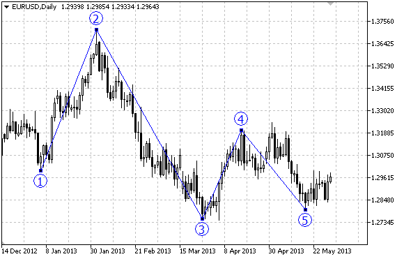

OBJ\_ELLIOTWAVE5


[MQL5 Reference](index.md)  /  [Constants, Enumerations and Structures](constants.md)  /  [Objects Constants](objectconstants.md)  /  [Object Types](enum_object.md) / OBJ\_ELLIOTWAVE5

[](obj_expansion.md) 
[](obj_elliotwave3.md)

OBJ\_ELLIOTWAVE5

Elliott Motive Wave.



Note

For "Elliott Motive Wave", it is possible to enable/disable the mode of connecting points by lines ([OBJPROP\_DRAWLINES](enum_object_property.md#enum_object_property_integer) property), as well as set the level of wave positioning (from [ENUM\_ELLIOT\_WAVE\_DEGREE](enum_elliot_wave_degree.md) enumeration).

Example

The following script creates and moves Elliott motive wave on the chart. Special functions have been developed to create and change graphical object's properties. You can use these functions "as is" in your own applications.

 

```
//--- description
#property description "Script draws \"Elliott Motive Wave\"."
#property description "Anchor point coordinates are set in percentage of the size of"
#property description "the chart window."
//--- display window of the input parameters during the script's launch
#property script_show_inputs
//--- input parameters of the script
input string                  InpName="ElliotWave5";   // Object name
input int                     InpDate1=10;             // 1 st point's date, %
input int                     InpPrice1=90;            // 1 st point's price, %
input int                     InpDate2=20;             // 2 nd point's date, %
input int                     InpPrice2=40;            // 2 nd point's price, %
input int                     InpDate3=30;             // 3 rd point's date, %
input int                     InpPrice3=60;            // 3 rd point's price, %
input int                     InpDate4=40;             // 4 th point's date, %
input int                     InpPrice4=10;            // 4 th point's price, %
input int                     InpDate5=60;             // 5 th point's date, %
input int                     InpPrice5=40;            // 5 th point's price, %
input ENUM_ELLIOT_WAVE_DEGREE InpDegree=ELLIOTT_MINOR; // Level
input bool                    InpDrawLines=true;       // Displaying the lines
input color                   InpColor=clrRed;         // Color of the lines
input ENUM_LINE_STYLE         InpStyle=STYLE_DASH;     // Style of the lines
input int                     InpWidth=2;              // Width of the lines
input bool                    InpBack=false;           // Background object
input bool                    InpSelection=true;       // Highlight to move
input bool                    InpHidden=true;          // Hidden in the object list
input long                    InpZOrder=0;             // Priority for mouse click
//+------------------------------------------------------------------+
//| Create "Elliott Motive Wave" by the given coordinates            |
//+------------------------------------------------------------------+
bool ElliotWave5Create(const long                    chart_ID=0,              // chart's ID
                       const string                  name="ElliotWave5",      // wave name
                       const int                     sub_window=0,            // subwindow index 
                       datetime                      time1=0,                 // first point time
                       double                        price1=0,                // first point price
                       datetime                      time2=0,                 // second point time
                       double                        price2=0,                // second point price
                       datetime                      time3=0,                 // third point time
                       double                        price3=0,                // third point price
                       datetime                      time4=0,                 // fourth point time
                       double                        price4=0,                // fourth point price
                       datetime                      time5=0,                 // fifth point time
                       double                        price5=0,                // fifth point price
                       const ENUM_ELLIOT_WAVE_DEGREE degree=ELLIOTT_MINUETTE, // degree
                       const bool                    draw_lines=true,         // displaying the lines
                       const color                   clr=clrRed,              // object color
                       const ENUM_LINE_STYLE         style=STYLE_SOLID,       // style of the lines
                       const int                     width=1,                 // width of the lines
                       const bool                    back=false,              // in the background
                       const bool                    selection=true,          // highlight to move
                       const bool                    hidden=true,             // hidden in the object list
                       const long                    z_order=0)               // priority for mouse click
  {
//--- set anchor points' coordinates if they are not set
   ChangeElliotWave5EmptyPoints(time1,price1,time2,price2,time3,price3,time4,price4,time5,price5);
//--- reset the error value
   ResetLastError();
//--- Create "Elliott Motive Wave" by the given coordinates
   if(!ObjectCreate(chart_ID,name,OBJ_ELLIOTWAVE5,sub_window,time1,price1,time2,price2,time3,
      price3,time4,price4,time5,price5))
     {
      Print(__FUNCTION__,
            ": failed to create \"Elliott Motive Wave\"! Error code = ",GetLastError());
      return(false);
     }
//--- set degree (wave size)
   ObjectSetInteger(chart_ID,name,OBJPROP_DEGREE,degree);
//--- enable (true) or disable (false) the mode of displaying the lines
   ObjectSetInteger(chart_ID,name,OBJPROP_DRAWLINES,draw_lines);
//--- set the object's color
   ObjectSetInteger(chart_ID,name,OBJPROP_COLOR,clr);
//--- set the line style
   ObjectSetInteger(chart_ID,name,OBJPROP_STYLE,style);
//--- set width of the lines
   ObjectSetInteger(chart_ID,name,OBJPROP_WIDTH,width);
//--- display in the foreground (false) or background (true)
   ObjectSetInteger(chart_ID,name,OBJPROP_BACK,back);
//--- enable (true) or disable (false) the mode of highlighting the channel for moving
//--- when creating a graphical object using ObjectCreate function, the object cannot be
//--- highlighted and moved by default. Inside this method, selection parameter
//--- is true by default making it possible to highlight and move the object
   ObjectSetInteger(chart_ID,name,OBJPROP_SELECTABLE,selection);
   ObjectSetInteger(chart_ID,name,OBJPROP_SELECTED,selection);
//--- hide (true) or display (false) graphical object name in the object list
   ObjectSetInteger(chart_ID,name,OBJPROP_HIDDEN,hidden);
//--- set the priority for receiving the event of a mouse click in the chart
   ObjectSetInteger(chart_ID,name,OBJPROP_ZORDER,z_order);
//--- successful execution
   return(true);
  }
//+------------------------------------------------------------------+
//| Move anchor point of Elliott Motive Wave                         |
//+------------------------------------------------------------------+
bool ElliotWave5PointChange(const long   chart_ID=0,         // chart's ID
                            const string name="ElliotWave5", // object name
                            const int    point_index=0,      // anchor point index
                            datetime     time=0,             // anchor point time coordinate
                            double       price=0)            // anchor point price coordinate
  {
//--- if point position is not set, move it to the current bar having Bid price
   if(!time)
      time=TimeCurrent();
   if(!price)
      price=SymbolInfoDouble(Symbol(),SYMBOL_BID);
//--- reset the error value
   ResetLastError();
//--- move the anchor point
   if(!ObjectMove(chart_ID,name,point_index,time,price))
     {
      Print(__FUNCTION__,
            ": failed to move the anchor point! Error code = ",GetLastError());
      return(false);
     }
//--- successful execution
   return(true);
  }
//+------------------------------------------------------------------+
//| Delete Elliott Motive Wave                                       |
//+------------------------------------------------------------------+
bool ElliotWave5Delete(const long   chart_ID=0,         // chart's ID
                       const string name="ElliotWave5") // object name
  {
//--- reset the error value
   ResetLastError();
//--- delete the object
   if(!ObjectDelete(chart_ID,name))
     {
      Print(__FUNCTION__,
            ": failed to delete \"Elliott Motive Wave\"! Error code = ",GetLastError());
      return(false);
     }
//--- successful execution
   return(true);
  }
//+------------------------------------------------------------------+
//| Check the values of Elliott Motive Wave's anchor points and      |
//| set default values for empty ones                                |
//+------------------------------------------------------------------+
void ChangeElliotWave5EmptyPoints(datetime &time1,double &price1,
                                  datetime &time2,double &price2,
                                  datetime &time3,double &price3,
                                  datetime &time4,double &price4,
                                  datetime &time5,double &price5)
  {
//--- array for receiving the open time of the last 10 bars
   datetime temp[];
   ArrayResize(temp,10);
//--- receive data
   CopyTime(Symbol(),Period(),TimeCurrent(),10,temp);
//--- receive the value of one point on the current chart
   double point=SymbolInfoDouble(Symbol(),SYMBOL_POINT);
//--- if the first point's time is not set, it will be 9 bars left from the last bar
   if(!time1)
      time1=temp[0];
//--- if the first point's price is not set, it will have Bid value
   if(!price1)
      price1=SymbolInfoDouble(Symbol(),SYMBOL_BID);
//--- if the second point's time is not set, it will be 7 bars left from the last bar
   if(!time2)
      time2=temp[2];
//--- if the second point's price is not set, move it 300 points lower than the first one
   if(!price2)
      price2=price1-300*point;
//--- if the third point's time is not set, it will be 5 bars left from the last bar
   if(!time3)
      time3=temp[4];
//--- if the third point's price is not set, move it 250 points lower than the first one
   if(!price3)
      price3=price1-250*point;
//--- if the fourth point's time is not set, it will be 3 bars left from the last bar
   if(!time4)
      time4=temp[6];
//--- if the fourth point's price is not set, move it 550 points lower than the first one
   if(!price4)
      price4=price1-550*point;
//--- if the fifth point's time is not set, it will be on the last bar
   if(!time5)
      time5=temp[9];
//--- if the fifth point's price is not set, move it 450 points lower than the first one
   if(!price5)
      price5=price1-450*point;
  }
//+------------------------------------------------------------------+
//| Script program start function                                    |
//+------------------------------------------------------------------+
void OnStart()
  {
//--- check correctness of the input parameters
   if(InpDate1<0 || InpDate1>100 || InpPrice1<0 || InpPrice1>100 || 
      InpDate2<0 || InpDate2>100 || InpPrice2<0 || InpPrice2>100 || 
      InpDate3<0 || InpDate3>100 || InpPrice3<0 || InpPrice3>100 || 
      InpDate4<0 || InpDate4>100 || InpPrice4<0 || InpPrice4>100 || 
      InpDate5<0 || InpDate5>100 || InpPrice5<0 || InpPrice5>100)
     {
      Print("Error! Incorrect values of input parameters!");
      return;
     }
//--- number of visible bars in the chart window
   int bars=(int)ChartGetInteger(0,CHART_VISIBLE_BARS);
//--- price array size
   int accuracy=1000;
//--- arrays for storing the date and price values to be used
//--- for setting and changing object anchor points' coordinates
   datetime date[];
   double   price[];
//--- memory allocation
   ArrayResize(date,bars);
   ArrayResize(price,accuracy);
//--- fill the array of dates
   ResetLastError();
   if(CopyTime(Symbol(),Period(),0,bars,date)==-1)
     {
      Print("Failed to copy time values! Error code = ",GetLastError());
      return;
     }
//--- fill the array of prices
//--- find the highest and lowest values of the chart
   double max_price=ChartGetDouble(0,CHART_PRICE_MAX);
   double min_price=ChartGetDouble(0,CHART_PRICE_MIN);
//--- define a change step of a price and fill the array
   double step=(max_price-min_price)/accuracy;
   for(int i=0;i<accuracy;i++)
      price[i]=min_price+i*step;
//--- define points for drawing Elliott Motive Wave
   int d1=InpDate1*(bars-1)/100;
   int d2=InpDate2*(bars-1)/100;
   int d3=InpDate3*(bars-1)/100;
   int d4=InpDate4*(bars-1)/100;
   int d5=InpDate5*(bars-1)/100;
   int p1=InpPrice1*(accuracy-1)/100;
   int p2=InpPrice2*(accuracy-1)/100;
   int p3=InpPrice3*(accuracy-1)/100;
   int p4=InpPrice4*(accuracy-1)/100;
   int p5=InpPrice5*(accuracy-1)/100;
//--- Create Elliott Motive Wave
   if(!ElliotWave5Create(0,InpName,0,date[d1],price[p1],date[d2],price[p2],date[d3],price[p3],
      date[d4],price[p4],date[d5],price[p5],InpDegree,InpDrawLines,InpColor,InpStyle,InpWidth,
      InpBack,InpSelection,InpHidden,InpZOrder))
     {
      return;
     }
//--- redraw the chart and wait for 1 second
   ChartRedraw();
   Sleep(1000);
//--- now, move the anchor points
//--- loop counter
   int v_steps=accuracy/5;
//--- move the fifth anchor point
   for(int i=0;i<v_steps;i++)
     {
      //--- use the following value
      if(p5<accuracy-1)
         p5+=1;
      //--- move the point
      if(!ElliotWave5PointChange(0,InpName,4,date[d5],price[p5]))
         return;
      //--- check if the script's operation has been forcefully disabled
      if(IsStopped())
         return;
      //--- redraw the chart
      ChartRedraw();
     }
//--- 1 second of delay
   Sleep(1000);
//--- loop counter
   v_steps=accuracy/5;
//--- move the second and third anchor points
   for(int i=0;i<v_steps;i++)
     {
      //--- use the following values
      if(p2<accuracy-1)
         p2+=1;
      if(p3>1)
         p3-=1;
      //--- shift the points
      if(!ElliotWave5PointChange(0,InpName,1,date[d2],price[p2]))
         return;
      if(!ElliotWave5PointChange(0,InpName,2,date[d3],price[p3]))
         return;
      //--- check if the script's operation has been forcefully disabled
      if(IsStopped())
         return;
      //--- redraw the chart
      ChartRedraw();
     }
//--- 1 second of delay
   Sleep(1000);
//--- loop counter
   v_steps=accuracy*4/5;
//--- move the first and fourth anchor points
   for(int i=0;i<v_steps;i++)
     {
      //--- use the following values
      if(p1>1)
         p1-=1;
      if(p4<accuracy-1)
         p4+=1;
      //--- shift the points
      if(!ElliotWave5PointChange(0,InpName,0,date[d1],price[p1]))
         return;
      if(!ElliotWave5PointChange(0,InpName,3,date[d4],price[p4]))
         return;
      //--- check if the script's operation has been forcefully disabled
      if(IsStopped())
         return;
      //--- redraw the chart
      ChartRedraw();
     }
//--- 1 second of delay
   Sleep(1000);
//--- delete the object from the chart
   ElliotWave5Delete(0,InpName);
   ChartRedraw();
//--- 1 second of delay
   Sleep(1000);
//---
  }
```