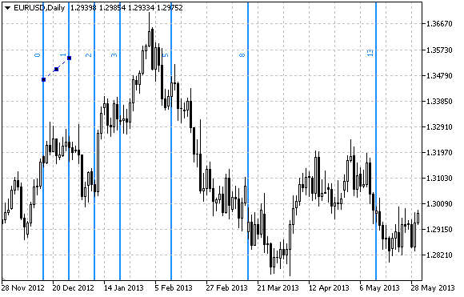

OBJ\_FIBOTIMES


[MQL5 Reference](index.md)  /  [Constants, Enumerations and Structures](constants.md)  /  [Objects Constants](objectconstants.md)  /  [Object Types](enum_object.md) / OBJ\_FIBOTIMES

[](obj_fibo.md) 
[](obj_fibofan.md)

OBJ\_FIBOTIMES

Fibonacci Time Zones.



Note

For "Fibonacci Time Zones", it is possible to specify the number of line-levels, their values and color.

Example

The following script creates and moves Fibonacci Time Zones on the chart. Special functions have been developed to create and change graphical object's properties. You can use these functions "as is" in your own applications.

```
//--- description
#property description "Script draws \"Fibonacci Time Zones\" graphical object."
#property description "Anchor point coordinates are set in percentage of the size of"
#property description "the chart window."
//--- display window of the input parameters during the script's launch
#property script_show_inputs
//--- input parameters of the script
input string          InpName="FiboTimes";       // Object name
input int             InpDate1=10;               // 1 st point's date, %
input int             InpPrice1=45;              // 1 st point's price, %
input int             InpDate2=20;               // 2 nd point's date, %
input int             InpPrice2=55;              // 2 nd point's price, %
input color           InpColor=clrRed;           // Object color
input ENUM_LINE_STYLE InpStyle=STYLE_DASHDOTDOT; // Line style
input int             InpWidth=2;                // Line width
input bool            InpBack=false;             // Background object
input bool            InpSelection=true;         // Highlight to move
input bool            InpHidden=true;            // Hidden in the object list
input long            InpZOrder=0;               // Priority for mouse click
//+------------------------------------------------------------------+
//| Create Fibonacci Time Zones by the given coordinates             |
//+------------------------------------------------------------------+
bool FiboTimesCreate(const long            chart_ID=0,        // chart's ID
                     const string          name="FiboTimes",  // object name
                     const int             sub_window=0,      // subwindow index 
                     datetime              time1=0,           // first point time
                     double                price1=0,          // first point price
                     datetime              time2=0,           // second point time
                     double                price2=0,          // second point price
                     const color           clr=clrRed,        // object color
                     const ENUM_LINE_STYLE style=STYLE_SOLID, // object line style
                     const int             width=1,           // object line width
                     const bool            back=false,        // in the background
                     const bool            selection=true,    // highlight to move
                     const bool            hidden=true,       // hidden in the object list
                     const long            z_order=0)         // priority for mouse click
  {
//--- set anchor points' coordinates if they are not set
   ChangeFiboTimesEmptyPoints(time1,price1,time2,price2);
//--- reset the error value
   ResetLastError();
//--- create Fibonacci Time Zones by the given coordinates
   if(!ObjectCreate(chart_ID,name,OBJ_FIBOTIMES,sub_window,time1,price1,time2,price2))
     {
      Print(__FUNCTION__,
            ": failed to create \"Fibonacci Time Zones\"! Error code = ",GetLastError());
      return(false);
     }
//--- set color
   ObjectSetInteger(chart_ID,name,OBJPROP_COLOR,clr);
//--- set line style
   ObjectSetInteger(chart_ID,name,OBJPROP_STYLE,style);
//--- set line width
   ObjectSetInteger(chart_ID,name,OBJPROP_WIDTH,width);
//--- display in the foreground (false) or background (true)
   ObjectSetInteger(chart_ID,name,OBJPROP_BACK,back);
//--- enable (true) or disable (false) the mode of highlighting the channel for moving
//--- when creating a graphical object using ObjectCreate function, the object cannot be
//--- highlighted and moved by default. Inside this method, selection parameter
//--- is true by default making it possible to highlight and move the object
   ObjectSetInteger(chart_ID,name,OBJPROP_SELECTABLE,selection);
   ObjectSetInteger(chart_ID,name,OBJPROP_SELECTED,selection);
//--- hide (true) or display (false) graphical object name in the object list
   ObjectSetInteger(chart_ID,name,OBJPROP_HIDDEN,hidden);
//--- set the priority for receiving the event of a mouse click in the chart
   ObjectSetInteger(chart_ID,name,OBJPROP_ZORDER,z_order);
//--- successful execution
   return(true);
  }
//+------------------------------------------------------------------+
//| Set number of levels and their parameters                        |
//+------------------------------------------------------------------+
bool FiboTimesLevelsSet(int             levels,           // number of level lines
                        double          &values[],        // values of level lines
                        color           &colors[],        // color of level lines
                        ENUM_LINE_STYLE &styles[],        // style of level lines
                        int             &widths[],        // width of level lines
                        const long      chart_ID=0,       // chart's ID
                        const string    name="FiboTimes") // object name
  {
//--- check array sizes
   if(levels!=ArraySize(colors) || levels!=ArraySize(styles) ||
      levels!=ArraySize(widths) || levels!=ArraySize(widths))
     {
      Print(__FUNCTION__,": array length does not correspond to the number of levels, error!");
      return(false);
     }
//--- set the number of levels
   ObjectSetInteger(chart_ID,name,OBJPROP_LEVELS,levels);
//--- set the properties of levels in the loop
   for(int i=0;i<levels;i++)
     {
      //--- level value
      ObjectSetDouble(chart_ID,name,OBJPROP_LEVELVALUE,i,values[i]);
      //--- level color
      ObjectSetInteger(chart_ID,name,OBJPROP_LEVELCOLOR,i,colors[i]);
      //--- level style
      ObjectSetInteger(chart_ID,name,OBJPROP_LEVELSTYLE,i,styles[i]);
      //--- level width
      ObjectSetInteger(chart_ID,name,OBJPROP_LEVELWIDTH,i,widths[i]);
      //--- level description
      ObjectSetString(chart_ID,name,OBJPROP_LEVELTEXT,i,DoubleToString(values[i],1));
     }
//--- successful execution
   return(true);
  }
//+------------------------------------------------------------------+
//| Move Fibonacci Time Zones anchor point                           |
//+------------------------------------------------------------------+
bool FiboTimesPointChange(const long   chart_ID=0,       // chart's ID
                          const string name="FiboTimes", // object name
                          const int    point_index=0,    // anchor point index
                          datetime     time=0,           // anchor point time coordinate
                          double       price=0)          // anchor point price coordinate
  {
//--- if point position is not set, move it to the current bar having Bid price
   if(!time)
      time=TimeCurrent();
   if(!price)
      price=SymbolInfoDouble(Symbol(),SYMBOL_BID);
//--- reset the error value
   ResetLastError();
//--- move the anchor point
   if(!ObjectMove(chart_ID,name,point_index,time,price))
     {
      Print(__FUNCTION__,
            ": failed to move the anchor point! Error code = ",GetLastError());
      return(false);
     }
//--- successful execution
   return(true);
  }
//+------------------------------------------------------------------+
//| Delete Fibonacci Time Zones                                      |
//+------------------------------------------------------------------+
bool FiboTimesDelete(const long   chart_ID=0,       // chart's ID
                     const string name="FiboTimes") // object name
  {
//--- reset the error value
   ResetLastError();
//--- delete the object
   if(!ObjectDelete(chart_ID,name))
     {
      Print(__FUNCTION__,
            ": failed to delete \"Fibonacci Time Zones\"! Error code = ",GetLastError());
      return(false);
     }
//--- successful execution
   return(true);
  }
//+------------------------------------------------------------------+
//| Check the values of Fibonacci Time Zones and                     |
//| set default values for empty ones                                |
//+------------------------------------------------------------------+
void ChangeFiboTimesEmptyPoints(datetime &time1,double &price1,
                                datetime &time2,double &price2)
  {
//--- if the first point's time is not set, it will be on the current bar
   if(!time1)
      time1=TimeCurrent();
//--- if the first point's price is not set, it will have Bid value
   if(!price1)
      price1=SymbolInfoDouble(Symbol(),SYMBOL_BID);
//--- if the second point's time is not set, it is located 2 bars left from the second one
   if(!time2)
     {
      //--- array for receiving the open time of the last 3 bars
      datetime temp[3];
      CopyTime(Symbol(),Period(),time1,3,temp);
      //--- set the first point 2 bars left from the second one
      time2=temp[0];
     }
//--- if the second point's price is not set, it is equal to the first point's one
   if(!price2)
      price2=price1;
  }
//+------------------------------------------------------------------+
//| Script program start function                                    |
//+------------------------------------------------------------------+
void OnStart()
  {
//--- check correctness of the input parameters
   if(InpDate1<0 || InpDate1>100 || InpPrice1<0 || InpPrice1>100 || 
      InpDate2<0 || InpDate2>100 || InpPrice2<0 || InpPrice2>100)
     {
      Print("Error! Incorrect values of input parameters!");
      return;
     }
//--- number of visible bars in the chart window
   int bars=(int)ChartGetInteger(0,CHART_VISIBLE_BARS);
//--- price array size
   int accuracy=1000;
//--- arrays for storing the date and price values to be used
//--- for setting and changing the coordinates of Fibonacci Time Zones anchor points
   datetime date[];
   double   price[];
//--- memory allocation
   ArrayResize(date,bars);
   ArrayResize(price,accuracy);
//--- fill the array of dates
   ResetLastError();
   if(CopyTime(Symbol(),Period(),0,bars,date)==-1)
     {
      Print("Failed to copy time values! Error code = ",GetLastError());
      return;
     }
//--- fill the array of prices
//--- find the highest and lowest values of the chart
   double max_price=ChartGetDouble(0,CHART_PRICE_MAX);
   double min_price=ChartGetDouble(0,CHART_PRICE_MIN);
//--- define a change step of a price and fill the array
   double step=(max_price-min_price)/accuracy;
   for(int i=0;i<accuracy;i++)
      price[i]=min_price+i*step;
//--- define points for drawing Fibonacci Time Zones
   int d1=InpDate1*(bars-1)/100;
   int d2=InpDate2*(bars-1)/100;
   int p1=InpPrice1*(accuracy-1)/100;
   int p2=InpPrice2*(accuracy-1)/100;
//--- create an object
   if(!FiboTimesCreate(0,InpName,0,date[d1],price[p1],date[d2],price[p2],
      InpColor,InpStyle,InpWidth,InpBack,InpSelection,InpHidden,InpZOrder))
     {
      return;
     }
//--- redraw the chart and wait for 1 second
   ChartRedraw();
   Sleep(1000);
//--- now, move the anchor points
//--- loop counter
   int h_steps=bars*2/5;
//--- move the second anchor point
   for(int i=0;i<h_steps;i++)
     {
      //--- use the following value
      if(d2<bars-1)
         d2+=1;
      //--- move the point
      if(!FiboTimesPointChange(0,InpName,1,date[d2],price[p2]))
         return;
      //--- check if the script's operation has been forcefully disabled
      if(IsStopped())
         return;
      //--- redraw the chart
      ChartRedraw();
      // 0.05 seconds of delay
      Sleep(50);
     }
//--- 1 second of delay
   Sleep(1000);
//--- loop counter
   h_steps=bars*3/5;
//--- move the first anchor point
   for(int i=0;i<h_steps;i++)
     {
      //--- use the following value
      if(d1<bars-1)
         d1+=1;
      //--- move the point
      if(!FiboTimesPointChange(0,InpName,0,date[d1],price[p1]))
         return;
      //--- check if the script's operation has been forcefully disabled
      if(IsStopped())
         return;
      //--- redraw the chart
      ChartRedraw();
      // 0.05 seconds of delay
      Sleep(50);
     }
//--- 1 second of delay
   Sleep(1000);
//--- delete the object from the chart
   FiboTimesDelete(0,InpName);
   ChartRedraw();
//--- 1 second of delay
   Sleep(1000);
//---
  }
```