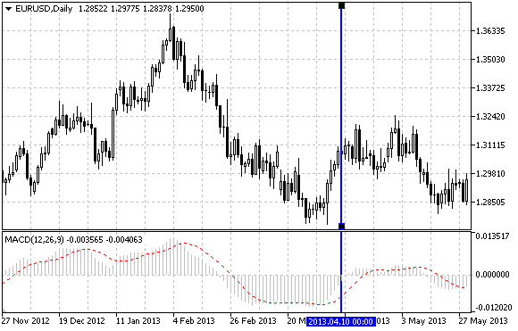

OBJ\_VLINE


[MQL5 Reference](index.md)  /  [Constants, Enumerations and Structures](constants.md)  /  [Objects Constants](objectconstants.md)  /  [Object Types](enum_object.md) / OBJ\_VLINE

[](enum_object.md) 
[](obj_hline.md)

OBJ\_VLINE

Vertical Line.



Note

When drawing a vertical line, it is possible to set the line display mode for all chart windows (property [OBJPROP\_RAY](enum_object_property.md#enum_object_property_integer)).

Example

The following script creates and moves the vertical line on the chart. Special functions have been developed to create and change graphical object's properties. You can use these functions "as is" in your own applications.

```
//--- description
#property description "Script draws \"Vertical Line\" graphical object."
#property description "Anchor point date is set in percentage of"
#property description "the chart window width in bars."
//--- display window of the input parameters during the script's launch
#property script_show_inputs
//--- input parameters of the script
input string          InpName="VLine";     // Line name
input int             InpDate=25;          // Event date, %
input color           InpColor=clrRed;     // Line color
input ENUM_LINE_STYLE InpStyle=STYLE_DASH; // Line style
input int             InpWidth=3;          // Line width
input bool            InpBack=false;       // Background line
input bool            InpSelection=true;   // Highlight to move
input bool            InpRay=true;         // Line's continuation down
input bool            InpHidden=true;      // Hidden in the object list
input long            InpZOrder=0;         // Priority for mouse click
//+------------------------------------------------------------------+
//| Create the vertical line                                         |
//+------------------------------------------------------------------+
bool VLineCreate(const long            chart_ID=0,        // chart's ID
                 const string          name="VLine",      // line name
                 const int             sub_window=0,      // subwindow index
                 datetime              time=0,            // line time
                 const color           clr=clrRed,        // line color
                 const ENUM_LINE_STYLE style=STYLE_SOLID, // line style
                 const int             width=1,           // line width
                 const bool            back=false,        // in the background
                 const bool            selection=true,    // highlight to move
                 const bool            ray=true,          // line's continuation down
                 const bool            hidden=true,       // hidden in the object list
                 const long            z_order=0)         // priority for mouse click
  {
//--- if the line time is not set, draw it via the last bar
   if(!time)
      time=TimeCurrent();
//--- reset the error value
   ResetLastError();
//--- create a vertical line
   if(!ObjectCreate(chart_ID,name,OBJ_VLINE,sub_window,time,0))
     {
      Print(__FUNCTION__,
            ": failed to create a vertical line! Error code = ",GetLastError());
      return(false);
     }
//--- set line color
   ObjectSetInteger(chart_ID,name,OBJPROP_COLOR,clr);
//--- set line display style
   ObjectSetInteger(chart_ID,name,OBJPROP_STYLE,style);
//--- set line width
   ObjectSetInteger(chart_ID,name,OBJPROP_WIDTH,width);
//--- display in the foreground (false) or background (true)
   ObjectSetInteger(chart_ID,name,OBJPROP_BACK,back);
//--- enable (true) or disable (false) the mode of moving the line by mouse
//--- when creating a graphical object using ObjectCreate function, the object cannot be
//--- highlighted and moved by default. Inside this method, selection parameter
//--- is true by default making it possible to highlight and move the object
   ObjectSetInteger(chart_ID,name,OBJPROP_SELECTABLE,selection);
   ObjectSetInteger(chart_ID,name,OBJPROP_SELECTED,selection);
//--- enable (true) or disable (false) the mode of displaying the line in the chart subwindows
   ObjectSetInteger(chart_ID,name,OBJPROP_RAY,ray);
//--- hide (true) or display (false) graphical object name in the object list
   ObjectSetInteger(chart_ID,name,OBJPROP_HIDDEN,hidden);
//--- set the priority for receiving the event of a mouse click in the chart
   ObjectSetInteger(chart_ID,name,OBJPROP_ZORDER,z_order);
//--- successful execution
   return(true);
  }
//+------------------------------------------------------------------+
//| Move the vertical line                                           |
//+------------------------------------------------------------------+
bool VLineMove(const long   chart_ID=0,   // chart's ID
               const string name="VLine", // line name
               datetime     time=0)       // line time
  {
//--- if line time is not set, move the line to the last bar
   if(!time)
      time=TimeCurrent();
//--- reset the error value
   ResetLastError();
//--- move the vertical line
   if(!ObjectMove(chart_ID,name,0,time,0))
     {
      Print(__FUNCTION__,
            ": failed to move the vertical line! Error code = ",GetLastError());
      return(false);
     }
//--- successful execution
   return(true);
  }
//+------------------------------------------------------------------+
//| Delete the vertical line                                         |
//+------------------------------------------------------------------+
bool VLineDelete(const long   chart_ID=0,   // chart's ID
                 const string name="VLine") // line name
  {
//--- reset the error value
   ResetLastError();
//--- delete the vertical line
   if(!ObjectDelete(chart_ID,name))
     {
      Print(__FUNCTION__,
            ": failed to delete the vertical line! Error code = ",GetLastError());
      return(false);
     }
//--- successful execution
   return(true);
  }
//+------------------------------------------------------------------+
//| Script program start function                                    |
//+------------------------------------------------------------------+
void OnStart()
  {
//--- check correctness of the input parameters
   if(InpDate<0 || InpDate>100)
     {
      Print("Error! Incorrect values of input parameters!");
      return;
     }
//--- number of visible bars in the chart window
   int bars=(int)ChartGetInteger(0,CHART_VISIBLE_BARS);
//--- array for storing the date values to be used
//--- for setting and changing line anchor point's coordinates
   datetime date[];
//--- memory allocation
   ArrayResize(date,bars);
//--- fill the array of dates
   ResetLastError();
   if(CopyTime(Symbol(),Period(),0,bars,date)==-1)
     {
      Print("Failed to copy time values! Error code = ",GetLastError());
      return;
     }
//--- define points for drawing the line
   int d=InpDate*(bars-1)/100;
//--- create a vertical line
   if(!VLineCreate(0,InpName,0,date[d],InpColor,InpStyle,InpWidth,InpBack,
      InpSelection,InpRay,InpHidden,InpZOrder))
      return;
//--- redraw the chart and wait for 1 second
   ChartRedraw();
   Sleep(1000);
//--- now, move the line
//--- loop counter
   int h_steps=bars/2;
//--- move the line
   for(int i=0;i<h_steps;i++)
     {
      //--- use the following value
      if(d<bars-1)
         d+=1;
      //--- move the point
      if(!VLineMove(0,InpName,date[d]))
         return;
      //--- check if the script's operation has been forcefully disabled
      if(IsStopped())
         return;
      //--- redraw the chart
      ChartRedraw();
      // 0.03 seconds of delay
      Sleep(30);
     }
//--- 1 second of delay
   Sleep(1000);
//--- delete the channel from the chart
   VLineDelete(0,InpName);
   ChartRedraw();
//--- 1 second of delay
   Sleep(1000);
//---
  }
```