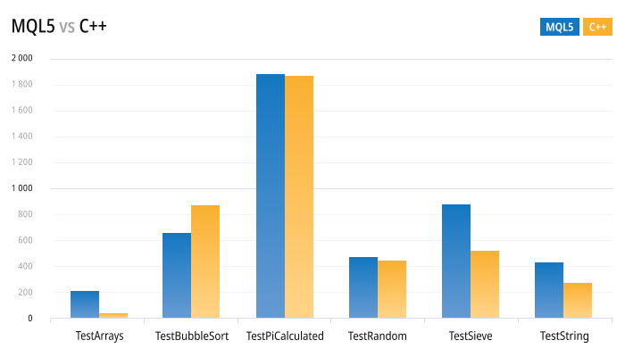

ONNX Support

[MQL5 Reference](index.md)  /  [ONNX models](onnx.md) / ONNX Support

 

ONNX Support in MQL5

ONNX is an open format build to represent machine learning models. This standard defines a common set of operators and a common file format to enable developers to use models with different frameworks, tools, runtimes and compilers.

Thus, the open ONNX format allows you to receive and transfer machine learning models between different [platforms and machine learning toolkits](https://onnx.ai/supported-tools). The ONNX is implemented in the MQL5 language to enable AI developers to run created models in the high-performance execution environment provided by the MetaTrader 5 platform.

The MQL5 execution speed is comparable to that of C++ applications. This is proved by the execution results of standard tests on MQL5 and C++. The lower the bar, the less time (in milliseconds) spent on execution and the better the result. The tests have been conducted on Windows 10 (build 17763) x64, Xeon  E5-2630 v4 @ 2.20GHz, Memory: 65457 Mb.

The new asynchronous trading operations and the native ONNX support provide you with new opportunities which were previously available only to a handful of professional AI developers and institutional traders. ONNX support in MQL5 enables traders to train models for financial market trading in their preferred development environment and then to trade with low network costs, high order book update speeds and asynchronous order submission.

Currently, ONNX is being developed and maintained by partner companies such as Microsoft, Facebook, Amazon and others, which guarantees the further development of this open project.