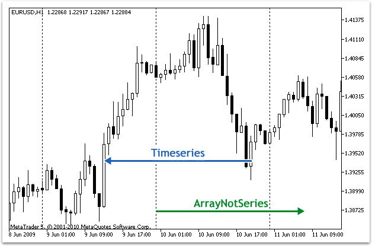

Timeseries and Indicators Access


[MQL5 Reference](index.md) / Timeseries and Indicators Access

[](calendarvaluelast.md) 
[](bufferdirection.md)

Access to Timeseries and Indicator Data

These are functions for working with timeseries and indicators. A timeseries differs from the usual data array by its reverse ordering - elements of timeseries are indexed from the end of an array to its begin (from the most recent data to the oldest ones). To copy the time-series values and indicator data, it's recommended to use [dynamic arrays](dynamic_array.md) only, because copying functions are designed to allocate the necessary size of arrays that receive values.

There is an important exception to this rule: if timeseries and indicator values need to be copied often, for example at each call of [OnTick()](ontick.md) in Expert Advisors or at each call of [OnCalculate()](oncalculate.md) in indicators, in this case one should better use [statically distributed arrays](dynamic_array.md#static_array), because operations of memory allocation for dynamic arrays require additional time, and this will have effect during testing and optimization.

When using functions accessing timeseries and indicator values, indexing direction should be taken into account. This is described in the [Indexing Direction in Arrays, Buffers and Timeseries](bufferdirection.md) section.

Access to indicator and timeseries data is implemented irrespective of the fact whether the requested data are ready (the so called [asynchronous access](timeseries_access.md#synchronized)). This is critically important for the calculation of custom indicator, so if there are no data, functions of Copy...() type immediately return an error. However, when accessing form Expert Advisors and scripts, several attempts to receive data are made in a small pause, which is aimed at providing some time necessary to download required timeseries or to calculate indicator values.

The [Organizing Data Access](timeseries_access.md) section describes details of receiving, storing and requesting price data in the MetaTrader 5 client terminal.



It is historically accepted that an access to the price data in an array is performed from the end of the data. Physically, the new data are always written at the array end, but the index of the array is always equal to zero. The 0 index in the timeseries array denotes data of the current bar, i.e. the bar that corresponds to the unfinished time interval in this timeframe.

A timeframe is the time period, during which a single price bar is formed. There are 21 predefined [standard timeframes](enum_timeframes.md).

| Function | Action |
| --- | --- |
| [SeriesInfoInteger](seriesinfointeger.md) | Returns information about the state of historical data |
| [Bars](bars.md) | Returns the number of bars count in the history for a specified symbol and period |
| [BarsCalculated](barscalculated.md) | Returns the number of calculated data in an indicator buffer or -1 in the case of error (data hasn't been calculated yet) |
| [IndicatorCreate](indicatorcreate.md) | Returns the handle to the specified technical indicator created by an array of [MqlParam](mqlparam.md) type parameters |
| [IndicatorParameters](indicatorparameters.md) | Based on the specified handle, returns the number of input parameters of the indicator, as well as the values and types of the parameters |
| [IndicatorRelease](indicatorrelease.md) | Removes an indicator handle and releases the calculation block of the indicator, if it's not used by anyone else |
| [CopyBuffer](copybuffer.md) | Gets data of a specified buffer from a specified indicator into an array |
| [CopyRates](copyrates.md) | Gets history data of the [Rates](mqlrates.md) structure for a specified symbol and period into an array |
| [CopySeries](copyseries.md) | Gets the synchronized timeseries from the [Rates](mqlrates.md) structure for the specified symbol-period and the specified amount |
| [CopyTime](copytime.md) | Gets history data on bar opening time for a specified symbol and period into an array |
| [CopyOpen](copyopen.md) | Gets history data on bar opening price for a specified symbol and period into an array |
| [CopyHigh](copyhigh.md) | Gets history data on maximal bar price for a specified symbol and period into an array |
| [CopyLow](copylow.md) | Gets history data on minimal bar price for a specified symbol and period into an array |
| [CopyClose](copyclose.md) | Gets history data on bar closing price for a specified symbol and period into an array |
| [CopyTickVolume](copytickvolume.md) | Gets history data on tick volumes for a specified symbol and period into an array |
| [CopyRealVolume](copyrealvolume.md) | Gets history data on trade volumes for a specified symbol and period into an array |
| [CopySpread](copyspread.md) | Gets history data on spreads for a specified symbol and period into an array |
| [CopyTicks](copyticks.md) | Gets ticks in the MqlTick format into ticks\_array |
| [CopyTicksRange](copyticksrange.md) | Gets ticks in the MqlTick format within the specified date range to ticks\_array |
| [iBars](ibars.md) | Returns the number of bars of a corresponding symbol and period, available in history |
| [iBarShift](ibarshift.md) | Returns the index of the bar corresponding to the specified time |
| [iClose](iclose.md) | Returns the Close price of the bar (indicated by the 'shift' parameter) on the corresponding chart |
| [iHigh](ihigh.md) | Returns the High price of the bar (indicated by the 'shift' parameter) on the corresponding chart |
| [iHighest](ihighest.md) | Returns the index of the highest value found on the corresponding chart (shift relative to the current bar) |
| [iLow](ilow.md) | Returns the Low price of the bar (indicated by the 'shift' parameter) on the corresponding chart |
| [iLowest](ilowest.md) | Returns the index of the smallest value found on the corresponding chart (shift relative to the current bar) |
| [iOpen](iopen.md) | Returns the Open price of the bar (indicated by the 'shift' parameter) on the corresponding chart |
| [iTime](itime.md) | Returns the opening time of the bar (indicated by the 'shift' parameter) on the corresponding chart |
| [iTickVolume](itickvolume.md) | Returns the tick volume of the bar (indicated by the 'shift' parameter) on the corresponding chart |
| [iRealVolume](irealvolume.md) | Returns the real volume of the bar (indicated by the 'shift' parameter) on the corresponding chart |
| [iVolume](ivolume.md) | Returns the tick volume of the bar (indicated by the 'shift' parameter) on the corresponding chart |
| [iSpread](ispread.md) | Returns the spread value of the bar (indicated by the 'shift' parameter) on the corresponding chart |

Despite the fact that by using the [ArraySetAsSeries()](arraysetasseries.md) function it is possible to set up in [arrays](variables.md#array_define) access to elements like that in timeseries, it should be remembered that the array elements are physically stored in one and the same order - only indexing direction changes. To demonstrate this fact let's perform an example:

```
   datetime TimeAsSeries[];
//--- set access to the array like to a timeseries
   ArraySetAsSeries(TimeAsSeries,true);
   ResetLastError();
   int copied=CopyTime(NULL,0,0,10,TimeAsSeries);
   if(copied<=0)
     {
      Print("The copy operation of the open time values for last 10 bars has failed");
      return;
     }
   Print("TimeCurrent =",TimeCurrent());
   Print("ArraySize(Time) =",ArraySize(TimeAsSeries));
   int size=ArraySize(TimeAsSeries);
   for(int i=0;i<size;i++)
     {
      Print("TimeAsSeries["+i+"] =",TimeAsSeries[i]);
     }
 
   datetime ArrayNotSeries[];
   ArraySetAsSeries(ArrayNotSeries,false);
   ResetLastError();
   copied=CopyTime(NULL,0,0,10,ArrayNotSeries);
   if(copied<=0)
     {
      Print("The copy operation of the open time values for last 10 bars has failed");
      return;
     }   
   size=ArraySize(ArrayNotSeries);
   for(int i=size-1;i>=0;i--)
     {
      Print("ArrayNotSeries["+i+"] =",ArrayNotSeries[i]);
     }
```

As a result we will get the output like this:

```
TimeCurrent = 2009.06.11 14:16:23
ArraySize(Time) = 10
TimeAsSeries[0] = 2009.06.11 14:00:00
TimeAsSeries[1] = 2009.06.11 13:00:00
TimeAsSeries[2] = 2009.06.11 12:00:00
TimeAsSeries[3] = 2009.06.11 11:00:00
TimeAsSeries[4] = 2009.06.11 10:00:00
TimeAsSeries[5] = 2009.06.11 09:00:00
TimeAsSeries[6] = 2009.06.11 08:00:00
TimeAsSeries[7] = 2009.06.11 07:00:00
TimeAsSeries[8] = 2009.06.11 06:00:00
TimeAsSeries[9] = 2009.06.11 05:00:00
 
ArrayNotSeries[9] = 2009.06.11 14:00:00
ArrayNotSeries[8] = 2009.06.11 13:00:00
ArrayNotSeries[7] = 2009.06.11 12:00:00
ArrayNotSeries[6] = 2009.06.11 11:00:00
ArrayNotSeries[5] = 2009.06.11 10:00:00
ArrayNotSeries[4] = 2009.06.11 09:00:00
ArrayNotSeries[3] = 2009.06.11 08:00:00
ArrayNotSeries[2] = 2009.06.11 07:00:00
ArrayNotSeries[1] = 2009.06.11 06:00:00
ArrayNotSeries[0] = 2009.06.11 05:00:00
```

As we see from the output, as the index of TimeAsSeries array increases, the time value of the index decreases, i.e. we move from the present to the past. For the common array ArrayNotSeries the result is different - as index grows, we move from past to present.

See Also

[ArrayIsDynamic](arrayisdynamic.md), [ArrayGetAsSeries](arraygetasseries.md), [ArraySetAsSeries](arraysetasseries.md), [ArrayIsSeries](arrayisseries.md)